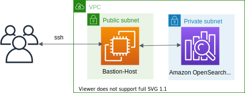

# AWS CDK Python Examples

This repository contains a set of example projects for the [AWS Cloud Development Kit](https://docs.aws.amazon.com/cdk/api/latest/)

| Example | Description | Tags |
|---------|-------------|------|
| [api-gateway/cognito-api-lambda](./api-gateway/cognito-api-lambda/) |  | api-gateway, cognito, lambda |
| [api-gateway/dynamodb](./api-gateway/dynamodb/) |  | api-gateway, dynamodb |
| [api-gateway/dynamodb-cognito](./api-gateway/dynamodb-cognito/) |  | api-gateway, cognito, dynamodb |
| [cloudfront/static-site](./cloudfront/static-site/) |  | cloudfront |
| [documentdb](./documentdb/) |  | secerts manager, sagemaker, documentdb |
| [dynamodb](./dynamodb/) |  | dynamodb |
| [ec2/vpc](./ec2/vpc/) |  | vpc |
| [ec2/import-existing-vpc](./ec2/import-existing-vpc/) |  | vpc |
| [elasticache/redis](./elasticache/redis/) |  | redis, redis-cluster |
| [elasticsearch](./elasticsearch/) |  | elasticsearch |
| [opensearch](./opensearch-service/) |  | opensearch |
| [kinesis-data-firehose/data-transform](./kinesis-data-firehose/data-transform/) |  | kinesis firehose, lambda, s3, schema-validation |
| [kinesis-data-firehose/dynamic-partitioning/inline](./kinesis-data-firehose/dynamic-partitioning/inline/) |  | kinesis firehose, lambda, s3, dynamic-partitioning |
| [kinesis-data-firehose/dynamic-partitioning/lambda](./kinesis-data-firehose/dynamic-partitioning/lambda/) |  | kinesis firehose, s3, dynamic-partitioning, jq |
| [kinesis-data-firehose/ekk-stack](./kinesis-data-firehose/ekk-stack/) |  | kinesis firehose, s3, elasticsearch, bastion host |
| [lambda/async-invoke](./lambda/async-invoke/) |  | lambda, sns, event-bridge |
| [memorydb-for-redis](./memorydb/) |  | memorydb |
| [msk](./msk/) |  | msk(kafka) |
| [mwaa(airflow)](./mwaa/) |  | mwaa(airflow) |
| [neptune](./neptune/) |  | sagemaker, neptune |
| [rds/rds_proxy-aurora_mysql](./rds/rds_proxy-aurora_mysql/) |  | rds-proxy, aurora mysql, secrets manager |
| [rds/sagemaker-aurora_mysql](./rds/sagemaker-aurora_mysql/) |  | rds-proxy, aurora mysql, secrets manager, sagemaker |

Enjoy!

## Useful commands

 * `npm install -g aws-cdk`          Install the AWS CDK Toolkit (the `cdk` command).
 * `npm install -g aws-cdk@latest`   Install the latest AWS CDK Toolkit (the `cdk`command).
 * `cdk init app --language python`  Create a new, empty CDK Python project.
 * `cdk bootstrap --profile <AWS Profile>` Deploys the CDK Toolkit staging stack; see [Bootstrapping](https://docs.aws.amazon.com/cdk/v2/guide/bootstrapping.html)

## References

 * [Working with the AWS CDK](https://docs.aws.amazon.com/cdk/latest/guide/work-with.html)
 * [Your first AWS CDK app](https://docs.aws.amazon.com/cdk/latest/guide/hello_world.html)
 * [AWS CDK v1 Reference Documentation](https://docs.aws.amazon.com/cdk/api/v1/)
 * [AWS CDK v2 Reference Documentation](https://docs.aws.amazon.com/cdk/api/v2/)
 * [Migrating to AWS CDK v2](https://docs.aws.amazon.com/cdk/v2/guide/migrating-v2.html)
 * [AWS CDK Toolkit (cdk command)](https://docs.aws.amazon.com/cdk/v2/guide/cli.html)
 * [aws-samples/aws-cdk-examples](https://github.com/aws-samples/aws-cdk-examples)

