# AWS CDK Python Examples

This repository contains a set of [AWS Cloud Development Kit](https://docs.aws.amazon.com/cdk/api/latest/) Python examples with architecture diagrams for frequently used AWS services.

| Example | Description | Tags |
|---------|-------------|------|
| [api-gateway/cognito-api-lambda](./api-gateway/cognito-api-lambda/) | 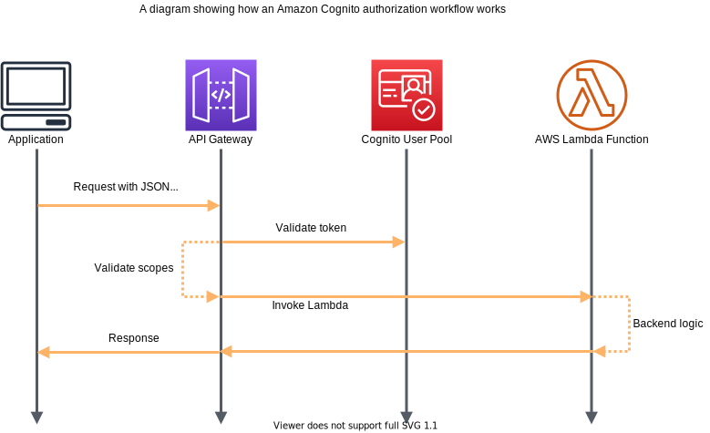 | api-gateway, cognito, lambda |
| [api-gateway/dynamodb](./api-gateway/dynamodb/) | 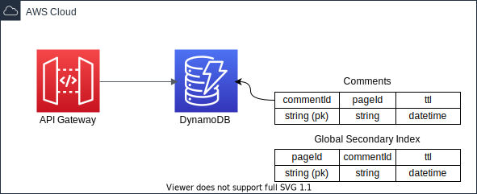 | api-gateway, dynamodb |
| [api-gateway/dynamodb-cognito](./api-gateway/dynamodb-cognito/) |  | api-gateway, cognito, dynamodb |
| [api-gateway/http-dynamodb-crud-api](./api-gateway/http-dynamodb-crud-api/) |  | api-gateway(HTTP API), dynamodb, lambda |
| [api-gateway/kds-proxy](./api-gateway/kds-proxy/) | 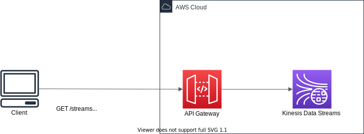 | api-gateway, kinesis data streams |
| [api-gateway/kds-proxy-cognito](./api-gateway/kds-proxy-cognito/) | 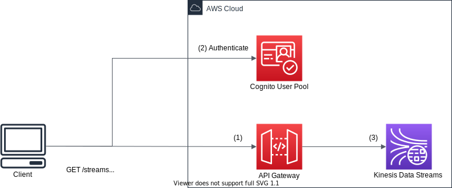 | api-gateway, cognito, kinesis data streams |
| [api-gateway/logging-api-calls-to-firehose](./api-gateway/logging-api-calls-to-firehose/) | 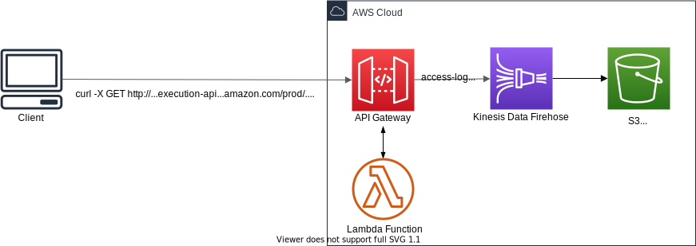 | api-gateway, kinesis data firehose |
| [api-gateway/logging-api-calls-to-cloudwatch-logs](./api-gateway/logging-api-calls-to-cloudwatch-logs/) | 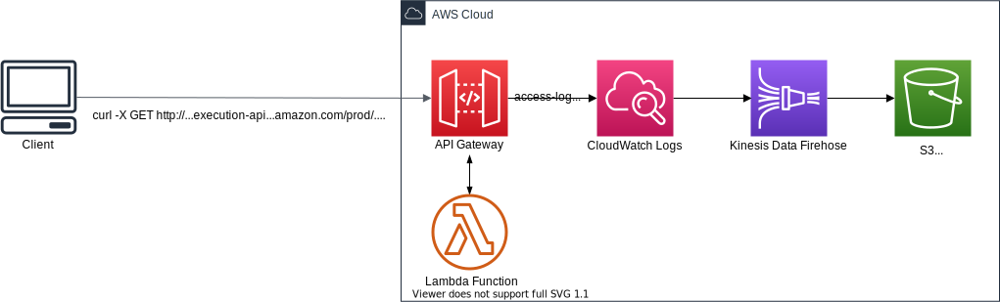 | api-gateway, cloudwatch logs subscription filters with kinesis data firehose |
| [athena](./athena/) |  | athena (named query, work group), s3 |
| [batch/batch-with-ec2](./batch/batch-with-ec2/) | Launch AWS Batch | aws batch |
| [cloud9](./cloud9/) |  | cloud9 |
| [cloudfront/static-site](./cloudfront/static-site/) |  | cloudfront |
| [custom-resources/sagemaker-jumstart-model-deploy](./custom-resources/sagemaker-jumstart-model-deploy/) | Deploy SageMaker JumpStart Model with CDK Custom Resources | sagemaker jumpstart, cdk custom-resources |
| [dms/aurora_mysql-to-kinesis](./dms/aurora_mysql-to-kinesis/) |  | dms, mysql, kinesis |
| [dms/aurora_mysql-to-s3](./dms/aurora_mysql-to-s3/) |  | dms, mysql, s3 |
| [documentdb](./documentdb/) |  | documentdb(docdb), secerts manager, sagemaker|
| [documentdb-elastic-clusters](./documentdb-elastic-clusters/) |  | documentdb elastic clusters(docdb-elastic), secerts manager|
| [dynamodb](./dynamodb/) | 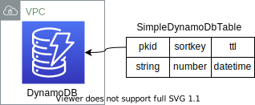 | dynamodb |
| [ec2/vpc](./ec2/vpc/) | 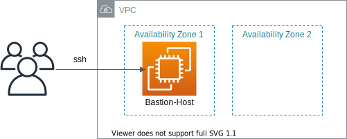 | vpc |
| [ec2/import-existing-vpc](./ec2/import-existing-vpc/) |  | vpc |
| [ec2/jenkins-on-ec2](./ec2/jenkins-on-ec2/) |  | jenkins, ec2 |
| [ec2/jupyter-on-dlami](./ec2/jupyter-on-dlami/) | Launch Jupyter Server on Amazon Deep Learning AMI | jupyter, ec2, DLAMI |
| [ec2/dlami-wth-aws-neuron](./ec2/dlami-wth-aws-neuron/) | Launch Jupyter Server on Amazon Deep Learning AMI with AWS Neuron | jupyter, ec2, DLAMI, AWS Neuron |
| [ecs-patterns/alb-fargate-service](./ecs-patterns/alb-fargate-service/) |  | ecs patterns, Application Loadbalancer Fargate Service |
| [ecs-patterns/nlb-fargate-service](./ecs-patterns/nlb-fargate-service/) |   | ecs patterns, Network Loadbalancer Fargate Service |
| [elasticache/redis](./elasticache/redis/) | 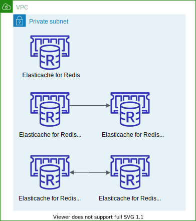 | redis |
| [elasticache/redis-primary-replica](./elasticache/redis-primary-replica/) |  | redis primary-replica cluster |
| [elasticache/redis-cluster](./elasticache/redis-cluster/) |  | redis-cluster |
| [elasticache-serverless/serverless-redis-cluster](./elasticache-serverless/serverless-redis-cluster/) |  | ElastiCache Serverless for Redis |
| [elasticsearch](./elasticsearch/) |  | elasticsearch |
| [opensearch/cfn-domain](./opensearch-service/cfn-domain) |  | opensearch created with cdk.aws_opensearch.CfnDomain construct |
| [opensearch/domain](./opensearch-service/domain) |  | opensearch created with cdk.aws_opensearch.Domain construct |
| [opensearch-serverless/search](./opensearch-serverless/search) |  | opensearch serverless for search usecases |
| [opensearch-serverless/time-series](./opensearch-serverless/time-series) |  | opensearch serverless for time series analysis |
| [opensearch-serverless/vpc-endpoint](./opensearch-serverless/vpc-endpoint) |  | opensearch serverless in VPC |
| [opensearch-serverless/kinesis-firehose](./opensearch-serverless/kinesis-firehose) |  | data ingestion to opensearch serverless using kinesis firehose |
| [opensearch-ingestion/opensearch](./opensearch-ingestion/opensearch) |  | data ingestion to opensearch domain using OpenSearch Ingestion Pipelines |
| [opensearch-ingestion/opensearch-serverless](./opensearch-ingestion/opensearch-serverless) |  | data ingestion to opensearch serverless using OpenSearch Ingestion Pipelines |
| [emr](./emr/) | 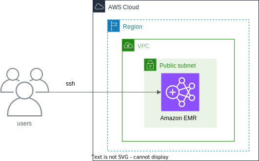 | emr, Hive, Spark, JupyterHub, Hudi, Iceberg  |
| [emr-serverless](./emr-serverless/) | 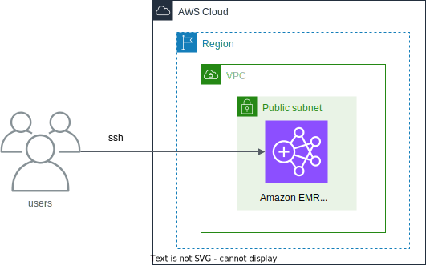 | emr serverless |
| [emr-studio](./emr-studio/) | Launch an Amazon EMR Studio | emr studio |
| [glue/cdc-parquet-to-apache-iceberg](./glue/cdc-parquet-to-apache-iceberg/) |  | aws glue, Apache Iceberg, Parquet |
| [glue/cdc-streams-to-apache-iceberg](./glue/cdc-streams-to-apache-iceberg/) |  | aws glue streaming, Apache Iceberg |
| [glue/streaming-etl/sink-to-s3](./glue/streaming-etl/sink-to-s3/) |  | aws glue streaming, kinesis data streams, s3, parquet |
| [glue/streaming-etl/sink-to-deltalake](./glue/streaming-etl/sink-to-deltalake/) | 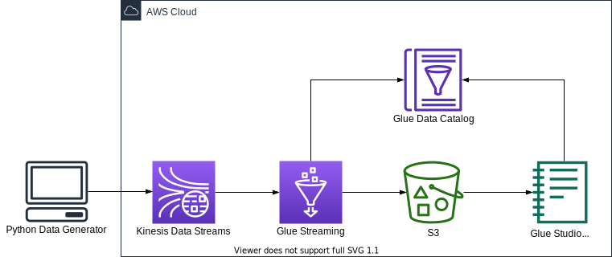 | aws glue streaming, kinesis data streams, s3, Delta Lake |
| [glue/streaming-etl/sink-to-hudi](./glue/streaming-etl/sink-to-hudi/) |  | aws glue streaming, kinesis data streams, s3, Apache Hudi |
| [glue/streaming-etl/sink-to-iceberg](./glue/streaming-etl/sink-to-iceberg/) |  | aws glue streaming, kinesis data streams, s3, Apache Iceberg |
| [glue/streaming-etl/kafka-to-iceberg](./glue/streaming-etl/kafka-to-iceberg/) |  | aws glue streaming, Managed Service for Apache Kafka (MSK), s3, Apache Iceberg |
| [glue/streaming-etl/msk-serverless-to-iceberg](./glue/streaming-etl/msk-serverless-to-iceberg/) | 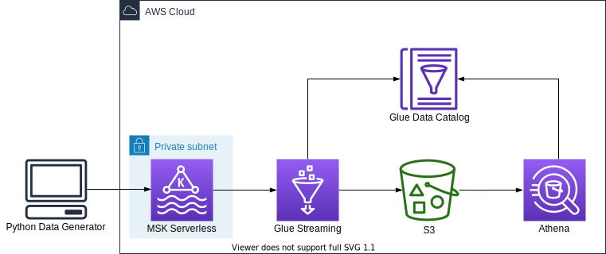 | aws glue streaming, MSK Serverless, s3, Apache Iceberg |
| [kendra/webcrawler-datasource](./kendra/webcrawler-datasource/) |  | kendra, lambda |
| [keyspaces-cassandra](./keyspaces-cassandra/) | | amazon keyspaces, cassandra |
| [kinesis-data-firehose/data-transform](./kinesis-data-firehose/data-transform/) |  | kinesis firehose, lambda, s3, schema-validation |
| [kinesis-data-firehose/dynamic-partitioning/inline](./kinesis-data-firehose/dynamic-partitioning/inline/) |  | kinesis firehose, s3, dynamic-partitioning, jq |
| [kinesis-data-firehose/dynamic-partitioning/lambda](./kinesis-data-firehose/dynamic-partitioning/lambda/) |  | kinesis firehose, s3, dynamic-partitioning, lambda |
| [kinesis-data-firehose/ekk-stack](./kinesis-data-firehose/ekk-stack/) |  | kinesis firehose, s3, Elasticsearch, bastion host |
| [kinesis-data-firehose/opskk-stack](./kinesis-data-firehose/opskk-stack/) |  | kinesis firehose, s3, OpenSearch, bastion host |
| [kinesis-data-firehose/msk-firehose-s3-stack](./kinesis-data-firehose/msk-firehose-s3-stack/) |  | msk, kinesis firehose, s3, bastion host |
| [kinesis-data-firehose/msk-serverless-firehose-s3-stack](./kinesis-data-firehose/msk-serverless-firehose-s3-stack/) |  | msk serverless, kinesis firehose, s3, bastion host |
| [kinesis-data-streams/to-kinesis-data-firehose](./kinesis-data-streams/to-kinesis-data-firehose/) |  | kinesis data streams, kinesis firehose, s3 |
| [kinesis-data-analytics-for-flink/msk-replication](./kinesis-data-analytics/kda-flink/msk-replication/) |  | kinesis data analytics for flink, msk |
| [lakeformation](./lakeformation/) | Granting AWS Lake Formation permissions on Data Catalog Resources | glue data catalog, lakeformation |
| [lambda/alb-lambda](./lambda/alb-lambda/) |  | lambda, application load balancer |
| [lambda/alb-path-routing-lambda](./lambda/alb-path-routing-lambda/) | 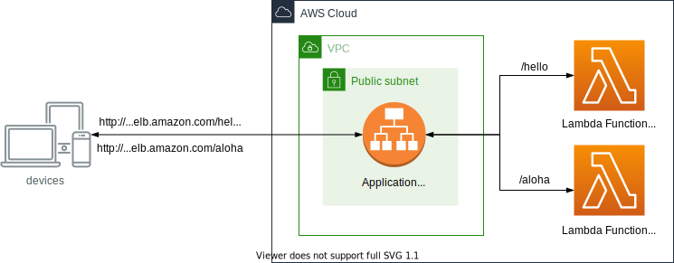 | lambda, application load balancer |
| [lambda/async-invoke](./lambda/async-invoke/) | 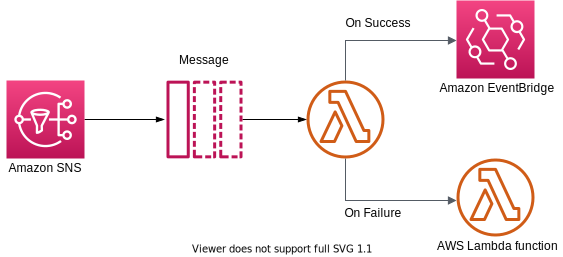 | lambda, sns, event-bridge |
| [lambda/lambda-custom-container](./lambda/lambda-custom-container/) |  | lambda, ecr, custom container |
| [memorydb-for-redis](./memorydb/) |  | memorydb |
| [msk](./msk/) |  | msk(kafka) |
| [msk_aplha](./msk_alpha/) |  | msk(kafka) |
| [msk-serverless](./msk-serverless/) |  | msk serverless(kafka) |
| [mwaa(airflow)](./mwaa/) |  | mwaa(airflow) |
| [neptune](./neptune/) |  | sagemaker, neptune |
| [rds/aurora_mysql](./rds/aurora_mysql/) |  | aurora mysql, secrets manager |
| [rds/aurora_postgresql](./rds/aurora_postgresql/) |  | aurora postgresql, secrets manager |
| [aurora_serverless_v2/aurora_mysql-serverless_v2-cluster](./rds/aurora_serverless_v2/aurora_mysql-serverless_v2-cluster) |  | aurora mysql serverless v2 cluster, secrets manager |
| [aurora_serverless_v2/aurora_mysql-serverless_v2-replica](./rds/aurora_serverless_v2/aurora_mysql-serverless_v2-replica) |  | aurora mysql serverless v2, aurora mysql, secrets manager |
| [rds/mariadb](./rds/mariadb/) |  | mariadb, secrets manager |
| [rds/rds_proxy-aurora_mysql](./rds/rds_proxy-aurora_mysql/) |  | rds-proxy, aurora mysql, secrets manager |
| [rds/nginx-rds_proxy-aurora_mysql](./rds/nginx-rds_proxy-aurora_mysql/) |  | NGINX, aurora mysql, secrets manager |
| [rds/sagemaker-aurora_mysql](./rds/sagemaker-aurora_mysql/) |  | aurora mysql, secrets manager, sagemaker notebook |
| [rds/sagemaker-aurora_postgresql](./rds/sagemaker-aurora_postgresql/) |  | aurora postgresql, secrets manager, sagemaker notebook |
| [rds/sagemaker-studio-aurora_postgresql](./rds/sagemaker-studio-aurora_postgresql/) |  | aurora postgresql, secrets manager, sagemaker studio in vpc |
| [redshift/cfn](./redshift/cfn) | 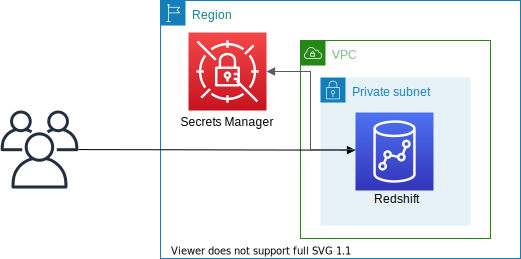 | redshift |
| [redshift/alpha](./redshift/redshift_alpha/) |  | redshift |
| [redshift-serverless](./redshift-serverless/) | 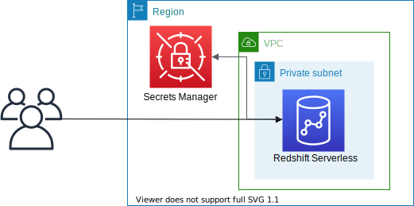 | redshift-serverless |
| [redshift-streaming-ingestion/from-kinesis](./redshift-streaming-ingestion/from-kinesis/) |  | redshift streaming ingestion from kinesis |
| [redshift-streaming-ingestion/from-msk](./redshift-streaming-ingestion/from-msk/) | 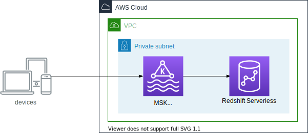 | redshift streaming ingestion from msk |
| [redshift-streaming-ingestion/from-msk-serverless](./redshift-streaming-ingestion/from-msk-serverless/) |  | redshift streaming ingestion from msk serverless |
| [sagemaker/notebook](./sagemaker/notebook/) | Launch an Amazon SageMaker Notebook Instance | sagemaker notebook instance |
| [sagemaker/studio](./sagemaker/studio/) | 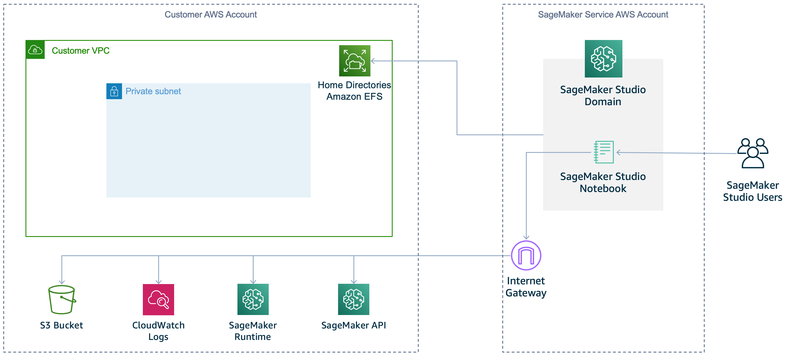 | sagemaker studio |
| [sagemaker/studio-in-vpc](./sagemaker/studio-in-vpc/) | 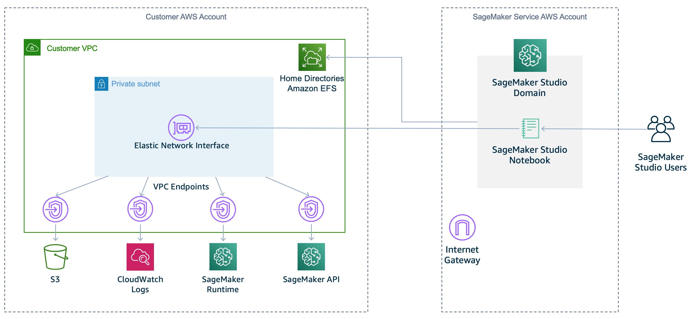 | sagemaker studio in a Private VPC |
| [sagemaker/fsx-lustre](./sagemaker/fsx-lustre/) | Training Jobs with FileSystemInput using Amazon FSx for Lustre | sagemaker studio, FSx for Lustre (FSxLustre) |
| [sagemaker/sagemaker-glue](./sagemaker/sagemaker-glue/) |   | sagemaker studio, aws glue |
| [sagemaker/mlflow-ec2-sagemaker](./sagemaker/mlflow-ec2-sagemaker/) |  | MLflow, sagemaker studio |
| [sagemaker/mlflow-ecs-sagemaker](./sagemaker/mlflow-ecs-sagemaker/) |  | MLflow, ecs, fargate, sagemaker studio |

Enjoy!

## Useful commands

 * `npm install -g aws-cdk`          Install the AWS CDK Toolkit (the `cdk` command).
 * `npm install -g aws-cdk@latest`   Install the latest AWS CDK Toolkit (the `cdk`command).
 * `cdk init app --language python`  Create a new, empty CDK Python project.
 * `cdk bootstrap --profile <AWS Profile>` Deploys the CDK Toolkit staging stack; see [Bootstrapping](https://docs.aws.amazon.com/cdk/v2/guide/bootstrapping.html)

## References

 * [Working with the AWS CDK](https://docs.aws.amazon.com/cdk/latest/guide/work-with.html)
 * [Your first AWS CDK app](https://docs.aws.amazon.com/cdk/latest/guide/hello_world.html)
 * [AWS CDK v2 Reference Documentation](https://docs.aws.amazon.com/cdk/api/v2/)
 * [AWS CDK Toolkit (cdk command)](https://docs.aws.amazon.com/cdk/v2/guide/cli.html)
 * [AWS CDK Workshop](https://cdkworkshop.com/)
 * [Construct Hub: Open-source CDK libraries](https://constructs.dev/)
 * [aws-samples/aws-cdk-examples](https://github.com/aws-samples/aws-cdk-examples)
 * [CDK Resources](https://cdk.dev/resources) - A collection of tools to help during the development of CDK applications.
 * [Awesome CDK](https://github.com/kalaiser/awesome-cdk) - Curated list of awesome AWS Cloud Development Kit (AWS CDK) open-source projects, guides, blogs and other resources.
 * [AWS CloudFormation quotas](https://docs.aws.amazon.com/AWSCloudFormation/latest/UserGuide/cloudformation-limits.html) - Check out **AWS CloudFormation quotas** when you encounter limitation errors when authoring templates and creating stacks.

