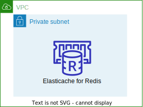

# AWS CDK Python Examples

This repository contains a set of example projects for the [AWS Cloud Development
Kit](https://docs.aws.amazon.com/cdk/api/latest/)

| Example | Description |
|---------|-------------|
| dynamodb |  |
| ec2-vpc  |  |
| ec2-import-existing-vpc  |  |
| elasticache for redis |  |
| elasticsearch |  |
| neptune |  |
| rds proxy + aurora mysql |  |

Enjoy!
