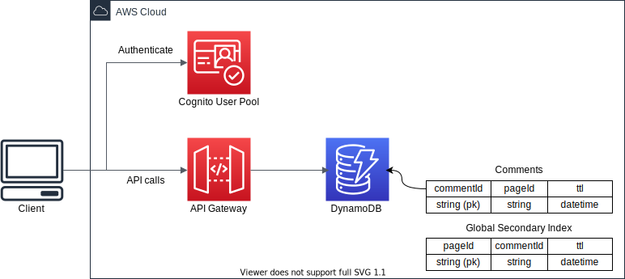
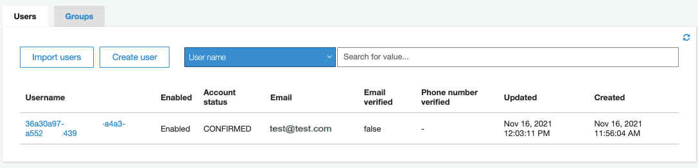

# Amazon API Gateway to DynamoDB integration with Amazon Cognito as authorizer



This is an Amazon API Gateway to DynamoDB integration with Amazon Cognito as authorizer project for Python development with CDK.

The `cdk.json` file tells the CDK Toolkit how to execute your app.

This project is set up like a standard Python project.  The initialization
process also creates a virtualenv within this project, stored under the `.venv`
directory.  To create the virtualenv it assumes that there is a `python3`
(or `python` for Windows) executable in your path with access to the `venv`
package. If for any reason the automatic creation of the virtualenv fails,
you can create the virtualenv manually.

To manually create a virtualenv on MacOS and Linux:

```
$ python3 -m venv .venv
```

After the init process completes and the virtualenv is created, you can use the following
step to activate your virtualenv.

```
$ source .venv/bin/activate
```

If you are a Windows platform, you would activate the virtualenv like this:

```
% .venv\Scripts\activate.bat
```

Once the virtualenv is activated, you can install the required dependencies.

```
(.venv) $ pip install -r requirements.txt
```

At this point you can now synthesize the CloudFormation template for this code.

```
(.venv) $ export CDK_DEFAULT_ACCOUNT=$(aws sts get-caller-identity --query Account --output text)
(.venv) $ export CDK_DEFAULT_REGION=$(aws configure get region)
(.venv) $ cdk synth --all
```

Use `cdk deploy` command to create the stack shown above,

```
(.venv) $ cdk deploy --require-approval never --all
```

To add additional dependencies, for example other CDK libraries, just add
them to your `setup.py` file and rerun the `pip install -r requirements.txt`
command.

#### DynamoDB Table Desecriptions

 * Comments: store comments for each page of your website.
    <pre>
    {
      "TableName": "Comments",
      "KeySchema": [
        {
          "AttributeName": "commentId",
          "KeyType": "HASH"
        }
      ],
      "AttributeDefinitions": [
        {
          "AttributeName": "commentId",
          "AttributeType": "S"
        },
        {
          "AttributeName": "pageId",
          "AttributeType": "S"
        }
      ],
      "GlobalSecondaryIndexes": [
        {
          "IndexName": "pageId-index",
          "KeySchema": [
            {
              "AttributeName": "pageId",
              "KeyType": "HASH"
            }
          ],
          "Projection": {
              "ProjectionType": "ALL"
          }
        }
      ]
    }
    </pre>

#### API Definitions

 * Post Comments
    <pre>
    Resource: /comments
    HTTP Method: POST
    HTTP Request Body:
    {
      "pageId":   "example-page-id",
      "userName": "ExampleUserName",
      "message":  "This is an example comment to be added."
    }
    </pre>

 * Get Comments
    <pre>
    Resource: /comments/{pageId}
    HTTP Method: GET
    </pre>

## Testing the Cognito JWT Authorizer

Let's test if our lambda function is protected by the authorizer.
In order to test the flow we have to:

1. Register a Cognito User, using the aws cli
   <pre>
   aws cognito-idp sign-up \
     --client-id <i>your-user-pool-client-id</i> \
     --username "<i>user-email-id@domain.com</i>" \
     --password "<i>user-password</i>"
   </pre>
   Note: You can find `UserPoolClientId` with the following command:
   <pre>
   aws cloudformation describe-stacks --stack-name <i>your-cloudformation-stack-name</i> | jq -r '.Stacks[0].Outputs | map(select(.OutputKey == "UserPoolClientId")) | .[0].OutputValue'
   </pre>

2. Confirm the user, so they can log in:
   <pre>
   aws cognito-idp admin-confirm-sign-up \
     --user-pool-id <i>your-user-pool-id</i> \
     --username "<i>user-email-id@domain.com</i>"
   </pre>
   At this point if you look at your [cognito user pool](https://console.aws.amazon.com/cognito/home), you would see that the user is confirmed and ready to log in:
   

   Note: You can find `UserPoolId` with the following command:
   <pre>
   aws cloudformation describe-stacks --stack-name <i>your-cloudformation-stack-name</i> | jq -r '.Stacks[0].Outputs | map(select(.OutputKey == "UserPoolId")) | .[0].OutputValue'
   </pre>

3. Log the user in to get an identity JWT token
   <pre>
   aws cognito-idp initiate-auth \
     --auth-flow USER_PASSWORD_AUTH \
     --auth-parameters USERNAME="<i>user-email-id@domain.com</i>",PASSWORD="<i>user-password</i>" \
     --client-id <i>your-user-pool-client-id</i>
   </pre>

4. Hit our Api to test the Authorizer; use the token to invoke our API endpoint which will call the function (if the token is valid) <br/>
  * First we will put a record into DynamoDB, for example such as:
    <pre>
    {
      "pageId":   "breaking-news-story-01-18-2016",
      "userName": "Just Saying Thank You",
      "message":  "I really enjoyed this story!!"
    }
    </pre>

  * Run post comments api like this:
    <pre>
    MY_ID_TOKEN=$(aws cognito-idp initiate-auth --auth-flow USER_PASSWORD_AUTH --auth-parameters USERNAME="<i>user-email-id@domain.com</i>",PASSWORD="<i>user-password</i>" --client-id <i>your-user-pool-client-id</i> | jq -r '.AuthenticationResult.IdToken')

    curl -L -X POST '<i>your-api-url</i>/comments/' --header "Authorization: ${MY_ID_TOKEN}" \
      -d '{"pageId":"breaking-news-story-01-18-2016", "userName":"Just Saying Thank You", "message":"I really enjoyed this story!!"}' \
      -H 'Content-Type: application/json'
    </pre>
    The response is:
    <pre>
    {}
    </pre>

    Navigate to the DynamoDB console and view the `Comments` table to show that the request really was successfully processed.

  * Now let's try to retrieve data from our DynamoDB:
    <pre>
    MY_ID_TOKEN=$(aws cognito-idp initiate-auth --auth-flow USER_PASSWORD_AUTH --auth-parameters USERNAME="<i>user-email-id@domain.com</i>",PASSWORD="<i>user-password</i>" --client-id <i>your-user-pool-client-id</i> | jq -r '.AuthenticationResult.IdToken')

    curl -L -X GET '<i>your-api-url</i>/comments/breaking-news-story-01-18-2016' --header "Authorization: ${MY_ID_TOKEN}"
    </pre>
    The response is:
    <pre>
    {
      "comments": [
        {
          "commentId": "d4e373b5-9977-45e9-8855-ecacd160c108",
          "userName": "Just Saying Thank You",
          "message": "I really enjoyed this story!!"
        }
      ]
    }
    </pre>

  * Note: You can find <i>your-api-url</i> with the following command:
    <pre>
    aws cloudformation describe-stacks --stack-name <i>your-cloudformation-stack-name</i> | jq -r '.Stacks[0].Outputs | map(select(.ExportName == "ApiGatewayRestApiEndpoint")) | .[0].OutputValue'
    </pre>

## Clean Up

Delete the CloudFormation stack by running the below command.

```
(.venv) $ cdk destroy --force --all
```

## Useful commands

 * `cdk ls`          list all stacks in the app
 * `cdk synth`       emits the synthesized CloudFormation template
 * `cdk deploy`      deploy this stack to your default AWS account/region
 * `cdk diff`        compare deployed stack with current state
 * `cdk docs`        open CDK documentation

Enjoy!

## References

 * [Using Amazon API Gateway as a proxy for DynamoDB](https://aws.amazon.com/blogs/compute/using-amazon-api-gateway-as-a-proxy-for-dynamodb/)
 * [Amazon API Gateway REST API to DynamoDB](https://serverlessland.com/patterns/apigw-dynamodb)
 * [Amazon API Gateway mapping template and access logging variable reference](https://docs.aws.amazon.com/apigateway/latest/developerguide/api-gateway-mapping-template-reference.html)
 * [Building fine-grained authorization using Amazon Cognito, API Gateway, and IAM](https://aws.amazon.com/ko/blogs/security/building-fine-grained-authorization-using-amazon-cognito-api-gateway-and-iam/)
 * [Curl Cookbook](https://catonmat.net/cookbooks/curl)

