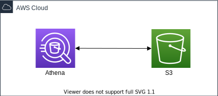

# Amazon Athena CDK Python project!



This is an Amazon Athena project for CDK development with Python.

The `cdk.json` file tells the CDK Toolkit how to execute your app.

This project is set up like a standard Python project.  The initialization
process also creates a virtualenv within this project, stored under the `.venv`
directory.  To create the virtualenv it assumes that there is a `python3`
(or `python` for Windows) executable in your path with access to the `venv`
package. If for any reason the automatic creation of the virtualenv fails,
you can create the virtualenv manually.

To manually create a virtualenv on MacOS and Linux:

```
$ python3 -m venv .venv
```

After the init process completes and the virtualenv is created, you can use the following
step to activate your virtualenv.

```
$ source .venv/bin/activate
```

If you are a Windows platform, you would activate the virtualenv like this:

```
% .venv\Scripts\activate.bat
```

Once the virtualenv is activated, you can install the required dependencies.

```
(.venv) $ pip install -r requirements.txt
```

At this point you can now synthesize the CloudFormation template for this code.

<pre>
(.venv) $ export CDK_DEFAULT_ACCOUNT=$(aws sts get-caller-identity --query Account --output text)
(.venv) $ export CDK_DEFAULT_REGION=$(aws configure get region)
(.venv) $ cdk synth --parameters AthenaWorkGroupName='<i>your-athena-work-group-name</i>'
</pre>

Use `cdk deploy` command to create the stack shown above,

<pre>
(.venv) $ cdk deploy --parameters AthenaWorkGroupName='<i>your-athena-work-group-name</i>'
</pre>

To add additional dependencies, for example other CDK libraries, just add
them to your `setup.py` file and rerun the `pip install -r requirements.txt`
command.

## Test

 * Lists available workgroups for the account. Returns information about the workgroup with the specified name.
    <pre>
    $ aws athena list-work-groups
    $ aws athena get-work-group --work-group <i>work-group-name</i>
    </pre>
 * Provides a list of available query IDs only for queries saved in the specified workgroup. Returns information about a single query.
    <pre>
    $ aws athena list-named-queries --work-group <i>value</i>
    $ aws athena get-named-query --named-query-id <i>value</i>
    </pre>
 * Lists the prepared statements in the specified workgroup. Retrieves the prepared statement with the specified name from the specified workgroup.
    <pre>
    $ aws athena list-prepared-statements --work-group <i>value</i>
    $ aws athena get-prepared-statement --statement-name <i>value</i> --work-group <i>value</i>
    </pre>

## Clean Up

Delete the CloudFormation stack by running the below command.

<pre>
(.venv) $ cdk destroy
</pre>

## Useful commands

 * `cdk ls`          list all stacks in the app
 * `cdk synth`       emits the synthesized CloudFormation template
 * `cdk deploy`      deploy this stack to your default AWS account/region
 * `cdk diff`        compare deployed stack with current state
 * `cdk docs`        open CDK documentation

Enjoy!

## References

 * [Amazon Athena Workshop](https://athena-in-action.workshop.aws/)
 * [Performance tuning in Athena](https://docs.aws.amazon.com/athena/latest/ug/performance-tuning.html)
 * [Amazon Athena - Using saved queries](https://docs.aws.amazon.com/athena/latest/ug/saved-queries.html)
 * [Amazon Athena - Using parameterized queries](https://docs.aws.amazon.com/athena/latest/ug/querying-with-prepared-statements.html)
 * [PyAthena](https://github.com/laughingman7743/PyAthena/) - Python DB API 2.0 (PEP 249) client for Amazon Athena

