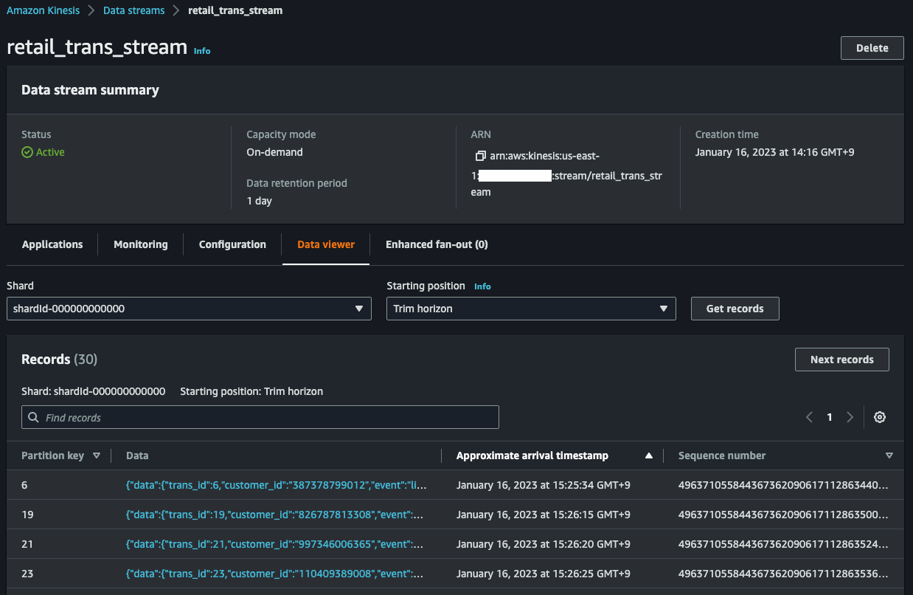

# Streaming Data to Amazon Kinesis Data Streams via AWS DMS Serverless


This is a data pipeline project using AWS DMS for Python development with CDK.

The `cdk.json` file tells the CDK Toolkit how to execute your app.

This project is set up like a standard Python project.  The initialization
process also creates a virtualenv within this project, stored under the `.venv`
directory.  To create the virtualenv it assumes that there is a `python3`
(or `python` for Windows) executable in your path with access to the `venv`
package. If for any reason the automatic creation of the virtualenv fails,
you can create the virtualenv manually.

To manually create a virtualenv on MacOS and Linux:

```
$ python3 -m venv .venv
```

After the init process completes and the virtualenv is created, you can use the following
step to activate your virtualenv.

```
$ source .venv/bin/activate
```

If you are a Windows platform, you would activate the virtualenv like this:

```
% .venv\Scripts\activate.bat
```

Once the virtualenv is activated, you can install the required dependencies.

```
(.venv) $ pip install -r requirements.txt
```

At this point you can now synthesize the CloudFormation template for this code.

<pre>
(.venv) $ export CDK_DEFAULT_ACCOUNT=$(aws sts get-caller-identity --query Account --output text)
(.venv) $ export CDK_DEFAULT_REGION=$(aws configure get region)
(.venv) $ cdk synth --all \
              -c source_database_secret_name='<i>secret-full-name</i>' \
              -c mysql_client_security_group_name='<i>mysql-client-security-group-name</i>' \
              -c source_database_name='<i>database-name</i>' \
              -c source_table_name='<i>table-name</i>' \
              -c target_kinesis_stream_name='<i>target-kinesis-stream-name</i>'
</pre>

Use `cdk deploy` command to create the stack shown above.

<pre>
(.venv) $ cdk deploy --all \
              -c source_database_secret_name='<i>secret-full-name</i>' \
              -c mysql_client_security_group_name='<i>mysql-client-security-group-name</i>' \
              -c source_database_name='<i>database-name</i>' \
              -c source_table_name='<i>table-name</i>' \
              -c target_kinesis_stream_name='<i>target-kinesis-stream-name</i>'
</pre>

To add additional dependencies, for example other CDK libraries, just add
them to your `setup.py` file and rerun the `pip install -r requirements.txt`
command.

## Useful commands

 * `cdk ls`          list all stacks in the app
 * `cdk synth`       emits the synthesized CloudFormation template
 * `cdk deploy`      deploy this stack to your default AWS account/region
 * `cdk diff`        compare deployed stack with current state
 * `cdk docs`        open CDK documentation

Enjoy!

## Example

1. Create an Aurora MySQL cluster with enabling binary logs; Set the `binlog_format` parameter to `ROW` in the parameter group.
2. Connect to the Aurora cluster writer node.
   <pre>
   $ mysql -h <i>db-cluster-name</i>.cluster-<i>xxxxxxxxxxxx</i>.<i>region-name</i>.rds.amazonaws.com -uadmin -p
    Welcome to the MySQL monitor.  Commands end with ; or \g.
    Your MySQL connection id is 947748268
    Server version: 5.7.12-log MySQL Community Server (GPL)

    Copyright (c) 2000, 2020, Oracle and/or its affiliates. All rights reserved.

    Oracle is a registered trademark of Oracle Corporation and/or its
    affiliates. Other names may be trademarks of their respective
    owners.

    Type 'help;' or '\h' for help. Type '\c' to clear the current input statement.

    mysql>
   </pre>
3. At SQL prompt run the below command to confirm that binary logging is enabled:
   <pre>
   mysql> SHOW GLOBAL VARIABLES LIKE "log_bin";
   +---------------+-------+
   | Variable_name | Value |
   +---------------+-------+
   | log_bin       | ON    |
   +---------------+-------+
   </pre>
4. Also run this to AWS DMS has bin log access that is required for replication
   <pre>
   mysql> CALL mysql.rds_set_configuration('binlog retention hours', 24);
   </pre>
5. Run the below command to create the sample database named `testdb`.
   <pre>
   mysql> CREATE DATABASE testdb;
   </pre>
6. Exit from the SQL prompt and open the command-line terminal.
7. Start the DMS Replication task by replacing the ARN in below command.
   <pre>
   (.venv) $ DMS_REPLICATION_CONFIG_ARN=$(aws cloudformation describe-stacks --stack-name <i>DMSServerlessAuroraMysqlToKDSStack</i> \
   | jq -r '.Stacks[0].Outputs | map(select(.OutputKey == "DMSReplicationConfigArn")) | .[0].OutputValue')
   (.venv) $ aws dms start-replication \
                     --replication-config-arn <i>${DMS_REPLICATION_CONFIG_ARN}</i> \
                     --start-replication-type start-replication
   </pre>
8. At the command-line prompt run the below command to create the sample table named `retail_trans` in `testdb` database.
   <pre>
   (.venv) $ python tests/gen_fake_mysql_data.py \
                    --database <i>testdb</i> \
                    --table <i>retail_trans</i> \
                    --user <i>user-name</i> \
                    --password <i>password</i> \
                    --host <i>db-cluster-name</i>.cluster-<i>xxxxxxxxxxxx</i>.<i>region-name</i>.rds.amazonaws.com \
                    --create-table

            CREATE TABLE IF NOT EXISTS testdb.retail_trans (
               trans_id BIGINT(20) AUTO_INCREMENT PRIMARY KEY,
               customer_id VARCHAR(12) NOT NULL,
               event VARCHAR(10) DEFAULT NULL,
               sku VARCHAR(10) NOT NULL,
               amount INT DEFAULT 0,
               device VARCHAR(10) DEFAULT NULL,
               trans_datetime DATETIME DEFAULT CURRENT_TIMESTAMP,
               KEY(trans_datetime)
            ) ENGINE=InnoDB AUTO_INCREMENT=0;
   </pre>
9. Generate test data.
   <pre>
   (.venv) $ python tests/gen_fake_mysql_data.py \
                    --database <i>testdb</i> \
                    --table <i>retail_tans</i> \
                    --user <i>user-name</i> \
                    --password <i>password</i> \
                    --host <i>db-cluster-name</i>.cluster-<i>xxxxxxxxxxxx</i>.<i>region-name</i>.rds.amazonaws.com \
                    --max-count 200
   </pre>
10. Check the Data Viewer in the Amazon Kinesis Management Console and you can see incomming records.

   * Insert
      <pre>
      {
         "data": {
            "trans_id": 6,
            "customer_id": "387378799012",
            "event": "list",
            "sku": "AI6161BEFX",
            "amount": 1,
            "device": "pc",
            "trans_datetime": "2023-01-16T06:18:32Z"
         },
         "metadata": {
            "timestamp": "2023-01-16T06:25:34.444953Z",
            "record-type": "data",
            "operation": "insert",
            "partition-key-type": "primary-key",
            "schema-name": "testdb",
            "table-name": "retail_trans",
            "transaction-id": 12884904641
         }
      }
      </pre>
   * Update
      <pre>
      {
         "data": {
            "trans_id": 6,
            "customer_id": "387378799012",
            "event": "list",
            "sku": "AI6161BEFX",
            "amount": 3,
            "device": "pc",
            "trans_datetime": "2023-01-16T06:18:32Z"
         },
         "metadata": {
            "timestamp": "2023-01-16T08:05:25.942777Z",
            "record-type": "data",
            "operation": "update",
            "partition-key-type": "primary-key",
            "schema-name": "testdb",
            "table-name": "retail_trans",
            "transaction-id": 12884973957
         }
      }
      </pre>
   * Delete
      <pre>
      {
         "data": {
            "trans_id": 6,
            "customer_id": "387378799012",
            "event": "list",
            "sku": "AI6161BEFX",
            "amount": 3,
            "device": "pc",
            "trans_datetime": "2023-01-16T06:18:32Z"
         },
         "metadata": {
            "timestamp": "2023-01-16T08:10:49.737891Z",
            "record-type": "data",
            "operation": "delete",
            "partition-key-type": "primary-key",
            "schema-name": "testdb",
            "table-name": "retail_trans",
            "transaction-id": 12884978099
         }
      }
      </pre>

#### Clean Up

1. Stop the DMS Replication task by replacing the ARN in below command.
   <pre>
   (.venv) $ DMS_REPLICATION_CONFIG_ARN=$(aws cloudformation describe-stacks --stack-name <i>DMSServerlessAuroraMysqlToKDSStack</i> \
   | jq -r '.Stacks[0].Outputs | map(select(.OutputKey == "DMSReplicationConfigArn")) | .[0].OutputValue')
   (.venv) $ aws dms stop-replication \
                     --replication-config-arn <i>${DMS_REPLICATION_CONFIG_ARN}</i>
   </pre>
2. Delete the CloudFormation stack by running the below command.
   <pre>
   (.venv) $ cdk destroy --force --all
   </pre>


## References

 * [AWS DMS Serverless: Automatically Provisions and Scales Capacity for Migration and Data Replication (2023-06-01)](https://aws.amazon.com/blogs/aws/new-aws-dms-serverless-automatically-provisions-and-scales-capacity-for-migration-and-data-replication/)
 * [aws-dms-deployment-using-aws-cdk](https://github.com/aws-samples/aws-dms-deployment-using-aws-cdk) - AWS DMS deployment using AWS CDK (Python)
 * [aws-dms-msk-demo](https://github.com/aws-samples/aws-dms-msk-demo) - Streaming Data to Amazon MSK via AWS DMS
 * [How to troubleshoot binary logging errors that I received when using AWS DMS with Aurora MySQL as the source?(Last updated: 2019-10-01)](https://aws.amazon.com/premiumsupport/knowledge-center/dms-binary-logging-aurora-mysql/)
 * [AWS DMS - Using Amazon Kinesis Data Streams as a target for AWS Database Migration Service](https://docs.aws.amazon.com/dms/latest/userguide/CHAP_Target.Kinesis.html)
 * [Specifying task settings for AWS Database Migration Service tasks](https://docs.aws.amazon.com/dms/latest/userguide/CHAP_Tasks.CustomizingTasks.TaskSettings.html#CHAP_Tasks.CustomizingTasks.TaskSettings.Example)
 * [Working with AWS DMS Serverless](https://docs.aws.amazon.com/dms/latest/userguide/CHAP_Serverless.html)
 * [Using Data Viewer in the Kinesis Console](https://docs.aws.amazon.com/streams/latest/dev/data-viewer.html)
 * [How AWS DMS handles open transactions when starting a full load and CDC task (2022-12-26)](https://aws.amazon.com/blogs/database/how-aws-dms-handles-open-transactions-when-starting-a-full-load-and-cdc-task/)
 * [AWS DMS key troubleshooting metrics and performance enhancers (2023-02-10)](https://aws.amazon.com/blogs/database/aws-dms-key-troubleshooting-metrics-and-performance-enhancers/)

