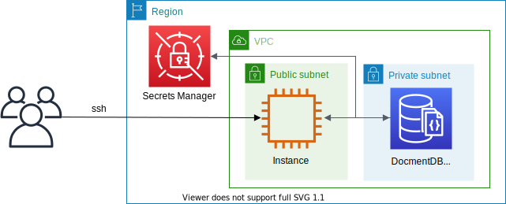

# Amazon DocumentDB Elastic Clusters CDK Python project!



This is an Amazon DocumentDB Elastic Clusters project for CDK development with Python.

The `cdk.json` file tells the CDK Toolkit how to execute your app.

This project is set up like a standard Python project.  The initialization
process also creates a virtualenv within this project, stored under the `.venv`
directory.  To create the virtualenv it assumes that there is a `python3`
(or `python` for Windows) executable in your path with access to the `venv`
package. If for any reason the automatic creation of the virtualenv fails,
you can create the virtualenv manually.

To manually create a virtualenv on MacOS and Linux:

```
$ python3 -m venv .venv
```

After the init process completes and the virtualenv is created, you can use the following
step to activate your virtualenv.

```
$ source .venv/bin/activate
```

If you are a Windows platform, you would activate the virtualenv like this:

```
% .venv\Scripts\activate.bat
```

Once the virtualenv is activated, you can install the required dependencies.

```
$ pip install -r requirements.txt
```

:information_source: Before you deploy this project, you should create an AWS Secret for your DocumentDB Admin user. You can create an AWS Secret like this:

<pre>
$ aws secretsmanager create-secret \
    --name <i>"your-docdb-secret-name"</i> \
    --description "<i>(Optional) description of the secret</i>" \
    --secret-string '{"admin_user_name": "docdbadmin", "admin_user_password": <i>"password_of_at_least_8_characters"</i>}'
</pre>

At this point you can now synthesize the CloudFormation template for this code.

<pre>
(.venv) $ export CDK_DEFAULT_ACCOUNT=$(aws sts get-caller-identity --query Account --output text)
(.venv) $ export CDK_DEFAULT_REGION=$(aws configure get region)
(.venv) $ cdk synth -c docdb_cluster_name='<i>cluster-name</i>' \
                    -c docdb_cluster_secret_name='<i>docdb-secret-name</i>'
</pre>

Use `cdk deploy` command to create the stack shown above,

<pre>
(.venv) $ cdk deploy -c docdb_cluster_name='<i>cluster-name</i>' \
                     -c docdb_cluster_secret_name='<i>docdb-secret-name</i>'
</pre>

To add additional dependencies, for example other CDK libraries, just add
them to your `setup.py` file and rerun the `pip install -r requirements.txt`
command.

## Clean Up

Delete the CloudFormation stack by running the below command.

<pre>
(.venv) $ cdk destroy --force --all \
                      -c docdb_cluster_name='<i>cluster-name</i>' \
                      -c docdb_cluster_secret_name='<i>docdb-secret-name</i>'
</pre>

## Useful commands

 * `cdk ls`          list all stacks in the app
 * `cdk synth`       emits the synthesized CloudFormation template
 * `cdk deploy`      deploy this stack to your default AWS account/region
 * `cdk diff`        compare deployed stack with current state
 * `cdk docs`        open CDK documentation

Enjoy!

## Run Test

#### Connect the DocumentDB Elastic Cluster with MongoDB shell

1. Connect the client EC2 Host

   You can connect to an EC2 instance using the EC2 Instance Connect CLI.<br/>
   Install `ec2instanceconnectcli` python package and Use the **mssh** command with the instance ID as follows.
   <pre>
   $ sudo pip install ec2instanceconnectcli
   $ mssh ec2-user@<i>i-001234a4bf70dec41EXAMPLE</i>
   </pre>

2. Connect to your new Elastic Cluster

   On the [Amazon DocumentDB Management Console](https://console.aws.amazon.com/docdb), under Clusters, locate your cluster.<br/>
   Choose the cluster you created by selecting the cluster identifier. From Connectivity and Security, copy your endpoint and paste it into your EC2 Host.<br/>
   Once connected, you should see the following output:
   <pre>
   [ec2-user@ip-172-31-15-68 ~]$ mongo mongodb://mongo mongodb://<i>{admin-user-name}</i>:<i>{admin-user-password}</i>@<i>cluster-name</i>-123456789012.us-east-1.docdb-elastic.amazonaws.com:27017 -ssl
   MongoDB shell version v4.0.28
   connecting to: mongodb://<i>cluster-name</i>-123456789012.us-east-1.docdb-elastic.amazonaws.com:27017/?gssapiServiceName=mongodb
   Implicit session: session { "id" : UUID("141dbc40-dfa0-46a0-8ab8-28cf56d89cb0") }
   MongoDB server version: 5.0.0
   WARNING: shell and server versions do not match
   mongos>
   </pre>

3. Shard your collection; insert and query data

   Elastic Clusters add support for sharding in Amazon DocumentDB. Now that you are connected to your cluster, you can shard the cluster, insert data and run a few queries.
   <pre>
   MongoDB shell version v4.0.28
   connecting to: mongodb://<i>cluster-name</i>-123456789012.us-east-1.docdb-elastic.amazonaws.com:27017/?gssapiServiceName=mongodb
   Implicit session: session { "id" : UUID("141dbc40-dfa0-46a0-8ab8-28cf56d89cb0") }
   MongoDB server version: 5.0.0
   WARNING: shell and server versions do not match
   mongos> sh.shardCollection("db.Employee" , { "Employeeid" : "hashed" })
   { "ok" : 1 }
   mongos> db.Employee.insert({"Employeeid":1, "Name":"Joe", "LastName": "Bruin", "level": 1 })
   WriteResult({ "nInserted" : 1 })
   db.Employee.findOne()
   {
      "_id" : ObjectId("63a6983cd266b3c5163e2db4"),
      "Employeeid" : 1,
      "Name" : "Joe",
      "LastName" : "Bruin",
      "level" : 1
   }
   mongos>
   </pre>

#### Connect the DocumentDB Elastic Cluster with PyMongo

1. Connect the client EC2 Host

   You can connect to an EC2 instance using the EC2 Instance Connect CLI.<br/>
   Install `ec2instanceconnectcli` python package and Use the **mssh** command with the instance ID as follows.
   <pre>
   $ sudo pip install ec2instanceconnectcli
   $ mssh ec2-user@<i>i-001234a4bf70dec41EXAMPLE</i>
   </pre>

2. Connect to your new Elastic Cluster

   On the [Amazon DocumentDB Management Console](https://console.aws.amazon.com/docdb), under Clusters, locate your cluster.<br/>
   Choose the cluster you created by selecting the cluster identifier. From Connectivity and Security, copy your endpoint and paste it into your EC2 Host.<br/>
   Once connected, you should see the following output:
   <pre>
   [ec2-user@ip-172-31-15-68 ~]$ pip3 list | grep pymongo
   pymongo           4.3.3
   [ec2-user@ip-172-31-15-68 ~]$ python3
   Python 3.7.15 (default, Oct 31 2022, 22:44:31)
   [GCC 7.3.1 20180712 (Red Hat 7.3.1-15)] on linux
   Type "help", "copyright", "credits" or "license" for more information.
   >>> from pymongo import MongoClient
   >>> uri_str = 'mongodb://<i>{admin-user-name}</i>:<i>{admin-user-password}</i>@<i>cluster-name</i>-123456789012.us-east-1.docdb-elastic.amazonaws.com:27017/?ssl=true'
   >>> client = MongoClient(uri_str)
   >>>
   </pre>

3. Shard your collection; insert and query data

   Elastic Clusters add support for sharding in Amazon DocumentDB. Now that you are connected to your cluster, you can shard the cluster, insert data and run a few queries.
   <pre>
   Python 3.7.15 (default, Oct 31 2022, 22:44:31)
   [GCC 7.3.1 20180712 (Red Hat 7.3.1-15)] on linux
   Type "help", "copyright", "credits" or "license" for more information.
   >>> from pymongo import MongoClient
   >>> uri_str = 'mongodb://<i>{admin-user-name}</i>:<i>{admin-user-password}</i>@<i>cluster-name</i>-123456789012.us-east-1.docdb-elastic.amazonaws.com:27017/?ssl=true'
   >>> client = MongoClient(uri_str)
   >>> db = client['db']
   >>> collection = db['Employee']
   >>> doc = {"Employeeid":1, "Name":"Joe", "LastName": "Bruin", "level": 1 }
   >>> doc_id = collection.insert_one(doc).inserted_id
   >>> doc_id
   ObjectId('63a7aab0f82742ed22fc84a4')
   >>> import pprint
   >>> pprint.pprint(collection.find_one())
   {'Employeeid': 1,
    'LastName': 'Bruin',
    'Name': 'Joe',
    '_id': ObjectId('63a7aab0f82742ed22fc84a4'),
    'level': 1}
   >>> pprint.pprint(collection.find_one({"_id": doc_id}))
   {'Employeeid': 1,
    'LastName': 'Bruin',
    'Name': 'Joe',
    '_id': ObjectId('63a7aab0f82742ed22fc84a4'),
    'level': 1}
   >>> db.list_collection_names()
   ['Employee']
   >>>
   </pre>

## References

 * [Getting Started with Amazon DocumentDB Elastic Clusters](https://docs.aws.amazon.com/documentdb/latest/developerguide/elastic-get-started.html)
 * [Announcing Amazon DocumentDB Elastic Clusters (2022-11-30)](https://aws.amazon.com/ko/blogs/aws/announcing-amazon-documentdb-elastic-clusters/)
 * [PyMongo Documentation](https://pymongo.readthedocs.io/en/stable/) - **PyMongo** is a Python distribution containing tools for working with MongoDB, and is the recommended way to work with `MongoDB` from Python.
 * [MongoDB Documentation](https://www.mongodb.com/docs/manual/)
 * [Connect using the EC2 Instance Connect CLI](https://docs.aws.amazon.com/AWSEC2/latest/UserGuide/ec2-instance-connect-methods.html#ec2-instance-connect-connecting-ec2-cli)
   <pre>
   $ sudo pip install ec2instanceconnectcli
   $ mssh ec2-user@<i>i-001234a4bf70dec41EXAMPLE</i> # ec2-instance-id
   </pre>

