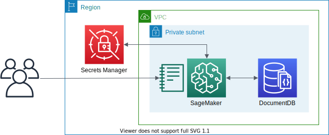

# Amazon DocumentDB with Jupyter Notebooks



This is a sample project for Python development with CDK.

The `cdk.json` file tells the CDK Toolkit how to execute your app.

This project is set up like a standard Python project.  The initialization
process also creates a virtualenv within this project, stored under the `.venv`
directory.  To create the virtualenv it assumes that there is a `python3`
(or `python` for Windows) executable in your path with access to the `venv`
package. If for any reason the automatic creation of the virtualenv fails,
you can create the virtualenv manually.

To manually create a virtualenv on MacOS and Linux:

```
$ python3 -m venv .venv
```

After the init process completes and the virtualenv is created, you can use the following
step to activate your virtualenv.

```
$ source .venv/bin/activate
```

If you are a Windows platform, you would activate the virtualenv like this:

```
% .venv\Scripts\activate.bat
```

Once the virtualenv is activated, you can install the required dependencies.

```
$ pip install -r requirements.txt
```

At this point you can now synthesize the CloudFormation template for this code.

```
$ export CDK_DEFAULT_ACCOUNT=$(aws sts get-caller-identity --query Account --output text)
$ export CDK_DEFAULT_REGION=$(aws configure get region)
$ cdk synth --all
```

Use `cdk deploy` command to create the stack shown above,

```
$ cdk deploy --all
```

then load and run the [Jupyter notebook](https://github.com/aws-samples/documentdb-sagemaker-example/blob/main/script.ipynb) in your Sagemaker instance.

## Useful commands

 * `cdk ls`          list all stacks in the app
 * `cdk synth`       emits the synthesized CloudFormation template
 * `cdk deploy`      deploy this stack to your default AWS account/region
 * `cdk diff`        compare deployed stack with current state
 * `cdk docs`        open CDK documentation

Enjoy!

## Troubleshooting

 When you run the [Jupyter notebook](https://github.com/aws-samples/documentdb-sagemaker-example/blob/main/script.ipynb) in your Sagemaker instance, you need to change some codes
 (1) You should assign `secret_name` variable to your AWS Secrets to access DocumentDB
  ```python
  # Get DocumentDB credentials stored in Secrets Manager
  def get_secret(secret_name):

      # Create a Secrets Manager client
      session = boto3.session.Session()
      client = session.client(
          service_name='secretsmanager',
          region_name=session.region_name
      )

      get_secret_value_response = client.get_secret_value(SecretId=secret_name)
      secret = get_secret_value_response['SecretString']

      return json.loads(secret)
  ```

 You can find AWS Secrets as runing the following codes.
  ```python
  $ python
  Python 3.9.1 (default, Dec 17 2020, 03:41:37)
  [Clang 12.0.0 (clang-1200.0.32.27)] on darwin
  Type "help", "copyright", "credits" or "license" for more information.
  >>> import boto3
  >>> cf_client = boto3.client('cloudformation', region_name='us-east-1')
  >>> cf_stackname = 'AmazonDocDBStack'
  >>> response = cf_client.describe_stacks(StackName=cf_stackname)
  >>> outputs = response["Stacks"][0]["Outputs"]
  >>> secrets = [e for e in outputs if e['OutputKey'] == 'DocDBSecret'][0]
  >>> secrets
  {'OutputKey': 'DocDBSecret', 'OutputValue': 'DocDBSecret3B817195-ZPE9J6tmnLtd', 'ExportName': 'DocDBSecret'}
  >>> secret_name = secrets['OutputValue']
  >>> secret_name
  'DocDBSecret3B817195-ZPE9J6tmnLtd'
  >>>
  ```
 (2) You should apply URL encoding for DocumentDB password. DocumentDB password has been genenerated by CloudFormation so that it may contain invalid characters in URL.
  + **As-Is**
    ```python
    # Sets up a connection to the Amazon DocumentDB database
    secret = get_secret(secret_name)

    db_username = secret['username']
    db_password = secret['password']
    db_port = secret['port']
    db_host = secret['host']
    ```

  + **To-Be**
    ```python
    # Sets up a connection to the Amazon DocumentDB database
    secret = get_secret(secret_name)

    import urllib
    db_username = secret['username']
    db_password = urllib.parse.quote_plus(secret['password'])
    db_port = secret['port']
    db_host = secret['host']
    ```

## References

 - [Analyzing data stored in Amazon DocumentDB (with MongoDB compatibility) using Amazon Sagemaker](https://aws.amazon.com/blogs/machine-learning/analyzing-data-stored-in-amazon-documentdb-with-mongodb-compatibility-using-amazon-sagemaker/)
 - [github.com/aws-samples/documentdb-sagemaker-example](https://github.com/aws-samples/documentdb-sagemaker-example)
 - [Amazon DocumentDB (with MongoDB compatibility) samples](https://github.com/aws-samples/amazon-documentdb-samples/)
 - [Vector search for Amazon DocumentDB](https://docs.aws.amazon.com/documentdb/latest/developerguide/vector-search.html)
