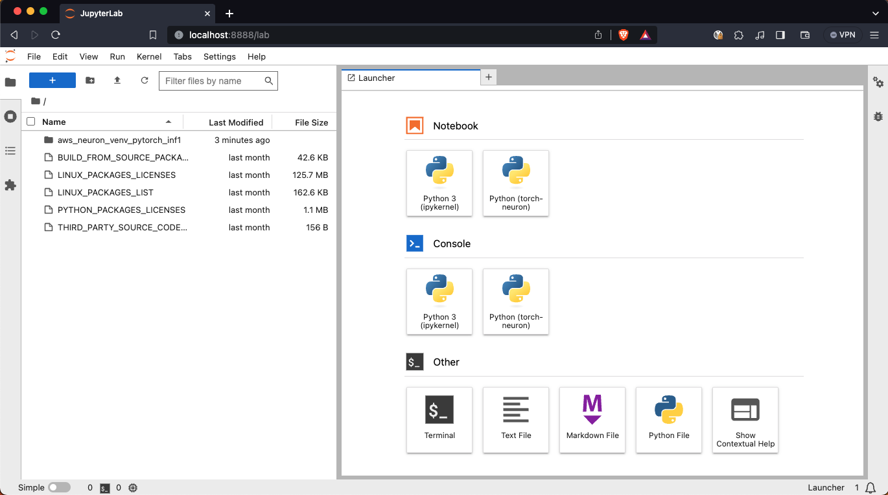

# Using Amazon Deep Learning AMI (DLAMI) with AWS Neuron

The `cdk.json` file tells the CDK Toolkit how to execute your app.

This project is set up like a standard Python project.  The initialization
process also creates a virtualenv within this project, stored under the `.venv`
directory.  To create the virtualenv it assumes that there is a `python3`
(or `python` for Windows) executable in your path with access to the `venv`
package. If for any reason the automatic creation of the virtualenv fails,
you can create the virtualenv manually.

To manually create a virtualenv on MacOS and Linux:

```
$ python3 -m venv .venv
```

After the init process completes and the virtualenv is created, you can use the following
step to activate your virtualenv.

```
$ source .venv/bin/activate
```

If you are a Windows platform, you would activate the virtualenv like this:

```
% .venv\Scripts\activate.bat
```

Once the virtualenv is activated, you can install the required dependencies.

```
(.venv) $ pip install -r requirements.txt
```

To add additional dependencies, for example other CDK libraries, just add
them to your `setup.py` file and rerun the `pip install -r requirements.txt`
command.

Before synthesizing the CloudFormation, you should set approperly the cdk context configuration file, `cdk.context.json`.

For example:

```
{
  "instance_type": "g5.xlarge",
  "dlami_name": "Deep Learning AMI GPU PyTorch 1.13.1 (Ubuntu 20.04) 20230818",
  "vpc_name": "default"
}
```

At this point, you can now synthesize the CloudFormation template for this code.

<pre>
(.venv) $ export CDK_DEFAULT_ACCOUNT=$(aws sts get-caller-identity --query Account --output text)
(.venv) $ export CDK_DEFAULT_REGION=$(aws configure get region)
(.venv) $ cdk synth --all
</pre>

Use `cdk deploy` command to create all the stacks at once.

<pre>
(.venv) $ cdk deploy --all
</pre>


## Set up to access Jupyter Lab Server on Local MacOS PC

The deployment might take about `10` minutes.<br/>
After then, you can access to the jupyter server through the browser by the following instructions.

#### Configure a Linux or macOS Client

1. Open a terminal on your local PC.
2. Connect the EC2 instance.<br/>
   You can connect to an EC2 instance using the EC2 Instance Connect CLI.<br/>
   Install `ec2instanceconnectcli` python package and Use the **mssh** command with the instance ID as follows.

   <pre>
   $ sudo pip install ec2instanceconnectcli
   $ mssh -r {<i>region (i.e., us-east-1)</i>} ubuntu@<i>i-001234a4bf70dec41EXAMPLE</i> # <i>ubuntu</i>: Ubuntu Linux's user name
   </pre>

#### Run Jupyter Lab on the DLAMI EC2 Instance

3. Set up Neuron by following the [AWS Neuron Setup Guide](https://awsdocs-neuron.readthedocs-hosted.com/en/latest/general/setup/index.html)<br/>
   For example, in order to set up PyTorch Neuron(`torch-neuron`) for Amazon `Inf1` on **Ubuntu 20 (DAMLI Pytorch AMI)**, see the [**PyTorch Neuron (`torch-neuron`) Setup on Ubuntu 20 with DLAMI Base** guide](https://awsdocs-neuron.readthedocs-hosted.com/en/latest/general/setup/neuron-setup/pytorch/neuron/ubuntu/torch-neuron-ubuntu20-base-dlami.html#setup-torch-neuron-u20-base-dlami)

4. Run Jupyter Lab by running the command:
   <pre>
   $ mssh -r {<i>region (i.e., us-east-1)</i>} ubuntu@<i>i-001234a4bf70dec41EXAMPLE</i>
   =============================================================================
       __|  __|_  )
       _|  (     /   Deep Learning AMI GPU PyTorch 1.13.1 (Ubuntu 20.04)
      ___|\___|___|
   =============================================================================

   Welcome to Ubuntu 20.04.6 LTS (GNU/Linux 5.15.0-1041-aws x86_64v)
   ...
   ubuntu@ip-172-31-13-101:~$ python3.8 -m venv aws_neuron_venv_pytorch_inf1
   ubuntu@ip-172-31-13-101:~$ source aws_neuron_venv_pytorch_inf1/bin/activate
   (aws_neuron_venv_pytorch_inf1) ubuntu@ip-172-31-13-101:~$ jupyter lab --no-browser
   ...
   [I 2023-10-14 13:19:42.355 ServerApp] Use Control-C to stop this server and shut down all kernels (twice to skip confirmation).
   [C 2023-10-14 13:19:42.357 ServerApp]

      To access the server, open this file in a browser:
         file:///home/ubuntu/.local/share/jupyter/runtime/jpserver-36968-open.html
      Or copy and paste one of these URLs:
         http://localhost:8888/lab?token=168f50883c5c5a78cca01b2d436f0b79e6446d16394276a7
         http://127.0.0.1:8888/lab?token=168f50883c5c5a78cca01b2d436f0b79e6446d16394276a7
   [I 2023-10-14 13:19:42.373 ServerApp] Skipped non-installed server(s): bash-language-server, dockerfile-language-server-nodejs, javascript-typescript-langserver, jedi-language-server, julia-language-server, pyright, python-language-server, python-lsp-server, r-languageserver, sql-language-server, texlab, typescript-language-server, unified-language-server, vscode-css-languageserver-bin, vscode-html-languageserver-bin, vscode-json-languageserver-bin, yaml-language-server
   </pre>

#### Access Jupyter Lab on the local PC

5. Open another terminal on your local PC and do ssh tunneling by running the command:
   <pre>
   $ mssh -r {<i>region (i.e., us-east-1)</i>} ubuntu@<i>i-001234a4bf70dec41EXAMPLE</i> -N -L 8888:localhost:8888
   </pre>
6. In the address bar of your browser, copy and paste one of the URLs shown in the console when launching jupyter lab.<br/>
   For example, `http://localhost:8888/lab?token=168f50883c5c5a78cca01b2d436f0b79e6446d16394276a7`
   

#### Compile the model for AWS Inferentia with NeuronSDK

7. If you want to compile the model for AWS Inferentia with PyTorch Neuron (`torch-neuron`), refer to the [aws-neuron-samples/torch-neuron](https://github.com/aws-neuron/aws-neuron-samples/tree/master/torch-neuron)


## Clean Up

Delete the CloudFormation stacks by running the below command.

```
(.venv) $ cdk destroy --all
```


## Useful commands

 * `cdk ls`          list all stacks in the app
 * `cdk synth`       emits the synthesized CloudFormation template
 * `cdk deploy`      deploy this stack to your default AWS account/region
 * `cdk diff`        compare deployed stack with current state
 * `cdk docs`        open CDK documentation

Enjoy!


## References

 * [Release Notes for Amazon DLAMI](https://docs.aws.amazon.com/dlami/latest/devguide/appendix-ami-release-notes.html)
   * Query AMI-ID with AWSCLI (example region is `us-east-1`):
     <pre>
     $ aws ec2 describe-images --region us-east-1 --owners amazon --filters 'Name=name,Values=Deep Learning AMI GPU PyTorch 1.13.? (Ubuntu 20.04) ????????' 'Name=state,Values=available' --query 'reverse(sort_by(Images, &CreationDate))[:1].Name'
     </pre>
 * [AWS Neuron Documentation](https://awsdocs-neuron.readthedocs-hosted.com/en/latest/index.html)
 * [Using the DLAMI with AWS Neuron](https://docs.aws.amazon.com/dlami/latest/devguide/tutorial-inferentia-using.html)
   * [Using PyTorch-Neuron and the AWS Neuron Compiler](https://docs.aws.amazon.com/dlami/latest/devguide/tutorial-inferentia-pytorch-neuron.html)
 * [(GitHub) PyTorch Neuron (torch-neuron) Samples for AWS Inf1](https://github.com/aws-neuron/aws-neuron-samples/tree/master/torch-neuron)
 * [SageMaker Examples - Get started with model compilation with Neo](https://sagemaker-examples.readthedocs.io/en/latest/sagemaker_neo_compilation_jobs/index.html)
 * [Connect using the EC2 Instance Connect CLI](https://docs.aws.amazon.com/AWSEC2/latest/UserGuide/ec2-instance-connect-methods.html#ec2-instance-connect-connecting-ec2-cli)
   <pre>
   $ sudo pip install ec2instanceconnectcli
   $ mssh --region us-east-1 ec2-user@i-001234a4bf70dec41EXAMPLE # <i>ec2-user</i>: Amazon Linux's user name
   </pre>
 * [[Solved] Working with Jupyter notebook on Remote server – on Mac and Windows: Connection refused?](https://ctcoding.wordpress.com/2019/10/19/working-with-jupyter-notebook-on-remote-server-on-mac-and-windows/)
