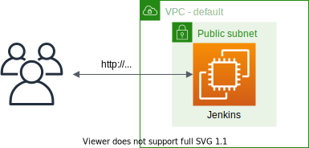

# Jenkins on Amazon EC2



This is a project for Python development with CDK.

The `cdk.json` file tells the CDK Toolkit how to execute your app.

This project is set up like a standard Python project.  The initialization
process also creates a virtualenv within this project, stored under the `.venv`
directory.  To create the virtualenv it assumes that there is a `python3`
(or `python` for Windows) executable in your path with access to the `venv`
package. If for any reason the automatic creation of the virtualenv fails,
you can create the virtualenv manually.

To manually create a virtualenv on MacOS and Linux:

```
$ python3 -m venv .venv
```

After the init process completes and the virtualenv is created, you can use the following
step to activate your virtualenv.

```
$ source .venv/bin/activate
```

If you are a Windows platform, you would activate the virtualenv like this:

```
% .venv\Scripts\activate.bat
```

Once the virtualenv is activated, you can install the required dependencies.

```
(.venv) $ pip install -r requirements.txt
```

At this point you can now synthesize the CloudFormation template for this code.

```
(.venv) $ cdk synth --all
```

If your VPC is created outside your CDK app, you can use `Vpc.fromLookup()`.
The CDK CLI will search for the specified VPC in the the stack’s region and account,
and import the subnet configuration.

To import an existing VPC, you should specify the following environment variables.

```
(.venv) $ export CDK_DEFAULT_ACCOUNT=$(aws sts get-caller-identity --query Account --output text)
(.venv) $ export CDK_DEFAULT_REGION=$(aws configure get region)
```

If you pass context variable such as `vcp_name=<your vpc name>` (e.g. `vpc_name='default'`), you can use the existing VPC.

<pre>
(.venv) $ cdk synth -c vpc_name='default' --all
</pre>

Use `cdk deploy` command to create the stack shown above.

<pre>
(.venv) $ cdk deploy --all
</pre>

To add additional dependencies, for example other CDK libraries, just add
them to your `setup.py` file and rerun the `pip install -r requirements.txt`
command.

## Set up to access Jenkins Server on Local MacOS PC

The deployment might take about `10` minutes.<br/>
After then, you can access to the Jenkins server through the browser by the following instructions.

#### Configure a Linux or macOS Client

1. Open a terminal on your local PC.
2. Connect the EC2 instance.<br/>
   You can connect to an EC2 instance using the EC2 Instance Connect CLI.<br/>
   Install `ec2instanceconnectcli` python package and Use the **mssh** command with the instance ID as follows.

   <pre>
   $ sudo pip install ec2instanceconnectcli
   $ mssh -r {<i>region (i.e., us-east-1)</i>} ec2-user@<i>i-001234a4bf70dec41EXAMPLE</i> # <i>ec-user</i>: Amazon Linux's user name
   </pre>

## Configure Jenkins

This project installs Jenkins on an Amazon EC2 instance with the following Amazon Linux
<pre>
[ec2-user ~]$ cat /etc/*release
NAME="Amazon Linux"
VERSION="2"
ID="amzn"
ID_LIKE="centos rhel fedora"
VERSION_ID="2"
PRETTY_NAME="Amazon Linux 2"
ANSI_COLOR="0;33"
CPE_NAME="cpe:2.3:o:amazon:amazon_linux:2"
HOME_URL="https://amazonlinux.com/"
Amazon Linux release 2 (Karoo)
</pre>

Jenkins is now installed and running on your EC2 instance. To configure Jenkins:
 * Connect to http://<your_server_public_DNS>:80 from your favorite browser. You will be able to access Jenkins through its management interface:
   <div>
     
   </div>
 * For more details, see [Tutorial for installing Jenkins on AWS](https://www.jenkins.io/doc/tutorials/tutorial-for-installing-jenkins-on-AWS/#configure-jenkins)

## Recommended Jenkins Plugins

| Plugin name | Version |
|-------------|---------|
| git | 4.10.2 |
| job-dsl | 1.78.3 |
| pipeline | 2.6 |
| pipeline-aws | 1.43 |
| CloudBees AWS Credentials for the Jenkins plugin | 1.33 |

## Clean Up

Delete the CloudFormation stacks by running the below command.

```
(.venv) $ cdk destroy --all
```

## Useful commands

 * `cdk ls`          list all stacks in the app
 * `cdk synth`       emits the synthesized CloudFormation template
 * `cdk deploy`      deploy this stack to your default AWS account/region
 * `cdk diff`        compare deployed stack with current state
 * `cdk docs`        open CDK documentation

Enjoy!

## References

 * [Tutorial for installing Jenkins on AWS](https://www.jenkins.io/doc/tutorials/tutorial-for-installing-jenkins-on-AWS/#configure-jenkins)
 * [AWS EC2에 Jenkins 설치하기 (2021-01-12)](https://velog.io/@yundleyundle/AWS-EC2%EC%97%90-Jenkins-%EC%84%A4%EC%B9%98%ED%95%98%EA%B8%B0)
 * [Create Amazon SageMaker projects using third-party source control and Jenkins (2021-08-17)](https://aws.amazon.com/blogs/machine-learning/create-amazon-sagemaker-projects-using-third-party-source-control-and-jenkins/)
 * [Amazon Corretto 8 Installation Instructions for Amazon Linux 2](https://docs.aws.amazon.com/corretto/latest/corretto-8-ug/amazon-linux-install.html)
 * [Amazon Corretto 11 Installation Instructions for Amazon Linux 2](https://docs.aws.amazon.com/corretto/latest/corretto-11-ug/amazon-linux-install.html)
 * [Amazon Corretto Documentation](https://docs.aws.amazon.com/corretto/index.html)
 * [Connect using the EC2 Instance Connect CLI](https://docs.aws.amazon.com/AWSEC2/latest/UserGuide/ec2-instance-connect-methods.html#ec2-instance-connect-connecting-ec2-cli)
   <pre>
   $ sudo pip install ec2instanceconnectcli
   $ mssh --region us-east-1 ec2-user@i-001234a4bf70dec41EXAMPLE # <i>ec2-user</i>: Amazon Linux's user name
   </pre>

