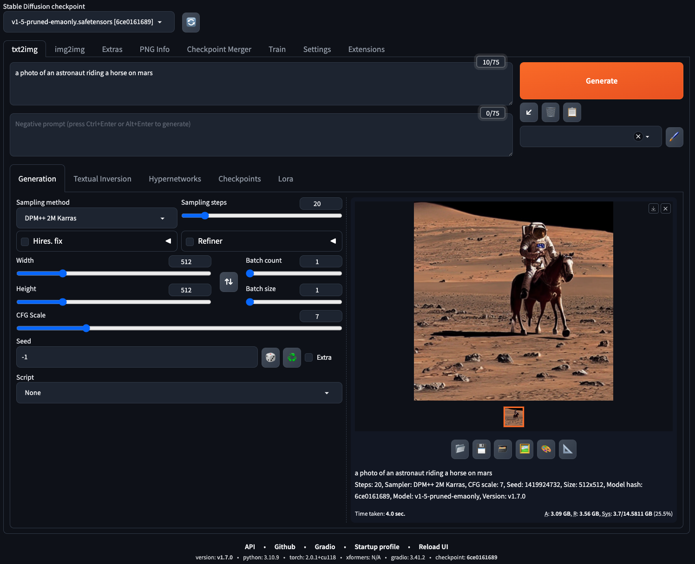

# Creating Stabel Diffusion WebUI Server (AUTOMATIC1111) using Amazon Deep Learning AMI (DLAMI)

The `cdk.json` file tells the CDK Toolkit how to execute your app.

This project is set up like a standard Python project. The initialization
process also creates a virtualenv within this project, stored under the `.venv`
directory.  To create the virtualenv it assumes that there is a `python3`
(or `python` for Windows) executable in your path with access to the `venv`
package. If for any reason the automatic creation of the virtualenv fails,
you can create the virtualenv manually.

To manually create a virtualenv on MacOS and Linux:

```
$ python3 -m venv .venv
```

After the init process completes and the virtualenv is created, you can use the following
step to activate your virtualenv.

```
$ source .venv/bin/activate
```

If you are a Windows platform, you would activate the virtualenv like this:

```
% .venv\Scripts\activate.bat
```

Once the virtualenv is activated, you can install the required dependencies.

```
(.venv) $ pip install -r requirements.txt
```

Before to synthesize the CloudFormation template for this code, you should update `cdk.context.json` file.

For example,

<pre>
{
  "vpc_name": "default",
  "sd_webui_instance_type": "g4dn.2xlarge",
  "dlami_name": "Deep Learning Proprietary Nvidia Driver AMI GPU PyTorch 2.0.1 (Amazon Linux 2) 20240206",
  "ec2_key_pair_name": "<i>your-ec2-key-pair-name(exclude .pem extension)</i>"
}
</pre>

Now you are ready to synthesize the CloudFormation template for this code.

<pre>
(.venv) $ cdk synth --all
</pre>

> :information_source: You can find out the latest Deep learning AMI by runing the following command:
<pre>
  aws ec2 describe-images --region <i>us-east-1</i> \
      --owners amazon \
      --filters 'Name=name,Values=Deep Learning Proprietary Nvidia Driver AMI GPU PyTorch 2.0.1 (Amazon Linux 2) ????????' 'Name=state,Values=available' \
      --query 'reverse(sort_by(Images, &CreationDate))[:1].Name'
</pre>

Use `cdk deploy` command to create the stack shown above.

<pre>
(.venv) $ cdk deploy --all
</pre>

Or, we can provision each CDK stack one at a time like this:

```
(.venv) $ cdk list
SDWebUIonDLAMIVpcStack
SDWebUIonDLAMIStack

(.venv) $ cdk deploy SDWebUIonDLAMIVpcStack

(.venv) $ cdk deploy SDWebUIonDLAMIStack
```

To add additional dependencies, for example other CDK libraries, just add
them to your `setup.py` file and rerun the `pip install -r requirements.txt`
command.

## Connect to the Stable Diffusion WebUI server

1. Find out the Stable Diffusion WebUI URL by running the following command:
   ```
   $ aws cloudformation describe-stacks \
        --stack-name SDWebUIonDLAMIStack | \
        jq -r '.Stacks[0].Outputs | .[] | select(.OutputKey | endswith("StableDiffusionWebUIURL")) | .OutputValue'
   ```
2. In the address bar of your browser, type the URL above, or click on the link.
   

## Clean Up

Delete the CloudFormation stacks by running the below command.

```
(.venv) $ cdk destroy --force --all
```

## Useful commands

 * `cdk ls`          list all stacks in the app
 * `cdk synth`       emits the synthesized CloudFormation template
 * `cdk deploy`      deploy this stack to your default AWS account/region
 * `cdk diff`        compare deployed stack with current state
 * `cdk docs`        open CDK documentation

Enjoy!

## References

 * [Extension for Stable Diffusion on AWS](https://awslabs.github.io/stable-diffusion-aws-extension/en/) - The [Extension for Stable Diffusion on Amazon Web Services solution](https://aws.amazon.com/campaigns/aigc/solutions/stable-diffusion-aws-extension/) helps customers migrate their existing Stable Diffusion model training, inference, and finetuning workloads from on-premises servers to Amazon SageMaker using extension and CloudFormation template.
   * [Generative AI - Stable Diffusion on Amazon SageMaker Workshop](https://catalog.us-east-1.prod.workshops.aws/workshops/d9ca179a-3a36-4822-9f80-0b3ffcc26f37/en-US)
 * [Release Notes for Amazon DLAMI](https://docs.aws.amazon.com/dlami/latest/devguide/appendix-ami-release-notes.html)
   * Query AMI-ID with AWSCLI (example region is `us-east-1`):
     <pre>
     aws ec2 describe-images --region us-east-1 \
         --owners amazon \
         --filters 'Name=name,Values=Deep Learning AMI (Amazon Linux 2) Version ??.?' 'Name=state,Values=available' \
         --query 'reverse(sort_by(Images, &CreationDate))[:1].Name'
     </pre>
 * [(Open Source) Stable Diffusion Web UI](https://github.com/AUTOMATIC1111/stable-diffusion-webui.git) - A web interface for Stable Diffusion, implemented using Gradio library
 * [Stable Diffusion Prompt: a Definitive guide](https://stable-diffusion-art.com/prompt-guide/)
 * [How can I send user-data output to the console logs on an EC2 instance running Amazon Linux or Amazon Linux 2?](https://aws.amazon.com/premiumsupport/knowledge-center/ec2-linux-log-user-data/)
   * The following is the line that redirects the user-data output:
     ```
     exec > >(tee /var/log/user-data.log|logger -t user-data -s 2>/dev/console) 2>&1
     ```
 * [How to Specify AWS EC2 Root Volume Size with CDK](https://davidagood.com/aws-ec2-cdk-specify-root-volume-size/)
 * [(AWS re:Post) How do I set the properties of a root volume for an Amazon EC2 instance that I created using an AWS CloudFormation template?](https://repost.aws/knowledge-center/cloudformation-root-volume-property)
