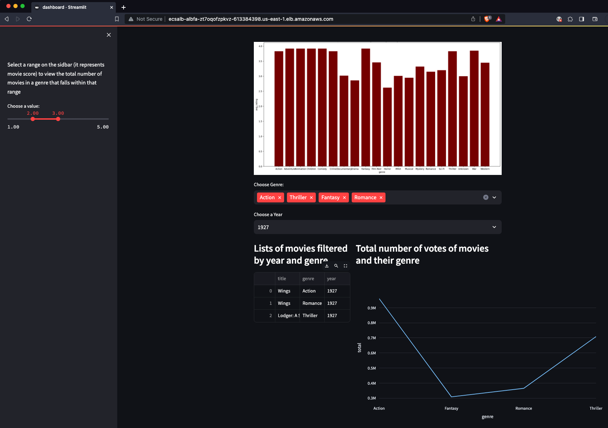

# Data Dashboard with Streamlit and ECS Application Load Balanced Services


This is an ECS Application Load Balanced Services project for CDK development with Python.

The `cdk.json` file tells the CDK Toolkit how to execute your app.

This project is set up like a standard Python project.  The initialization
process also creates a virtualenv within this project, stored under the `.venv`
directory.  To create the virtualenv it assumes that there is a `python3`
(or `python` for Windows) executable in your path with access to the `venv`
package. If for any reason the automatic creation of the virtualenv fails,
you can create the virtualenv manually.

To manually create a virtualenv on MacOS and Linux:

```
$ python3 -m venv .venv
```

After the init process completes and the virtualenv is created, you can use the following
step to activate your virtualenv.

```
$ source .venv/bin/activate
```

If you are a Windows platform, you would activate the virtualenv like this:

```
% .venv\Scripts\activate.bat
```

Once the virtualenv is activated, you can install the required dependencies.

```
(.venv) $ pip install -r requirements.txt
```

At this point you can now synthesize the CloudFormation template for this code.

```
(.venv) $ cdk synth --all
```

To add additional dependencies, for example other CDK libraries, just add
them to your `setup.py` file and rerun the `pip install -r requirements.txt`
command.

Now let's try to deploy.

### Listing all CDK Stacks

```
(.venv) $ cdk list
ECSAlbFargateServiceVpcStack
AuroraMySQLServerlessV2Stack
BastionHostStack
ECSClusterStack
ECSTaskStack
ECSNlbFargateServiceStack
ECSAlbFargateServiceStack
```

### (Step 1) Creating Aurora MySQL cluster

```
(.venv) $ cdk deploy --require-approval never \
                     ECSAlbFargateServiceVpcStack \
                     AuroraMySQLServerlessV2Stack \
                     BastionHostStack
```

### (Step 2) Create a sample database and tables

In order to set up the Aurora MySQL, you need to connect the Aurora MySQL cluster on an EC2 Bastion host.

 1. Connect to the Aurora cluster writer node.

     <pre>
     $ BASTION_HOST_ID=$(aws cloudformation describe-stacks --stack-name <i>BastionHostStack</i> | jq -r '.Stacks[0].Outputs | .[] | select(.OutputKey | endswith("EC2InstanceId")) | .OutputValue')
     $ ssh -i /path/to/ec2_key_pair_name.pem ec2-user@${BASTION_HOST_ID}
     [ec2-user@ip-172-31-7-186 ~]$ mysql -h<i>db-cluster-name.cluster-xxxxxxxxxxxx.region-name.rds.amazonaws.com</i> -u<i>clusteradmin</i> -p
     Enter password:
     Welcome to the MariaDB monitor.  Commands end with ; or \g.
     Your MySQL connection id is 10
     Server version: 5.7.12-log MySQL Community Server (GPL)

     Copyright (c) 2000, 2018, Oracle, MariaDB Corporation Ab and others.

     Type 'help;' or '\h' for help. Type '\c' to clear the current input statement.

     MySQL [(none)]>
     </pre>

    > :information_source: `BastionHost` is a CDK Stack to create the bastion host.

    > :information_source: You can also connect to an EC2 instance using the EC2 Instance Connect CLI.
    For more information, see [Connect using the EC2 Instance Connect CLI](https://docs.aws.amazon.com/AWSEC2/latest/UserGuide/ec2-instance-connect-methods.html#ec2-instance-connect-connecting-ec2-cli).
    For example,
       <pre>
       $ sudo pip install ec2instanceconnectcli
       $ mssh ec2-user@i-001234a4bf70dec41EXAMPLE # ec2-instance-id
       </pre>
 2. Run the below command to create the sample database named `testdb`.
     <pre>
     MySQL [(none)]> SHOW DATABASES;
     +--------------------+
     | Database           |
     +--------------------+
     | information_schema |
     | mysql              |
     | performance_schema |
     | sys                |
     +--------------------+
     4 rows in set (0.00 sec)

     MySQL [(none)]> CREATE DATABASE IF NOT EXISTS testdb;
     Query OK, 1 row affected (0.01 sec)

     MySQL [(none)]> USE testdb;
     Database changed
     MySQL [testdb]> SHOW TABLES;
     Empty set (0.00 sec)
     </pre>
 3. Also run this to create the sample tables such as `movies`, `movie_ratings`.
     <pre>
     MySQL [testdb]> CREATE TABLE IF NOT EXISTS testdb.movies (
               pkid BIGINT(20) AUTO_INCREMENT,
               movieId INT DEFAULT 0,
               title VARCHAR(128) DEFAULT NULL,
               genre VARCHAR(32) DEFAULT NULL,
               year INT DEFAULT 0,
               PRIMARY KEY(pkid),
               KEY(movieId),
               KEY(year)
           ) ENGINE=InnoDB AUTO_INCREMENT=0;
     Query OK, 0 rows affected, 1 warning (0.04 sec)

     MySQL [testdb]> CREATE TABLE IF NOT EXISTS testdb.movie_ratings (
               pkid BIGINT(20) AUTO_INCREMENT,
               movieId INT DEFAULT 0,
               cnt INT DEFAULT 0,
               avg_rating DOUBLE DEFAULT 0.0,
               PRIMARY KEY(pkid),
               KEY(movieId)
           ) ENGINE=InnoDB AUTO_INCREMENT=0;
     Query OK, 0 rows affected, 1 warning (0.07 sec)

     MySQL [testdb]> SHOW TABLES;
     +------------------+
     | Tables_in_testdb |
     +------------------+
     | movie_ratings    |
     | movies           |
     +------------------+
     1 row in set (0.00 sec)

     MySQL [testdb]>
     </pre>

### (Step 3) Upload movies and mives_ratings into tables

After setting up the Aurora MySQL, come back to the terminal of the bastion host.<br/>
Download a sample data and populate `movies`, `movies_ratings` table by runing `gen_fake_mysql_data.py` script.

<pre>
[ec2-user@ip-172-31-7-186 ~]$ wget https://files.grouplens.org/datasets/movielens/ml-20m.zip
[ec2-user@ip-172-31-7-186 ~]$ unzip ml-20m.zip
[ec2-user@ip-172-31-7-186 ~]$ python3 gen_fake_mysql_data.py \
   --host ${<i>DB_HOST</i>} \
   --user ${<i>DB_USER</i>} \
   --password ${<i>DB_PASSWORD}</i>
</pre>

> :information_source: The dataset is available for download here - https://grouplens.org/datasets/movielens/20m/

### (Step 4) Deploy Dashboard application on ECS Fargate

Before deploy CDK stacks, make sure Docker is runing on your machine.

```
(.venv) $ cdk deploy --require-approval never \
                     ECSClusterStack \
                     ECSTaskStack \
                     ECSAlbFargateServiceStack
```

Once all CDK Stacks have been deployed successfully, youn can find out a data dashboard url by running the following command:
<pre>
aws cloudformation describe-stacks --stack-name <i>ECSAlbFargateServiceStack</i> | jq -r '.Stacks[0].Outputs | .[] | select(.OutputKey | endswith("LoadBalancerDNS")) | .OutputValue'
</pre>

  > :information_source: `ECSAlbFargateServiceStack` is a CDK Stack to create the bastion host.

Then you can access the dashboard through a browser.



## Clean Up

Delete the CloudFormation stack by running the below command.

```
(.venv) $ cdk destroy --force --all
```


## Useful commands

 * `cdk ls`          list all stacks in the app
 * `cdk synth`       emits the synthesized CloudFormation template
 * `cdk deploy`      deploy this stack to your default AWS account/region
 * `cdk diff`        compare deployed stack with current state
 * `cdk docs`        open CDK documentation

Enjoy!


## References

 * [Streamlit](https://streamlit.io/) - Streamlit turns data scripts into shareable web apps in minutes.
 * [Build a Data Dashboard with Streamlit in Python](https://earthly.dev/blog/streamlit-python-dashboard/)
 * [How to build a real-time live dashboard with Streamlit](https://blog.streamlit.io/how-to-build-a-real-time-live-dashboard-with-streamlit/)
 * [MovieLens 20M Dataset](https://grouplens.org/datasets/movielens/20m/)


## Troubleshooting

 * [(Pandas) df to table throw error TypeError: __init__() got multiple values for argument 'schema'](https://stackoverflow.com/questions/75282511/df-to-table-throw-error-typeerror-init-got-multiple-values-for-argument)

   ```
   TypeError: __init__() got multiple values for argument 'schema'
   ```