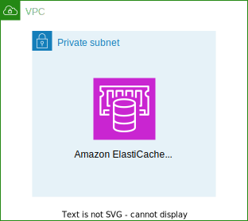

# Amazon ElastiCache Serverless for Redis Cluster



This is a CDK Python project for Amazon ElastiCache Serverless for Redis Cluster.

The `cdk.json` file tells the CDK Toolkit how to execute your app.

This project is set up like a standard Python project.  The initialization
process also creates a virtualenv within this project, stored under the .env
directory.  To create the virtualenv it assumes that there is a `python3`
(or `python` for Windows) executable in your path with access to the `venv`
package. If for any reason the automatic creation of the virtualenv fails,
you can create the virtualenv manually.

To manually create a virtualenv on MacOS and Linux:

```
$ python3 -m venv .env
```

After the init process completes and the virtualenv is created, you can use the following
step to activate your virtualenv.

```
$ source .env/bin/activate
```

If you are a Windows platform, you would activate the virtualenv like this:

```
% .env\Scripts\activate.bat
```

Once the virtualenv is activated, you can install the required dependencies.

```
(.venv) $ pip install -r requirements.txt
```

At this point you can now synthesize the CloudFormation template for this code.

```
(.venv) $ cdk synth --all
```

Use `cdk deploy` command to create the stack shown above.

```
(.venv) $ cdk deploy --all
```

To add additional dependencies, for example other CDK libraries, just add
them to your `setup.py` file and rerun the `pip install -r requirements.txt`
command.

## Clean Up

Delete the CloudFormation stack by running the below command.

```
(.venv) $ cdk destroy --force --all
```

## Verify

After a few minutes, the cluster is running and you can connect using the [Redis command line interface](https://redis.io/topics/rediscli) or any [Redis client](https://redis.io/clients).

ElastiCache Serverless for Redis in this project runs in a virtual private cloud (VPC). You need to EC2 instance or Cloud9 in your VPC to access ElastiCache Serverless. Also either EC2 instance or Cloud9 must be given a proper security group such as `redis-cluster-client-sg` created in the stack above.

### Connect to Amazon MemoryDB using Redis command line interface

<pre>
$ wget https://download.redis.io/releases/redis-7.0.1.tar.gz
$ tar -xzvf redis-7.0.1.tar.gz
$ cd redis-7.0.1
$ make MALLOC=jemalloc BUILD_TLS=yes
$ sudo make install
$ redis-cli -c --tls -h <i>elasticache-serverless-for-redis-endpoint</i> -p 6379
<i>{your-elasticache-serverless-name}</i>.serverless.<i>{region}</i>.cache.amazonaws.com:6379>
<i>{your-elasticache-serverless-name}</i>.serverless.<i>{region}</i>.cache.amazonaws.com:6379> INFO
# Server
redis_version:7.1
redis_mode:cluster
arch_bits:64
run_id:0

# Replication
role:master
connected_slaves:1
slave0:ip=<i>{your-elasticache-serverless-name}</i>.serverless.<i>{region}</i>.cache.amazonaws.com,port=6380,state=online,offset=0,lag=0

# Cluster
cluster_enabled:1
<i>{your-elasticache-serverless-name}</i>.serverless.<i>{region}</i>.cache.amazonaws.com:6379>
</pre>

## Useful commands

 * `cdk ls`          list all stacks in the app
 * `cdk synth`       emits the synthesized CloudFormation template
 * `cdk deploy`      deploy this stack to your default AWS account/region
 * `cdk diff`        compare deployed stack with current state
 * `cdk docs`        open CDK documentation

Enjoy!

## References

 * [AWS re:Invent 2023 - [LAUNCH] Introducing Amazon ElastiCache Serverless (DAT342)](https://youtu.be/YYStP97pbXo?si=z-WvXJ_Kg_0PrmRc)
 * [Amazon ElastiCache Serverless for Redis and Memcached is now available (2023-11-27)](https://aws.amazon.com/blogs/aws/amazon-elasticache-serverless-for-redis-and-memcached-now-generally-available/)
 * [Amazon ElastiCache and Amazon MemoryDB announce support for Valkey (2024-10-08)](https://aws.amazon.com/blogs/database/amazon-elasticache-and-amazon-memorydb-announce-support-for-valkey/)
 * [Get started with Amazon ElastiCache for Valkey (2024-10-08)](https://aws.amazon.com/blogs/database/get-started-with-amazon-elasticache-for-valkey/)
 * [Get started with Amazon MemoryDB for Valkey (2024-10-08)](https://aws.amazon.com/blogs/database/get-started-with-amazon-memorydb-for-valkey/)
 * [Amazon ElastiCache version 8.0 for Valkey brings faster scaling and improved memory efficiency (2024-11-21)](https://aws.amazon.com/blogs/database/amazon-elasticache-version-8-0-for-valkey-brings-faster-scaling-and-improved-memory-efficiency/)
