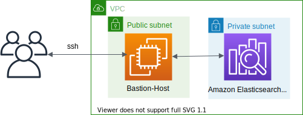
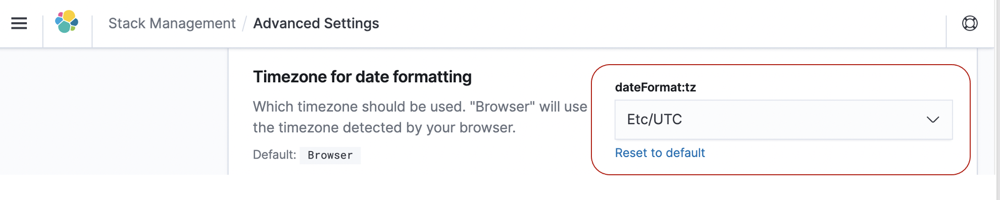

# Amazon Elasticsearch Service



This is a collection of projects for Python development with CDK.

The `cdk.json` file tells the CDK Toolkit how to execute your app.

This project is set up like a standard Python project.  The initialization
process also creates a virtualenv within this project, stored under the .env
directory.  To create the virtualenv it assumes that there is a `python3`
(or `python` for Windows) executable in your path with access to the `venv`
package. If for any reason the automatic creation of the virtualenv fails,
you can create the virtualenv manually.

To manually create a virtualenv on MacOS and Linux:

```
$ python3 -m venv .env
```

After the init process completes and the virtualenv is created, you can use the following
step to activate your virtualenv.

```
$ source .env/bin/activate
```

If you are a Windows platform, you would activate the virtualenv like this:

```
% .env\Scripts\activate.bat
```

Once the virtualenv is activated, you can install the required dependencies.

```
$ pip install -r requirements.txt
```

At this point you can now synthesize the CloudFormation template for this code.

```
$ cdk synth
```

Use `cdk deploy` command to create the stack shown above.

```
$ cdk deploy
```

To add additional dependencies, for example other CDK libraries, just add
them to your `setup.py` file and rerun the `pip install -r requirements.txt`
command.

## A note about Service-Linked Role
Some cluster configurations (e.g VPC access) require the existence of the `AWSServiceRoleForAmazonElasticsearchService` Service-Linked Role.

When performing such operations via the AWS Console, this SLR is created automatically when needed. However, this is not the behavior when using CloudFormation. If an SLR(Service-Linked Role) is needed, but doesn’t exist, you will encounter a failure message simlar to:

<pre>
Before you can proceed, you must enable a service-linked role to give Amazon OpenSearch Service...
</pre>

To resolve this, you need to [create](https://docs.aws.amazon.com/IAM/latest/UserGuide/using-service-linked-roles.html#create-service-linked-role) the SLR. We recommend using the AWS CLI:

```
aws iam create-service-linked-role --aws-service-name es.amazonaws.com
```

## Useful commands

 * `cdk ls`          list all stacks in the app
 * `cdk synth`       emits the synthesized CloudFormation template
 * `cdk deploy`      deploy this stack to your default AWS account/region
 * `cdk diff`        compare deployed stack with current state
 * `cdk docs`        open CDK documentation

Enjoy!

## Remotely access your Amazon Elasticsearch Cluster using SSH tunnel from local machine
1. Generate the new private and public keys `mynew_key` and `mynew_key.pub`, respectively:

   ```
   $ ssh-keygen -t rsa -f mynew_key
   ```

2. To access the Elasticsearch Cluster, add the ssh tunnel configuration to the ssh config file of the personal local PC as follows

    ```
    # Elasticsearch Tunnel
    Host estunnel
        HostName <EC2 Public IP of Bastion Host>
        User ec2-user
        IdentitiesOnly yes
        IdentityFile <Path to SSH Public Key>
        LocalForward 9200 <Elasticsearch Endpoint>:443
    ```

    ex)

    ```
    ~$ ls -1 .ssh/
    config
    mynew_key
    mynew_key.pub

    ~$ tail .ssh/config
    # Elasticsearch Tunnel
    Host estunnel
        HostName 214.132.71.219
        User ubuntu
        IdentitiesOnly yes
        IdentityFile ~/.ssh/mynew_key.pub
        LocalForward 9200 vpc-es-hol-qvwlxanar255vswqna37p2l2cy.us-east-1.es.amazonaws.com:443

    ~$
    ```

3. Use the following AWS CLI command to authorize the user and push the public key to the instance using the send-ssh-public-key command. To support this, you need the latest version of the AWS CLI.

   ex) Bastion Host's instance details
   - Instance ID: `i-0989ec3292613a4f9`
   - Availability Zone: `us-east-1a`
   - Instance OS User: `ec2-user`

   ```
   $ aws ec2-instance-connect send-ssh-public-key --region us-east-1 --instance-id i-0989ec3292613a4f9 --availability-zone us-east-1a --instance-os-user ec2-user --ssh-public-key file://${HOME}/.ssh/mynew_key.pub
   {
     "RequestId": "505f8675-710a-11e9-9263-4d440e7745c6",
     "Success": true
   }
   ```

4. Run `ssh -N estunnel` in Terminal.
5. Connect to `https://localhost:9200/_plugin/kibana/` in a web browser.
6. After selecting **Advanced Settings** from the left sidebar menu, set **Timezone** for date formatting to `Etc/UTC`.
   Since the log creation time of the test data is based on UTC, Kibana’s Timezone is also set to UTC.
   

#### References
- [Windows SSH / Tunnel for Kibana Instructions - Amazon Elasticsearch Service](https://search-sa-log-solutions.s3-us-east-2.amazonaws.com/logstash/docs/Kibana_Proxy_SSH_Tunneling_Windows.pdf)
- [Use an SSH Tunnel to access Kibana within an AWS VPC with PuTTy on Windows](https://amazonmsk-labs.workshop.aws/en/mskkdaflinklab/createesdashboard.html)
- [Amazon OpenSearch Plugins by engine version](https://docs.aws.amazon.com/opensearch-service/latest/developerguide/supported-plugins.html)
- [Supported versions of OpenSearch and Elasticsearch](https://docs.aws.amazon.com/opensearch-service/latest/developerguide/what-is.html#choosing-version)
- [Supported instance types in Amazon OpenSearch Service](https://docs.aws.amazon.com/opensearch-service/latest/developerguide/supported-instance-types.html#latest-gen)

#### Known Issues
- [(aws-elasticsearch): Vpc.fromLookup returns dummy VPC if the L2 elasticsearch.Domain availabilityZoneCount is set to 3](https://github.com/aws/aws-cdk/issues/12078)
  - **What did you expect to happen?**
    The lookup should find the VPC and populate the `cdk.context.json`. The synth should successfully show the resource template with the correct subnets and values.
  - **What actually happened?**
    An error is thrown, "When providing vpc options you need to provide a subnet for each AZ you are using" due to the VPC lookup silently failing and instead giving dummy data.
  - **How to work around this problem**
    > To work around this problem for now, you can temporarily remove the `Domain` definition from the application, run `cdk synth`, and then put it back in. This first `synth` will query the actual VPC details and store them in the `cdk.context.json` file, which will be used from now on, so that the dummy VPC will not be used.
    > (davidhessler@ commented on 29 Dec 2020)

