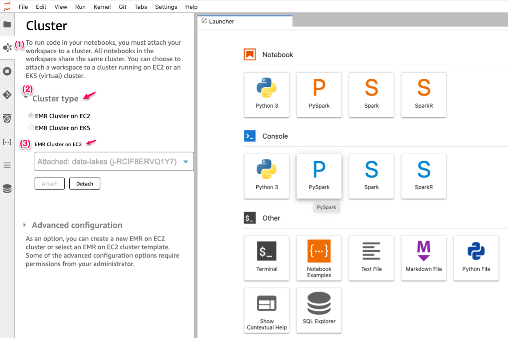

# Amazon EMR Studio CDK Python project!

This is an Amazon EMR Studio project for CDK development with Python.

The `cdk.json` file tells the CDK Toolkit how to execute your app.

This project is set up like a standard Python project.  The initialization
process also creates a virtualenv within this project, stored under the `.venv`
directory.  To create the virtualenv it assumes that there is a `python3`
(or `python` for Windows) executable in your path with access to the `venv`
package. If for any reason the automatic creation of the virtualenv fails,
you can create the virtualenv manually.

To manually create a virtualenv on MacOS and Linux:

```
$ python3 -m venv .venv
```

After the init process completes and the virtualenv is created, you can use the following
step to activate your virtualenv.

```
$ source .venv/bin/activate
```

If you are a Windows platform, you would activate the virtualenv like this:

```
% .venv\Scripts\activate.bat
```

Once the virtualenv is activated, you can install the required dependencies.

```
(.venv) $ pip install -r requirements.txt
```

At this point you can now synthesize the CloudFormation template for this code.

<pre>
(.venv) $ cdk synth \
              -c vpc_name="<i>your-vpc-name</i>" \
              -c emr_studio_name="<i>your-emr-studio-name</i>"
</pre>

To add additional dependencies, for example other CDK libraries, just add
them to your `setup.py` file and rerun the `pip install -r requirements.txt`
command.

Use cdk `deploy command` to create the stack shown above.

<pre>
(.venv) $ cdk deploy --require-approval never \
              -c vpc_name="<i>your-vpc-name</i>" \
              -c emr_studio_name="<i>your-emr-studio-name</i>"
</pre>

For example, 
<pre>
(.venv) $ cdk deploy --require-approval never \
              -c vpc_name="<i>default</i>" \
              -c emr_studio_name="<i>datalake-demo</i>"

EmrStudioStack: building assets...

[0%] start: Building eb5eeb490dccbcd549ae27e0359b16b08361800c8444cf3e4a1c969a0c9c84e2:819320734790-us-east-1
[100%] success: Built eb5eeb490dccbcd549ae27e0359b16b08361800c8444cf3e4a1c969a0c9c84e2:819320734790-us-east-1

EmrStudioStack: assets built

EmrStudioStack: deploying...
[0%] start: Publishing eb5eeb490dccbcd549ae27e0359b16b08361800c8444cf3e4a1c969a0c9c84e2:819320734790-us-east-1
[100%] success: Published eb5eeb490dccbcd549ae27e0359b16b08361800c8444cf3e4a1c969a0c9c84e2:819320734790-us-east-1
...

Outputs:
EmrStudioStack.EmrStudioDefaultS3Location = s3://datalake-demo-emr-studio-us-east-1-a4hzjvb
EmrStudioStack.EmrStudioId = es-KWX8LX799XYDYTL7SAWH75UV
EmrStudioStack.EmrStudioName = datalake-demo
EmrStudioStack.EmrStudioUrl = https://es-KWX8LX799XYDYTL7SAWH75UV.emrstudio-prod.us-east-1.amazonaws.com
</pre>

## Quick Start

After an EMR Studio is successfully created, click EMR Studio Url (check out `EmrStudioUrl` in CloudFormation Outputs section, e.g., https://es-KWX8LX799XYDYTL7SAWH75UV.emrstudio-prod.us-east-1.amazonaws.com).

When you use an EMR Studio, you can create and configure different Workspaces to organize and run notebooks.

Do the following steps to run your notebook.

- **(Step 1)** [Create an EMR Studio Workspace.](https://docs.aws.amazon.com/emr/latest/ManagementGuide/emr-studio-configure-workspace.html#emr-studio-create-workspace)
- **(Step 2)** [Launch a Workspace.](https://docs.aws.amazon.com/emr/latest/ManagementGuide/emr-studio-configure-workspace.html#emr-studio-use-workspace)
- **(Step 3)** Attach Jupyter Notebook to an EMR Cluster up and running.


## Useful commands

 * `cdk ls`          list all stacks in the app
 * `cdk synth`       emits the synthesized CloudFormation template
 * `cdk deploy`      deploy this stack to your default AWS account/region
 * `cdk diff`        compare deployed stack with current state
 * `cdk docs`        open CDK documentation

## References

 * [Use an Amazon EMR Studio](https://docs.aws.amazon.com/emr/latest/ManagementGuide/use-an-emr-studio.html)

Enjoy!
