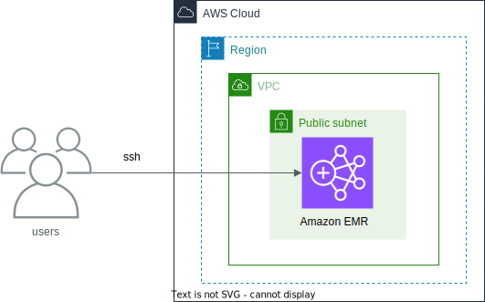

# Amazon EMR CDK Python project!



This is an Amazon EMR project for Python development with CDK.

The `cdk.json` file tells the CDK Toolkit how to execute your app.

This project is set up like a standard Python project.  The initialization
process also creates a virtualenv within this project, stored under the `.venv`
directory.  To create the virtualenv it assumes that there is a `python3`
(or `python` for Windows) executable in your path with access to the `venv`
package. If for any reason the automatic creation of the virtualenv fails,
you can create the virtualenv manually.

To manually create a virtualenv on MacOS and Linux:

```
$ python3 -m venv .venv
```

After the init process completes and the virtualenv is created, you can use the following
step to activate your virtualenv.

```
$ source .venv/bin/activate
```

If you are a Windows platform, you would activate the virtualenv like this:

```
% .venv\Scripts\activate.bat
```

Once the virtualenv is activated, you can install the required dependencies.

```
(.venv) $ pip install -r requirements.txt
```

At this point you can now synthesize the CloudFormation template for this code.
You pass context variable such as `vcp_name=<your vpc name>` (e.g. `vpc_name='default'`) in order to use the existing VPC.

<pre>
(.venv) $ cdk synth -c vpc_name="<i>your-vpc-name</i>"
</pre>

Before deployment, you shuld create the default IAM role `EMR_EC2_DefaultRole` and `EMR_DefaultRole` which can be used when creating the cluster

```
(.venv) $ aws emr create-default-roles
```

Use `cdk deploy` command to create the stack shown above.

<pre>
(.venv) $ cdk deploy -c vpc_name="<i>your-vpc-name</i>"
</pre>

To add additional dependencies, for example other CDK libraries, just add
them to your `setup.py` file and rerun the `pip install -r requirements.txt`
command.

## Connect to the Primary node using SSH

<pre>
$ aws ec2-instance-connect ssh --instance-id {<i>Primary Node Instance Id (e.g., i-073e3a822dd3351a1)</i>}  --os-user hadoop

Last login: Wed Nov 22 06:34:50 2023
   ,     #_
   ~\_  ####_        Amazon Linux 2
  ~~  \_#####\
  ~~     \###|       AL2 End of Life is 2025-06-30.
  ~~       \#/ ___
   ~~       V~' '->
    ~~~         /    A newer version of Amazon Linux is available!
      ~~._.   _/
         _/ _/       Amazon Linux 2023, GA and supported until 2028-03-15.
       _/m/'           https://aws.amazon.com/linux/amazon-linux-2023/

16 package(s) needed for security, out of 24 available
Run "sudo yum update" to apply all updates.

EEEEEEEEEEEEEEEEEEEE MMMMMMMM           MMMMMMMM RRRRRRRRRRRRRRR
E::::::::::::::::::E M:::::::M         M:::::::M R::::::::::::::R
EE:::::EEEEEEEEE:::E M::::::::M       M::::::::M R:::::RRRRRR:::::R
  E::::E       EEEEE M:::::::::M     M:::::::::M RR::::R      R::::R
  E::::E             M::::::M:::M   M:::M::::::M   R:::R      R::::R
  E:::::EEEEEEEEEE   M:::::M M:::M M:::M M:::::M   R:::RRRRRR:::::R
  E::::::::::::::E   M:::::M  M:::M:::M  M:::::M   R:::::::::::RR
  E:::::EEEEEEEEEE   M:::::M   M:::::M   M:::::M   R:::RRRRRR::::R
  E::::E             M:::::M    M:::M    M:::::M   R:::R      R::::R
  E::::E       EEEEE M:::::M     MMM     M:::::M   R:::R      R::::R
EE:::::EEEEEEEE::::E M:::::M             M:::::M   R:::R      R::::R
E::::::::::::::::::E M:::::M             M:::::M RR::::R      R::::R
EEEEEEEEEEEEEEEEEEEE MMMMMMM             MMMMMMM RRRRRRR      RRRRRR

[hadoop@ip-172-31-3-191 ~]$
</pre>

## Clean up

Before cleaning up the emr cluster, you need to tunrn off EMR `Termination protection`.

<pre>
(.venv) $ aws emr modify-cluster-attributes --cluster-id <i>your-emr-cluster-id</i> --no-termination-protected
(.venv) $ cdk destroy --force
</pre>

## Useful commands

 * `cdk ls`          list all stacks in the app
 * `cdk synth`       emits the synthesized CloudFormation template
 * `cdk deploy`      deploy this stack to your default AWS account/region
 * `cdk diff`        compare deployed stack with current state
 * `cdk docs`        open CDK documentation

## References

 * [Application versions in Amazon EMR 6.x releases](https://docs.aws.amazon.com/emr/latest/ReleaseGuide/emr-release-app-versions-6.x.html)
 * [Application versions in Amazon EMR 5.x releases](https://docs.aws.amazon.com/emr/latest/ReleaseGuide/emr-release-app-versions-5.x.html)
 * [Amzon EMR Best Practices Guides](https://aws.github.io/aws-emr-best-practices/)
 * [aws emr create-default-roles](https://docs.aws.amazon.com/cli/latest/reference/emr/create-default-roles.html)
 * [When I create an Amazon EMR cluster, I get an "EMR_DefaultRole is invalid" or "EMR_EC2_DefaultRole is invalid" error](https://aws.amazon.com/premiumsupport/knowledge-center/emr-default-role-invalid/)
 * [aws ec2-instance-connect ssh](https://awscli.amazonaws.com/v2/documentation/api/latest/reference/ec2-instance-connect/ssh.html) - Connect to your EC2 instance using your OpenSSH client.
 * [Spark 3.2.1 Configuration](https://spark.apache.org/docs/3.2.1/configuration.html)

## Further Readings

 * [(video) Modern Data Lake Storage Layers - Hudi vs. Iceberg vs. DeltaLake](https://youtu.be/fryfx0Zg7KA)
 * [An Introduction to Modern Data Lake Storage Layers - Hudi vs. Iceberg vs. DeltaLake](https://dacort.dev/posts/modern-data-lake-storage-layers/)

Enjoy!
