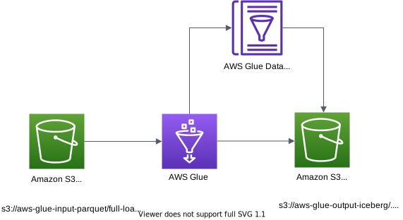

# AWS Glue Job to ingest Change Data Capture(CDC) to Apache Iceberg table in Amazon S3



This is a glue job project for CDK development with Python.

The `cdk.json` file tells the CDK Toolkit how to execute your app.

This project is set up like a standard Python project.  The initialization
process also creates a virtualenv within this project, stored under the `.venv`
directory.  To create the virtualenv it assumes that there is a `python3`
(or `python` for Windows) executable in your path with access to the `venv`
package. If for any reason the automatic creation of the virtualenv fails,
you can create the virtualenv manually.

To manually create a virtualenv on MacOS and Linux:

```
$ python3 -m venv .venv
```

After the init process completes and the virtualenv is created, you can use the following
step to activate your virtualenv.

```
$ source .venv/bin/activate
```

If you are a Windows platform, you would activate the virtualenv like this:

```
% .venv\Scripts\activate.bat
```

Once the virtualenv is activated, you can install the required dependencies.

```
(.venv) $ pip install -r requirements.txt
```

`AWS Glue 4.0` added support for Apache Iceberg natively, so no Apache Iceberg connector for AWS Glue from marketplace is needed.

In case of `AWS Glue 3.0`, before synthesizing the CloudFormation, **you first set up Apache Iceberg connector for AWS Glue to use Apache Iceberg with AWS Glue jobs.** (For more information, see [References](#references) (3), (4), or (5))

Then you should set approperly the cdk context configuration file, `cdk.context.json`.
For example:
<pre>
{
  "vpc_name": "default",
  "glue_assets_s3_bucket_name": "aws-glue-assets-123456789012-us-east-1",
  "glue_job_script_file_name": "employee-details-full-etl.py",
  "glue_job_input_arguments": {
    "--raw_s3_path": "s3://aws-glue-input-parquet-atq4q5u/full-load",
    "--iceberg_s3_path": "s3://aws-glue-output-iceberg-atq4q5u",
    "--database": "human_resources",
    "--partition_key": "department",
    "--primary_key": "emp_no",
    "--table_name": "employee_details"
  }
}
</pre>

:information_source: `--primary_key` option should be set by Iceberg table's primary column name.
:information_source: `--partition_key` option should be set by the colum for Iceberg table partition.

:warning: **You should create a S3 bucket for a glue job script and upload the glue job script file into the s3 bucket.**

At this point you can now synthesize the CloudFormation template for this code.

<pre>
(.venv) $ export CDK_DEFAULT_ACCOUNT=$(aws sts get-caller-identity --query Account --output text)
(.venv) $ export CDK_DEFAULT_REGION=$(aws configure get region)
(.venv) $ cdk synth
</pre>

Use `cdk deploy` command to create the stack shown above.

<pre>
(.venv) $ cdk deploy --require-approval never
</pre>

To add additional dependencies, for example other CDK libraries, just add
them to your `setup.py` file and rerun the `pip install -r requirements.txt`
command.

## Run Test

1. Generate fake parquet files
   <pre>
   (.venv) $ pwd
   ~/my-aws-cdk-examples/glue
   (.venv) $ pip install boto3 Faker fastparquet pyarrow pandas # pip install -r requirements-dev.txt
   (.venv) $ python src/utils/gen_fake_cdc_parquet.py

   [full-load data]
      Op  emp_no       name     department     city  salary              m_time
   0   I     129    Tiffany             IT    Tokyo   49882 1973-10-15 12:32:25
   1   I     204      Oscar             IT  Chicago   93507 2006-03-17 23:21:06
   2   I     252      Julia     Purchasing    Seoul   41204 2007-04-26 12:00:28
   3   I     288       Chad             IT    Tokyo   89084 2002-02-06 13:06:02
   4   I     347      James  Manufacturing      SFO   62261 1988-09-23 20:13:34
   5   I     377     Nathan  Manufacturing       NY   45970 1971-03-03 06:06:03
   6   I     434      Emily          Sales      SFO   20443 1994-03-27 02:22:03
   7   I     558     Edward  Manufacturing    Tokyo   85874 1985-08-18 11:37:01
   8   I     633   Danielle          Sales    Seoul   65974 2020-02-16 20:01:22
   9   I     682       Anne     Purchasing      SFO   36606 2000-07-31 17:35:01
   10  I     695       Gina             IT    Tokyo   93670 2006-02-07 23:05:40
   11  I     695    Richard        Finance    Seoul   37034 1998-12-09 20:18:12
   12  I     924  Frederick          Sales  Chicago   48173 1974-05-01 01:23:15
   13  I     951     Hannah     Purchasing       NY   71689 1993-03-07 04:18:21
   14  I     998  Elizabeth  Manufacturing    Seoul   46318 1971-05-27 14:07:43

   [cdc data]
   Op  emp_no      name     department     city  salary                  m_time
   0  U     377    Nathan       Security   Lisbon   50210 2022-07-11 15:12:31.189
   1  U     347     James            R&D   Sydney   56497 2022-07-11 08:48:31.189
   2  I    8826     Kelly        Finance    Tokyo   52185 2006-06-03 17:46:51.000
   3  U     252     Julia             FC   Sydney   89129 2022-07-11 13:07:31.189
   4  I    8787     Chris             IT  Chicago   30662 1991-08-04 05:10:38.000
   5  D     951    Hannah     Purchasing       NY   71689 2022-07-11 08:48:31.189
   6  I    7339  Jonathan          Sales    Seoul   33806 1972-08-24 22:44:20.000
   7  I    7441  Kristine  Manufacturing    Seoul   87117 1990-08-19 21:13:20.000
   (.venv) $ ls *.parquet
    cdc-load-20220730173650.parquet
    full-load-20220730173650.parquet
   </pre>
2. Create S3 bucket for input and oput data and Copy fake parquet files into input S3 bucket
   <pre>
   (.venv) $ aws s3 mb <i>s3://aws-glue-input-parquet-atq4q5u</i> --region <i>us-east-1</i>
   (.venv) $ aws s3 cp full-load-20220730173650.parquet <i>s3://aws-glue-input-parquet-atq4q5u/full-load/human_resources/employee_details/full-load-20220730173650.parquet</i>
   (.venv) $ aws s3 mb <i>s3://aws-glue-output-iceberg-atq4q5u</i> --region <i>us-east-1</i>
   </pre>
3. Create an Iceberg table using Athena - To create an Iceberg table in the AWS Glue Data Catalog, open the Athena console and run the following queries in sequence:
   <pre>
   -- Create database for the demo
   CREATE DATABASE IF NOT EXISTS human_resources;

   -- Create output Iceberg table with partitioning. Replace the S3 bucket name with your bucket name
   CREATE TABLE human_resources.employee_details_iceberg (
      emp_no bigint,
      name string,
      department string,
      city string,
      salary int,
      m_time timestamp,
      last_applied_date timestamp)
   PARTITIONED BY (`department`)
   LOCATION 's3://aws-glue-output-iceberg-atq4q5u/human_resources/employee_details_iceberg'
   TBLPROPERTIES (
      'table_type'='iceberg'
   );
   </pre>
   :information_source: If you fail to create the table, give Athena users access permissions on `human_resources` through [AWS Lake Formation](https://console.aws.amazon.com/lakeformation/home)
4. Deply glue job using `cdk deploy`
   <pre>
   (.venv) $ ls src/main/python/etl/
    employee-details-cdc-etl.py
   (.venv) $ aws s3 mb <i>s3://aws-glue-assets-123456789012-us-east-1</i> --region <i>us-east-1</i>
   (.venv) $ aws s3 cp employee-details-cdc-etl.py <i>s3://aws-glue-assets-123456789012-us-east-1/scripts/employee-details-cdc-etl.py</i>
   (.venv) $ cdk deploy --require-approval never
   </pre>
5. Make sure the glue job to access the Iceberg tables in the database, otherwise grant the glue job to permissions
   <pre>
   (.venv) $ aws lakeformation grant-permissions \
               --principal DataLakePrincipalIdentifier=arn:aws:iam::<i>account-id</i>:role/<i>GlueJobRole</i> \
               --permissions SELECT INSERT DELETE DESCRIBE ALTER \
               --resource '{ "Table": {"DatabaseName": "<i>human_resources</i>", "TableWildcard": {}} }'
   </pre>
6. Run glue job to fully load data into the Iceberg table
   <pre>
   (.venv) $ aws glue start-job-run --job-name <i>employee-details-cdc-etl</i>
   </pre>
7. Check the output logs of the glue job and results in S3
   <pre>
   (.venv) $ aws s3 ls <i>s3://aws-glue-output-iceberg-atq4q5u/human_resources/employee_details_iceberg/</i>
                           PRE data/
                           PRE metadata/
   </pre>
8. Query the Iceberg table using Athena - After you have successfully run the AWS Glue job, you can validate the output in Athena with the following SQL query:
   <pre>
   SELECT * FROM human_resources.employee_details_iceberg LIMIT 10;
   </pre>
9.  Upload incremental (CDC) data for further processing - After processing the initial full load file, let’s upload the following incremental files, which include insert, update, and delete records.
    <pre>
    (.venv) $ aws s3 cp cdc-load-20220730173650.parquet <i>s3://aws-glue-input-parquet-atq4q5u/cdc-load/human_resources/employee_details/cdc-load-20220730173650.parquet</i>
    </pre>
10. Run the AWS Glue job again to process incremental files
    <pre>
    (.venv) $ aws glue start-job-run \
                --job-name <i>employee-details-cdc-etl</i> \
                --arguments='--raw_s3_path="s3://aws-glue-input-parquet-atq4q5u/cdc-load/human_resources/employee_details/"'
    </pre>
11. Query the Iceberg table using Athena, after incremental data processing - After incremental data processing is complete, you can run the same SELECT statement again
    <pre>
    SELECT * FROM human_resources.employee_details_iceberg LIMIT 10;
    </pre>
12. Query the previous version of data with Iceberg’s time travel feature - You can run the following SQL query in Athena that uses the AS OF TIME statement of Iceberg to query the previous version of the data:
    <pre>
    -- Replace the timestamp with an appropriate one
    SELECT * FROM human_resources.employee_details_iceberg FOR SYSTEM_TIME AS OF TIMESTAMP '2022-07-30 17:36:00'
    </pre>


## Clean Up

Delete the CloudFormation stack by running the below command.

<pre>
(.venv) $ cdk destroy
</pre>

## Useful commands

 * `cdk ls`          list all stacks in the app
 * `cdk synth`       emits the synthesized CloudFormation template
 * `cdk deploy`      deploy this stack to your default AWS account/region
 * `cdk diff`        compare deployed stack with current state
 * `cdk docs`        open CDK documentation

Enjoy!


## References

- (1) [AWS Glue versions](https://docs.aws.amazon.com/glue/latest/dg/release-notes.html): The AWS Glue version determines the versions of Apache Spark and Python that AWS Glue supports.
   | AWS Glue version	| Hudi | Delta Lake	| Iceberg |
   |------------------|------|------------|---------|
   | AWS Glue 3.0	| 0.10.1 | 1.0.0 | 0.13.1 |
   | AWS Glue 4.0	| 0.12.1 | 2.1.0 | 1.0.0  |
- (2) [Migrating AWS Glue jobs to AWS Glue version 4.0 - Appendix C: Connector upgrades](https://docs.aws.amazon.com/glue/latest/dg/migrating-version-40.html#migrating-version-40-appendix-connector)
- (3) [Apache Iceberg Connector for AWS Glue를 이용하여 데이터레이크 CRUD 하기 \(2022-07-08\)](https://aws.amazon.com/ko/blogs/tech/transactional-datalake-using-apache-iceberg-connector-for-aws-glue/)
- (4) [Use the AWS Glue connector to read and write Apache Iceberg tables with ACID transactions and perform time travel \(2022-06-21\)](https://aws.amazon.com/ko/blogs/big-data/use-the-aws-glue-connector-to-read-and-write-apache-iceberg-tables-with-acid-transactions-and-perform-time-travel/)
- (5) [Implement a CDC-based UPSERT in a data lake using Apache Iceberg and AWS Glue \(2022-06-15\)](https://aws.amazon.com/ko/blogs/big-data/implement-a-cdc-based-upsert-in-a-data-lake-using-apache-iceberg-and-aws-glue/)
  - This blog post contains the PySpark script that is expected to deduplicate the input data before merging to the target Iceberg table.
- (6) [Process Apache Hudi, Delta Lake, Apache Iceberg datasets at scale, part 1: AWS Glue Studio Notebook \(2022-07-18\)](https://aws.amazon.com/ko/blogs/big-data/part-1-integrate-apache-hudi-delta-lake-apache-iceberg-datasets-at-scale-aws-glue-studio-notebook/)
- (7) [Apache Iceberg Connector for AWS Glue](https://aws.amazon.com/marketplace/pp/prodview-iicxofvpqvsio)
- (9) [Introduction to AWS Glue and Glue Databrew](https://catalog.us-east-1.prod.workshops.aws/workshops/aaaabcab-5e1e-4bff-b604-781a804763e1/en-US)
- (10) [AWS Glue Immersion day](https://catalog.us-east-1.prod.workshops.aws/workshops/ee59d21b-4cb8-4b3d-a629-24537cf37bb5/en-US)
- (11) [Amazon Athena Workshop - ACID Transactions with Iceberg](https://catalog.us-east-1.prod.workshops.aws/workshops/9981f1a1-abdc-49b5-8387-cb01d238bb78/en-US/90-athena-acid)
- (12) [Querying Iceberg table data and performing time travel](https://docs.aws.amazon.com/athena/latest/ug/querying-iceberg-table-data.html)
- (13) [AWS Lake Formation - Granting Data Catalog permissions using the named resource method](https://docs.aws.amazon.com/lake-formation/latest/dg/granting-cat-perms-named-resource.html)
- (14) [Configuring AWS Glue interactive sessions for Jupyter and AWS Glue Studio notebooks](https://docs.aws.amazon.com/glue/latest/dg/interactive-sessions-magics.html)
- (15) [Troubleshooting errors in AWS Glue](https://docs.aws.amazon.com/glue/latest/dg/glue-troubleshooting-errors.html)
- (16) [Apaceh Iceberg - Spark Writes with SQL (v1.0.0)](https://iceberg.apache.org/docs/1.0.0/spark-writes/)


## Troubleshooting

- When you meet the following error, see [Why does my AWS Glue crawler or ETL job fail with the error "Insufficient Lake Formation permission(s)"?](https://aws.amazon.com/premiumsupport/knowledge-center/glue-insufficient-lakeformation-permissions/)

   <pre>
   An error occurred while calling o100.getCatalogSource. Insufficient Lake Formation permission(s) on <i>your-table-name</i> (Service: AWSGlue; Status Code: 400; Error Code: AccessDeniedException; Request ID: 2623b59f-b5d2-497b-bed6-a7b2bcc32ba8; Proxy: null)
   </pre>
- How do I resolve "MalformedPolicyDocument" errors in AWS CloudFormation?
  <pre>
  PM 1:46:58 | CREATE_FAILED        | AWS::IAM::Policy   | GlueJobRoleDefaultPolicy94EFA0CF IAM resource arn:aws:iam:us-east-1:123456789012:role/GlueJobRole cannot contain region information. (Service: AmazonIdentityManagement; Status Code: 400; Error Code: MalformedPolicyDocument; Request ID: 4e64e3c1-555f-44d1-b7e6-a170514e1ce6; Proxy: null)
   </pre>
   See [cdk.Arn.format: adds region automatically for services not requiring one](https://github.com/aws/aws-cdk/issues/13104)
