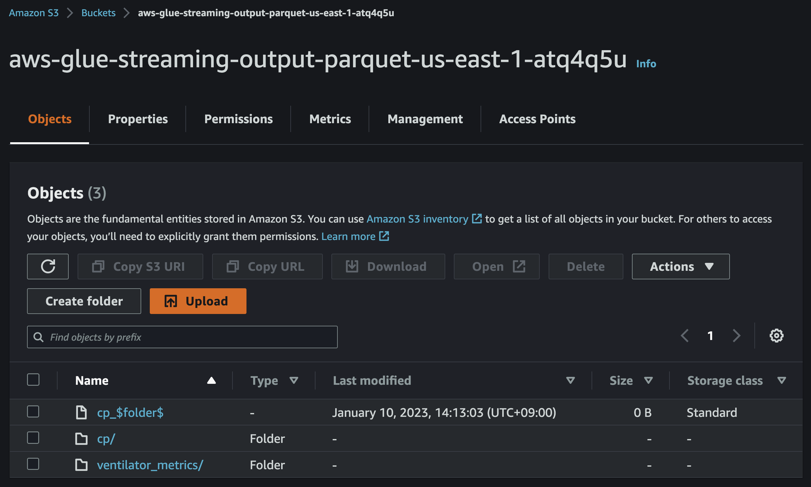

# AWS Glue Streaming ETL Job CDK Python project!


This is an examplary AWS Glue Streaming ETL Job project for CDK development with Python.

This project is based on the AWS Big Data Blog titled ["Crafting serverless stream ETL with AWS Glue"](https://aws.amazon.com/ko/blogs/big-data/crafting-serverless-streaming-etl-jobs-with-aws-glue/) with [aws sample codes](https://github.com/aws-samples/aws-glue-streaming-etl-blog)

In this project, we create a streaming ETL job in AWS Glue that consumes continuously generated ventilator metrics in micro-batches, applies transformations, performs aggregations, and delivers the data to a sink, so the results can be visualized or used in downstream processes. In this streaming ETL architecture, a Python script generates sample ventilator metrics and publishes them as a stream into Kinesis Data Streams.

After ingested to Amazon S3, you can query the data with [Amazon Athena](http://aws.amazon.com/athena) and build visual dashboards using [Amazon QuickSight](https://aws.amazon.com/quicksight).

The `cdk.json` file tells the CDK Toolkit how to execute your app.

This project is set up like a standard Python project.  The initialization
process also creates a virtualenv within this project, stored under the `.venv`
directory.  To create the virtualenv it assumes that there is a `python3`
(or `python` for Windows) executable in your path with access to the `venv`
package. If for any reason the automatic creation of the virtualenv fails,
you can create the virtualenv manually.

To manually create a virtualenv on MacOS and Linux:

```
$ python3 -m venv .venv
```

After the init process completes and the virtualenv is created, you can use the following
step to activate your virtualenv.

```
$ source .venv/bin/activate
```

If you are a Windows platform, you would activate the virtualenv like this:

```
% .venv\Scripts\activate.bat
```

Once the virtualenv is activated, you can install the required dependencies.

```
$ pip install -r requirements.txt
```

At this point you can now synthesize the CloudFormation template for this code.

```
$ cdk synth
```

To add additional dependencies, for example other CDK libraries, just add
them to your `setup.py` file and rerun the `pip install -r requirements.txt`
command.

## Run Test

1. Check the access logs in S3

   After 5~10 minutes, you can see that the access logs have been delivered from **Kinesis Data Streams** to **S3** and stored in a folder structure by year, month, day, and hour.

   

2. Creating and loading a table with partitioned data in Amazon Athena

   Go to [Athena](https://console.aws.amazon.com/athena/home) on the AWS Management console.<br/>
   * (step 1) Create a database

     In order to create a new database called `ventilatordb`, enter the following statement in the Athena query editor
     and click the **Run** button to execute the query.

     <pre>
     CREATE DATABASE IF NOT EXISTS ventilatordb
     </pre>

    * (step 2) Create a table

      Copy the following query into the Athena query editor, replace the `xxxxxxx` in the last line under `LOCATION` with the string of your S3 bucket, and execute the query to create a new table.
      <pre>
      CREATE EXTERNAL TABLE `ventilatordb.ventilators_parquet`(
        `ventilatorid` integer,
        `eventtime` timestamp,
        `serialnumber` string,
        `pressurecontrol` integer,
        `o2stats` integer,
        `minutevolume` integer,
        `manufacturer` string)
      PARTITIONED BY (
        `ingest_year` int,
        `ingest_month` int,
        `ingest_day` int,
        `ingest_hour` int)
      ROW FORMAT SERDE
        'org.apache.hadoop.hive.ql.io.parquet.serde.ParquetHiveSerDe'
      STORED AS INPUTFORMAT
        'org.apache.hadoop.hive.ql.io.parquet.MapredParquetInputFormat'
      OUTPUTFORMAT
        'org.apache.hadoop.hive.ql.io.parquet.MapredParquetOutputFormat'
      LOCATION
        's3://aws-glue-streaming-output-parquet-<i>xxxxx</i>/ventilator_metrics';
      </pre>
      If the query is successful, a table named `ventilators_parquet` is created and displayed on the left panel under the **Tables** section.

      If you get an error, check if (a) you have updated the `LOCATION` to the correct S3 bucket name, (b) you have mydatabase selected under the Database dropdown, and (c) you have `AwsDataCatalog` selected as the **Data source**.

    * (step 3) Load the partition data

      Run the following query to load the partition data.
      <pre>
      MSCK REPAIR TABLE ventilatordb.ventilators_parquet;
      </pre>
      After you run this command, the data is ready for querying.

3. Run test query

   Enter the following SQL statement and execute the query.
   <pre>
   SELECT COUNT(*)
   FROM ventilatordb.ventilators_parquet;
   </pre>

## Useful commands

 * `cdk ls`          list all stacks in the app
 * `cdk synth`       emits the synthesized CloudFormation template
 * `cdk deploy`      deploy this stack to your default AWS account/region
 * `cdk diff`        compare deployed stack with current state
 * `cdk docs`        open CDK documentation

## References

 * [Crafting serverless streaming ETL jobs with AWS Glue](https://aws.amazon.com/ko/blogs/big-data/crafting-serverless-streaming-etl-jobs-with-aws-glue/)
 * [aws-samples/aws-glue-streaming-etl-blog](https://github.com/aws-samples/aws-glue-streaming-etl-blog)
 * [Streaming ETL jobs in AWS Glue](https://docs.aws.amazon.com/glue/latest/dg/add-job-streaming.html)

Enjoy!
