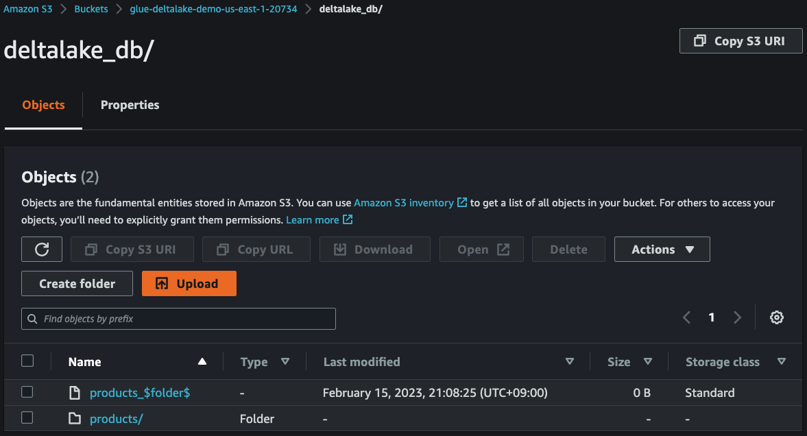
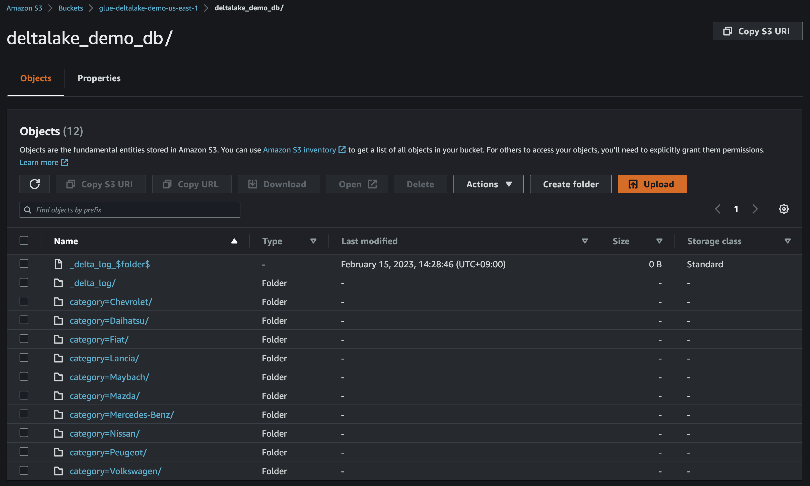
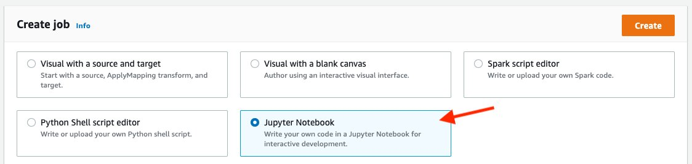
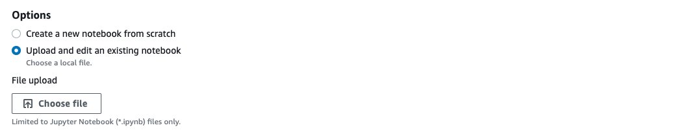
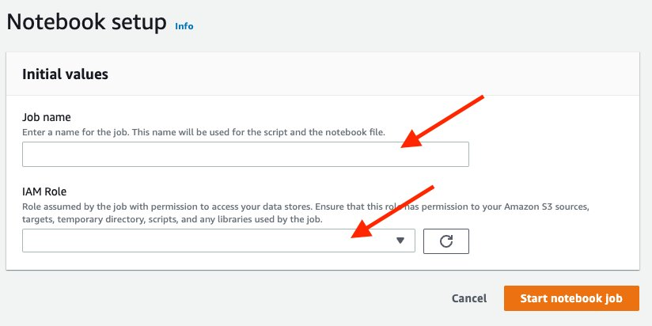

# AWS Glue Streaming ETL Job with Delta Lake CDK Python project!


In this project, we create a streaming ETL job in AWS Glue to integrate [Delta Lake](https://docs.delta.io/latest/index.html) with a streaming use case and create an in-place updatable data lake on Amazon S3.

After ingested to Amazon S3, you can query the data with [Amazon Glue Studio](https://docs.aws.amazon.com/glue/latest/ug/notebook-getting-started.html) or [Amazon Athena](https://docs.aws.amazon.com/athena/latest/ug/delta-lake-tables.html).

This project can be deployed with [AWS CDK Python](https://docs.aws.amazon.com/cdk/api/v2/).

The `cdk.json` file tells the CDK Toolkit how to execute your app.

This project is set up like a standard Python project.  The initialization
process also creates a virtualenv within this project, stored under the `.venv`
directory.  To create the virtualenv it assumes that there is a `python3`
(or `python` for Windows) executable in your path with access to the `venv`
package. If for any reason the automatic creation of the virtualenv fails,
you can create the virtualenv manually.

To manually create a virtualenv on MacOS and Linux:

```
$ python3 -m venv .venv
```

After the init process completes and the virtualenv is created, you can use the following
step to activate your virtualenv.

```
$ source .venv/bin/activate
```

If you are a Windows platform, you would activate the virtualenv like this:

```
% .venv\Scripts\activate.bat
```

Once the virtualenv is activated, you can install the required dependencies.

```
(.venv) $ pip install -r requirements.txt
```

In case of `AWS Glue 3.0`, before synthesizing the CloudFormation, **you first set up Delta Lake connector for AWS Glue to use Delta Lake with AWS Glue jobs.** (For more information, see [References](#references) (2))

Then you should set approperly the cdk context configuration file, `cdk.context.json`.

For example:
<pre>
{
  "kinesis_stream_name": "deltalake-demo-stream",
  "glue_assets_s3_bucket_name": "aws-glue-assets-123456789012-atq4q5u",
  "glue_job_script_file_name": "spark_deltalake_writes_with_sql_merge_into.py",
  "glue_job_name": "streaming_data_from_kds_into_deltalake_table",
  "glue_job_input_arguments": {
    "--catalog": "spark_catalog",
    "--database_name": "deltalake_db",
    "--table_name": "products",
    "--primary_key": "product_id",
    "--partition_key": "category",
    "--kinesis_database_name": "deltalake_stream_db",
    "--kinesis_table_name": "kinesis_stream_table",
    "--starting_position_of_kinesis_iterator": "LATEST",
    "--delta_s3_path": "s3://glue-deltalake-demo-us-east-1/deltalake_db/products",
    "--aws_region": "us-east-1",
    "--window_size": "100 seconds",
    "--extra-jars": "s3://aws-glue-assets-123456789012-atq4q5u/extra-jars/aws-sdk-java-2.17.224.jar",
    "--user-jars-first": "true"
  },
  "glue_connections_name": "deltalake-connector-1_0_0",
  "glue_kinesis_table": {
    "database_name": "deltalake_stream_db",
    "table_name": "kinesis_stream_table",
    "columns": [
      {
        "name": "product_id",
        "type": "string"
      },
      {
        "name": "product_name",
        "type": "string"
      },
      {
        "name": "price",
        "type": "int"
      },
      {
        "name": "category",
        "type": "string"
      },
      {
        "name": "updated_at",
        "type": "string"
      }
    ]
  }
}
</pre>

:information_source: `--primary_key` option should be set by Delta Lake table's primary column name.

:information_source: `--partition_key` option should be set by Delta Lake table's column name for partitioning.

:warning: **You should create a S3 bucket for a glue job script and upload the glue job script file into the s3 bucket.**

At this point you can now synthesize the CloudFormation template for this code.

<pre>
(.venv) $ export CDK_DEFAULT_ACCOUNT=$(aws sts get-caller-identity --query Account --output text)
(.venv) $ export CDK_DEFAULT_REGION=$(aws configure get region)
(.venv) $ cdk synth --all
</pre>

To add additional dependencies, for example other CDK libraries, just add
them to your `setup.py` file and rerun the `pip install -r requirements.txt`
command.

## Run Test

1. Set up **Delta Lake connector for AWS Glue** to use Delta Lake with AWS Glue jobs.
   <pre>
   (.venv) $ cdk deploy GlueDeltaLakeConnection
   </pre>
2. Create a S3 bucket for Delta Lake table
   <pre>
   (.venv) $ cdk deploy DeltaLakeS3Path
   </pre>
3. Create a Kinesis data stream
   <pre>
   (.venv) $ cdk deploy KinesisStreamAsGlueStreamingJobDataSource
   </pre>
4. Define a schema for the streaming data
   <pre>
   (.venv) $ cdk deploy GlueSchemaOnKinesisStream
   </pre>

   Running `cdk deploy GlueSchemaOnKinesisStream` command is like that we create a schema manually using the AWS Glue Data Catalog as the following steps:

   (1) On the AWS Glue console, choose **Data Catalog**.<br/>
   (2) Choose **Databases**, and click **Add database**.<br/>
   (3) Create a database with the name `deltalake_stream_db`.<br/>
   (4) On the **Data Catalog** menu, Choose **Tables**, and click **Add Table**.<br/>
   (5) For the table name, enter `kinesis_stream_table`.<br/>
   (6) Select `deltalake_stream_db` as a database.<br/>
   (7) Choose **Kinesis** as the type of source.<br/>
   (8) Enter the name of the stream.<br/>
   (9) For the classification, choose **JSON**.<br/>
   (10) Define the schema according to the following table.<br/>
    | Column name | Data type | Example |
    |-------------|-----------|---------|
    | product_id	| string | "00001" |
    | product_name | string | "Volkswagen Golf" |
    | price | int | 10370 |
    | category | string | "Volkswagen" |
    | updated_at | string | "2023-06-13 07:24:26" |

   (11) Choose **Finish**

5. Create Database in Glue Data Catalog for Delta Lake table
   <pre>
   (.venv) $ cdk deploy GlueSchemaOnDeltaLake
   </pre>
6. Upload **AWS SDK for Java 2.x** jar file into S3
   <pre>
   (.venv) $ wget https://repo1.maven.org/maven2/software/amazon/awssdk/aws-sdk-java/2.17.224/aws-sdk-java-2.17.224.jar
   (.venv) $ aws s3 cp aws-sdk-java-2.17.224.jar s3://aws-glue-assets-123456789012-atq4q5u/extra-jars/aws-sdk-java-2.17.224.jar
   </pre>
   A Glue Streaming Job might fail because of the following error:
   <pre>
   py4j.protocol.Py4JJavaError: An error occurred while calling o135.start.
   : java.lang.NoSuchMethodError: software.amazon.awssdk.utils.SystemSetting.getStringValueFromEnvironmentVariable(Ljava/lang/String;)Ljava/util/Optional
   </pre>
   We can work around the problem by starting the Glue Job with the additional parameters:
   <pre>
   --extra-jars <i>s3://path/to/aws-sdk-for-java-v2.jar</i>
   --user-jars-first true
   </pre>
   In order to do this, we might need to upload **AWS SDK for Java 2.x** jar file into S3.
7. Create Glue Streaming Job

   * (step 1) Select one of Glue Job Scripts and upload into S3

     **List of Glue Job Scirpts**
     | File name | Spark Writes |
     |-----------|--------------|
     | spark_deltalake_writes_with_dataframe.py | DataFrame append |
     | spark_deltalake_writes_with_sql_insert_overwrite.py | SQL insert overwrite |
     | spark_deltalake_writes_with_sql_merge_into.py | SQL merge into |

     <pre>
     (.venv) $ ls src/main/python/
      spark_deltalake_writes_with_dataframe.py
      spark_deltalake_writes_with_sql_insert_overwrite.py
      spark_deltalake_writes_with_sql_merge_into.py
     (.venv) $ aws s3 mb <i>s3://aws-glue-assets-123456789012-atq4q5u</i> --region <i>us-east-1</i>
     (.venv) $ aws s3 cp src/main/python/spark_deltalake_writes_with_sql_merge_into.py <i>s3://aws-glue-assets-123456789012-atq4q5u/scripts/</i>
     </pre>

   * (step 2) Provision the Glue Streaming Job

     <pre>
     (.venv) $ cdk deploy GlueStreamingSinkToDeltaLakeJobRole \
                          GrantLFPermissionsOnGlueJobRole \
                          GlueStreamingSinkToDeltaLake
     </pre>
8. Make sure the glue job to access the Kinesis Data Streams table in the Glue Catalog database, otherwise grant the glue job to permissions

   We can get permissions by running the following command:
   <pre>
   (.venv) $ aws lakeformation list-permissions | jq -r '.PrincipalResourcePermissions[] | select(.Principal.DataLakePrincipalIdentifier | endswith(":role/GlueStreamingJobRole-DeltaLake"))'
   </pre>
   If not found, we need manually to grant the glue job to required permissions by running the following command:
   <pre>
   (.venv) $ aws lakeformation grant-permissions \
               --principal DataLakePrincipalIdentifier=arn:aws:iam::<i>{account-id}</i>:role/<i>GlueStreamingJobRole-DeltaLake</i> \
               --permissions CREATE_TABLE DESCRIBE ALTER DROP \
               --resource '{ "Database": { "Name": "<i>deltalake_db</i>" } }'
   (.venv) $ aws lakeformation grant-permissions \
               --principal DataLakePrincipalIdentifier=arn:aws:iam::<i>{account-id}</i>:role/<i>GlueStreamingJobRole-DeltaLake</i> \
               --permissions SELECT DESCRIBE ALTER INSERT DELETE \
               --resource '{ "Table": {"DatabaseName": "<i>deltalake_db</i>", "TableWildcard": {}} }'
   </pre>

9.  Run glue job to load data from Kinesis Data Streams into S3
    <pre>
    (.venv) $ aws glue start-job-run --job-name <i>streaming_data_from_kds_into_deltalake_table</i>
    </pre>
10. Generate streaming data

    We can synthetically generate data in JSON format using a simple Python application.
    <pre>
    (.venv) $ python src/utils/gen_fake_kinesis_stream_data.py \
               --region-name <i>us-east-1</i> \
               --stream-name <i>your-stream-name</i> \
               --console \
               --max-count 10
    </pre>

    Synthentic Data Example order by `product_id` and `updated_at`
    <pre>
    {"product_id": "00001", "product_name": "Buick LeSabre", "price": 2024, "category": "Mercedes-Benz", "updated_at": "2023-02-14 01:15:00"}
    {"product_id": "00001", "product_name": "Holden Commodore", "price": 3650, "category": "Chevrolet", "updated_at": "2023-02-14 08:22:45"}
    {"product_id": "00001", "product_name": "Chevrolet Impala", "price": 5011, "category": "Volkswagen", "updated_at": "2023-02-14 13:10:12"}
    {"product_id": "00002", "product_name": "Peugeot 206", "price": 5659, "category": "Maybach", "updated_at": "2023-02-14 07:01:09"}
    {"product_id": "00002", "product_name": "Fiat Uno", "price": 8819, "category": "Chevrolet", "updated_at": "2023-02-14 07:09:05"}
    {"product_id": "00002", "product_name": "Bugatti Type 40", "price": 8319, "category": "Mercedes-Benz", "updated_at": "2023-02-14 09:16:01"}
    {"product_id": "00003", "product_name": "Buick LeSabre", "price": 6975, "category": "Maybach", "updated_at": "2023-02-14 10:17:00"}
    {"product_id": "00003", "product_name": "AMC Hornet", "price": 8115, "category": "Daihatsu", "updated_at": "2023-02-14 10:21:07"}
    {"product_id": "00003", "product_name": "Checker Marathon", "price": 8860, "category": "Nissan", "updated_at": "2023-02-14 11:01:36"}
    {"product_id": "00004", "product_name": "Checker Marathon", "price": 7526, "category": "Chevrolet", "updated_at": "2023-02-14 01:29:27"}
    {"product_id": "00004", "product_name": "Autobianchi A112", "price": 10979, "category": "Maybach", "updated_at": "2023-02-14 08:08:13"}
    {"product_id": "00004", "product_name": "Excalibur Series II", "price": 6432, "category": "Nissan", "updated_at": "2023-02-14 11:18:44"}
    {"product_id": "00005", "product_name": "Hindustan Ambassador", "price": 11102, "category": "Fiat", "updated_at": "2023-02-14 00:01:42"}
    {"product_id": "00005", "product_name": "Jeep Cherokee (XJ)", "price": 8284, "category": "Daihatsu", "updated_at": "2023-02-14 04:24:18"}
    {"product_id": "00005", "product_name": "Fiat Uno", "price": 11656, "category": "Fiat", "updated_at": "2023-02-14 06:25:04"}
    </pre>

    Spark Writes using `DataFrame append` insert all records into the Delta Lake table.
    <pre>
    {"product_id": "00001", "product_name": "Buick LeSabre", "price": 2024, "category": "Mercedes-Benz", "updated_at": "2023-02-14 01:15:00"}
    {"product_id": "00001", "product_name": "Holden Commodore", "price": 3650, "category": "Chevrolet", "updated_at": "2023-02-14 08:22:45"}
    {"product_id": "00001", "product_name": "Chevrolet Impala", "price": 5011, "category": "Volkswagen", "updated_at": "2023-02-14 13:10:12"}
    {"product_id": "00002", "product_name": "Peugeot 206", "price": 5659, "category": "Maybach", "updated_at": "2023-02-14 07:01:09"}
    {"product_id": "00002", "product_name": "Fiat Uno", "price": 8819, "category": "Chevrolet", "updated_at": "2023-02-14 07:09:05"}
    {"product_id": "00002", "product_name": "Bugatti Type 40", "price": 8319, "category": "Mercedes-Benz", "updated_at": "2023-02-14 09:16:01"}
    {"product_id": "00003", "product_name": "Buick LeSabre", "price": 6975, "category": "Maybach", "updated_at": "2023-02-14 10:17:00"}
    {"product_id": "00003", "product_name": "AMC Hornet", "price": 8115, "category": "Daihatsu", "updated_at": "2023-02-14 10:21:07"}
    {"product_id": "00003", "product_name": "Checker Marathon", "price": 8860, "category": "Nissan", "updated_at": "2023-02-14 11:01:36"}
    {"product_id": "00004", "product_name": "Checker Marathon", "price": 7526, "category": "Chevrolet", "updated_at": "2023-02-14 01:29:27"}
    {"product_id": "00004", "product_name": "Autobianchi A112", "price": 10979, "category": "Maybach", "updated_at": "2023-02-14 08:08:13"}
    {"product_id": "00004", "product_name": "Excalibur Series II", "price": 6432, "category": "Nissan", "updated_at": "2023-02-14 11:18:44"}
    {"product_id": "00005", "product_name": "Hindustan Ambassador", "price": 11102, "category": "Fiat", "updated_at": "2023-02-14 00:01:42"}
    {"product_id": "00005", "product_name": "Jeep Cherokee (XJ)", "price": 8284, "category": "Daihatsu", "updated_at": "2023-02-14 04:24:18"}
    {"product_id": "00005", "product_name": "Fiat Uno", "price": 11656, "category": "Fiat", "updated_at": "2023-02-14 06:25:04"}
    </pre>

    Spark Writes using `SQL insert overwrite` or `SQL merge into` insert the last updated records into the Delta Lake table.
    <pre>
    {"product_id": "00001", "product_name": "Chevrolet Impala", "price": 5011, "category": "Volkswagen", "updated_at": "2023-02-14 13:10:12"}
    {"product_id": "00002", "product_name": "Bugatti Type 40", "price": 8319, "category": "Mercedes-Benz", "updated_at": "2023-02-14 09:16:01"}
    {"product_id": "00003", "product_name": "Checker Marathon", "price": 8860, "category": "Nissan", "updated_at": "2023-02-14 11:01:36"}
    {"product_id": "00004", "product_name": "Excalibur Series II", "price": 6432, "category": "Nissan", "updated_at": "2023-02-14 11:18:44"}
    {"product_id": "00005", "product_name": "Fiat Uno", "price": 11656, "category": "Fiat", "updated_at": "2023-02-14 06:25:04"}
    </pre>
11. Check streaming data in S3

    After `3~5` minutes, you can see that the streaming data have been delivered from **Kinesis Data Streams** to **S3**.
     
     

12. Create IAM Role for Glue Studio Notebook and grant Lake Formation permissions
     <pre>
     (.venv) $ cdk deploy GlueStudioNotebookRoleDeltaLake \
                          GrantLFPermissionsOnGlueStudioRole
     </pre>

13. Run test queries with Amazon Glue Studio

    :warning: **Note**

    **Check that your browser does not block third-party cookies**.
    Any browser that blocks third party cookies either by default or as a user-enabled setting will prevent notebooks from launching.
    For more inforemation, see [References](#references) (7)

   * (step 1) Download the [Jupyter notebook file](./src/main/notebook/native-deltalake-sql.ipynb).
   * (step 2) On the AWS Glue console, choose **Jobs** in the navigation plane.
   * (step 3) Under **Create job**, select **Jupyter Notebook**.
     
   * (step 4) Select **Upload and edit an existing notebook**.
   * (step 5) Upload `native-deltalake-sql.ipynb` through **Choose file** under **File upload**.
     
   * (step 6) Choose **Create**.
   * (step 7) For **Job name**, enter `native_deltalake_sql`.
   * (step 9) For **IAM Role**, choose your IAM role (`AWSGlueServiceRole-StudioNotebook`).
   * (step 10) Choose **Start notebook job**.
     
   * (step 11) Run each cells in a row.


## Clean Up

1. Stop the glue job by replacing the job name in below command.

   <pre>
   (.venv) $ JOB_RUN_IDS=$(aws glue get-job-runs \
              --job-name streaming_data_from_kds_into_deltalake_table | jq -r '.JobRuns[] | select(.JobRunState=="RUNNING") | .Id' \
              | xargs)
   (.venv) $ aws glue batch-stop-job-run \
              --job-name streaming_data_from_kds_into_deltalake_table \
              --job-run-ids $JOB_RUN_IDS
   </pre>

2. Delete the CloudFormation stack by running the below command.

   <pre>
   (.venv) $ cdk destroy --all
   </pre>

## Useful commands

 * `cdk ls`          list all stacks in the app
 * `cdk synth`       emits the synthesized CloudFormation template
 * `cdk deploy`      deploy this stack to your default AWS account/region
 * `cdk diff`        compare deployed stack with current state
 * `cdk docs`        open CDK documentation

Enjoy!

## References

 * (1) [AWS Glue versions](https://docs.aws.amazon.com/glue/latest/dg/release-notes.html): The AWS Glue version determines the versions of Apache Spark and Python that AWS Glue supports.
   | AWS Glue version	| Hudi | Delta Lake	| Iceberg |
   |------------------|------|------------|---------|
   | AWS Glue 3.0	| 0.10.1 | 1.0.0 | 0.13.1 |
   | AWS Glue 4.0	| 0.12.1 | 2.1.0 | 1.0.0  |
 * (2) [Process Apache Hudi, Delta Lake, Apache Iceberg datasets at scale, part 1: AWS Glue Studio Notebook(2022-07-18)](https://aws.amazon.com/ko/blogs/big-data/part-1-integrate-apache-hudi-delta-lake-apache-iceberg-datasets-at-scale-aws-glue-studio-notebook/)
 * (3) [Deltalake with Amazon EMR](https://github.com/aws-samples/amazon-emr-with-delta-lake) - This guide helps you quickly explore the main features of Delta Lake. It provides code snippets that show how to read from and write to Delta tables with Amazon EMR.
 * (4) [AWS Glue Notebook Samples](https://github.com/aws-samples/aws-glue-samples/tree/master/examples/notebooks) - sample iPython notebook files which show you how to use open data dake formats; Apache Hudi, Delta Lake, and Apache Iceberg on AWS Glue Interactive Sessions and AWS Glue Studio Notebook.
 * (5) [Introducing native support for Apache Hudi, Delta Lake, and Apache Iceberg on AWS Glue for Apache Spark, Part 1: Getting Started (2023-01-26)](https://aws.amazon.com/blogs/big-data/part-1-getting-started-introducing-native-support-for-apache-hudi-delta-lake-and-apache-iceberg-on-aws-glue-for-apache-spark/)
 * (6) [Introducing native Delta Lake table support with AWS Glue crawlers](https://aws.amazon.com/ko/blogs/big-data/introducing-native-delta-lake-table-support-with-aws-glue-crawlers/)
 * (7) [Getting started with notebooks in AWS Glue Studio](https://docs.aws.amazon.com/glue/latest/ug/notebook-getting-started.html)
   * :warning: **Check that your browser does not block third-party cookies.** Any browser that blocks third party cookies either by default or as a user-enabled setting will prevent notebooks from launching.
 * (8) [Amazon Athena - Querying Delta Lake tables](https://docs.aws.amazon.com/athena/latest/ug/delta-lake-tables.html)

## Delta Lake References
 * (1) [Delta Lake(v1.0.0) documentation](https://docs.delta.io/1.0.0/index.html)
 * (2) [Delta Lake(v1.0.0) - Table batch reads and writes](https://docs.delta.io/1.0.0/delta-batch.html)
 * (3) [Delta Lake(v1.0.0) - Table streaming reads and writes](https://docs.delta.io/1.0.0/delta-streaming.html)
 * (4) [Delta Lake(v1.0.0) - Table deletes, updates, and merges](https://docs.delta.io/1.0.0/delta-update.html)

## Troubleshooting
 * [Creating a table in a database with empty LOCATION](https://docs.databricks.com/data/metastores/aws-glue-metastore.html#creating-a-table-in-a-database-with-empty-location)
   <pre>
   IllegalArgumentException: Can not create a Path from an empty string
   </pre>
 * [Why does my AWS Glue crawler or ETL job fail with the error "Insufficient Lake Formation permission(s)"?](https://aws.amazon.com/premiumsupport/knowledge-center/glue-insufficient-lakeformation-permissions/)
   <pre>
   AnalysisException: Insufficient Lake Formation permission(s) on deltalake_demo_db
   (Service: AWSGlue; Status Code: 400; Error Code: AccessDeniedException;
    Request ID: 79211aa0-e210-4840-a529-54bf4ac69ca4; Proxy: null)
   </pre>

