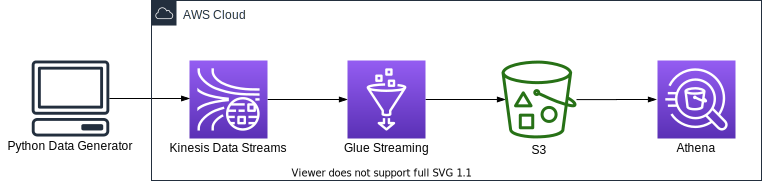

# AWS Glue Streaming ETL Job CDK Python project!



This is an examplary AWS Glue Streaming ETL Job project for CDK development with Python.

This project is based on the AWS Big Data Blog titled ["Crafting serverless stream ETL with AWS Glue"](https://aws.amazon.com/ko/blogs/big-data/crafting-serverless-streaming-etl-jobs-with-aws-glue/) with [aws sample codes](https://github.com/aws-samples/aws-glue-streaming-etl-blog)

In this project, we create a streaming ETL job in AWS Glue that consumes continuously generated ventilator metrics in micro-batches, applies transformations, performs aggregations, and delivers the data to a sink, so the results can be visualized or used in downstream processes. In this streaming ETL architecture, a Python script generates sample ventilator metrics and publishes them as a stream into Kinesis Data Streams.

After ingested to Amazon S3, you can query the data with [Amazon Athena](http://aws.amazon.com/athena) and build visual dashboards using [Amazon QuickSight](https://aws.amazon.com/quicksight).

The `cdk.json` file tells the CDK Toolkit how to execute your app.

This project is set up like a standard Python project.  The initialization
process also creates a virtualenv within this project, stored under the `.venv`
directory.  To create the virtualenv it assumes that there is a `python3`
(or `python` for Windows) executable in your path with access to the `venv`
package. If for any reason the automatic creation of the virtualenv fails,
you can create the virtualenv manually.

To manually create a virtualenv on MacOS and Linux:

```
$ python3 -m venv .venv
```

After the init process completes and the virtualenv is created, you can use the following
step to activate your virtualenv.

```
$ source .venv/bin/activate
```

If you are a Windows platform, you would activate the virtualenv like this:

```
% .venv\Scripts\activate.bat
```

Once the virtualenv is activated, you can install the required dependencies.

```
$ pip install -r requirements.txt
```

Then you should set approperly the cdk context configuration file, `cdk.context.json`.
For example:
<pre>
{
  "kinesis_stream_name": "ventilatorstream",
  "glue_assets_s3_bucket_name": "aws-glue-assets-123456789012-us-east-1",
  "glue_job_script_file_name": "glue_streaming_from_kds_to_s3.py",
  "glue_job_name": "glue_streaming_from_kds_to_s3",
  "glue_job_input_arguments": {
    "--aws_region": "us-east-1",
    "--output_path": "s3://aws-glue-streaming-output-parquet-atq4q5u/",
    "--glue_database": "ventilatordb",
    "--glue_table_name": "ventilators_table",
    "stream_starting_position": "LATEST"
  },
  "glue_kinesis_table": {
    "database_name": "ventilatordb",
    "table_name": "ventilators_table",
    "columns": [
      {
        "name": "ventilatorid",
        "type": "int"
      },
      {
        "name": "eventtime",
        "type": "string"
      },
      {
        "name": "serialnumber",
        "type": "string"
      },
      {
        "name": "pressurecontrol",
        "type": "int"
      },
      {
        "name": "o2stats",
        "type": "int"
      },
      {
        "name": "minutevolume",
        "type": "int"
      },
      {
        "name": "manufacturer",
        "type": "string"
      }
    ]
  }
}
</pre>

:warning: **You should create a S3 bucket for a glue job script and upload the glue job script file into the s3 bucket.**

At this point you can now synthesize the CloudFormation template for this code.

<pre>
(.venv) $ export CDK_DEFAULT_ACCOUNT=$(aws sts get-caller-identity --query Account --output text)
(.venv) $ export CDK_DEFAULT_REGION=$(aws configure get region)
(.venv) $ cdk synth --all
</pre>

To add additional dependencies, for example other CDK libraries, just add
them to your `setup.py` file and rerun the `pip install -r requirements.txt`
command.

## Run Test

1. Create a S3 bucket for Apache Iceberg table
   <pre>
   (.venv) $ cdk deploy GlueStreamingSinkToS3Path
   </pre>
2. Create a Kinesis data stream
   <pre>
   (.venv) $ cdk deploy KinesisStreamAsGlueStreamingJobDataSource
   </pre>
3. Define a schema for the streaming data
   <pre>
   (.venv) $ cdk deploy GlueSchemaOnKinesisStream
   </pre>

   Running `cdk deploy GlueSchemaOnKinesisStream` command is like that we create a schema manually using the AWS Glue Data Catalog as the following steps:

   (1) On the AWS Glue console, choose **Data Catalog**.<br/>
   (2) Choose **Databases**, and click **Add database**.<br/>
   (3) Create a database with the name `ventilatordb`.<br/>
   (4) On the **Data Catalog** menu, Choose **Tables**, and click **Add Table**.<br/>
   (5) For the table name, enter `ventilators_table`.<br/>
   (6) Select `ventilatordb` as a database.<br/>
   (7) Choose **Kinesis** as the type of source.<br/>
   (8) Enter the name of the stream.<br/>
   (9) For the classification, choose **JSON**.<br/>
   (10) Define the schema according to the following table.<br/>
    | Column name | Data type | Example |
    |-------------|-----------|---------|
    | ventilatorid	| int | 29 |
    | eventtime | string | "2023-09-07 16:02:17" |
    | serialnumber | string | "d85324d6-b426-4713-9409-aa7f5c7523b4" |
    | pressurecontrol | int | 26 |
    | o2stats | int | 91 |
    | minutevolume | int | 5 |
    | manufacturer | string | "GE" |

   (11) Choose **Finish**

4. Create Glue Streaming Job
   <pre>
   (.venv) $ ls src/main/python/
    glue_streaming_from_kds_to_s3.py
   (.venv) $ aws mb <i>s3://aws-glue-assets-123456789012-us-east-1</i> --region <i>us-east-1</i>
   (.venv) $ aws cp src/main/python/glue_streaming_from_kds_to_s3.py <i>s3://aws-glue-assets-123456789012-us-east-1/scripts/</i>
   (.venv) $ cdk deploy GlueStreamingSinkToS3JobRole GrantLFPermissionsOnGlueJobRole GlueStreamingSinkToS3Job
   </pre>
5. Make sure the glue job to access the Kinesis Data Streams table in the Glue Catalog database, otherwise grant the glue job to permissions

   We can get permissions by running the following command:
   <pre>
   (.venv) $ aws lakeformation list-permissions | jq -r '.PrincipalResourcePermissions[] | select(.Principal.DataLakePrincipalIdentifier | endswith(":role/GlueStreamingJobRole"))'
   </pre>
   If not found, we need manually to grant the glue job to required permissions by running the following command:
   <pre>
   (.venv) $ aws lakeformation grant-permissions \
               --principal DataLakePrincipalIdentifier=arn:aws:iam::<i>{account-id}</i>:role/<i>GlueStreamingJobRole</i> \
               --permissions SELECT DESCRIBE \
               --resource '{ "Table": {"DatabaseName": "<i>ventilatordb</i>", "TableWildcard": {}} }'
   </pre>
6. Run glue job to load data from Kinesis Data Streams into S3
   <pre>
   (.venv) $ aws glue start-job-run --job-name <i>glue-streaming-from-kds-to-s3</i>
   </pre>
7. Generate streaming data

   We can synthetically generate ventilator data in JSON format using a simple Python application.
   <pre>
   (.venv) $ python src/utils/gen_fake_kinesis_stream_data.py \
               --region-name <i>us-east-1</i> \
               --stream-name <i>your-stream-name</i> \
               --max-count 1000
   </pre>
8. Check the access logs in S3

   After `5~10` minutes, you can see that the access logs have been delivered from **Kinesis Data Streams** to **S3** and stored in a folder structure by year, month, day, and hour.

   

9. Create and load a table with partitioned data in Amazon Athena

   Go to [Athena](https://console.aws.amazon.com/athena/home) on the AWS Management console.<br/>
   * (step 1) Create a database

     In order to create a new database called `ventilatordb`, enter the following statement in the Athena query editor
     and click the **Run** button to execute the query.

     <pre>
     CREATE DATABASE IF NOT EXISTS ventilatordb
     </pre>

    * (step 2) Create a table

      Copy the following query into the Athena query editor, replace the `xxxxxxx` in the last line under `LOCATION` with the string of your S3 bucket, and execute the query to create a new table.
      <pre>
      CREATE EXTERNAL TABLE ventilatordb.ventilators_parquet (
        `ventilatorid` integer,
        `eventtime` timestamp,
        `serialnumber` string,
        `pressurecontrol` integer,
        `o2stats` integer,
        `minutevolume` integer,
        `manufacturer` string)
      PARTITIONED BY (
        `ingest_year` int,
        `ingest_month` int,
        `ingest_day` int,
        `ingest_hour` int)
      ROW FORMAT SERDE
        'org.apache.hadoop.hive.ql.io.parquet.serde.ParquetHiveSerDe'
      STORED AS INPUTFORMAT
        'org.apache.hadoop.hive.ql.io.parquet.MapredParquetInputFormat'
      OUTPUTFORMAT
        'org.apache.hadoop.hive.ql.io.parquet.MapredParquetOutputFormat'
      LOCATION
        's3://aws-glue-streaming-output-parquet-<i>xxxxx</i>/ventilator_metrics';
      </pre>
      If the query is successful, a table named `ventilators_parquet` is created and displayed on the left panel under the **Tables** section.

      If you get an error, check if (a) you have updated the `LOCATION` to the correct S3 bucket name, (b) you have mydatabase selected under the Database dropdown, and (c) you have `AwsDataCatalog` selected as the **Data source**.

      :information_source: If you fail to create the table, give Athena users access permissions on `ventilatordb` through [AWS Lake Formation](https://console.aws.amazon.com/lakeformation/home), or you can grant anyone using Athena to access `ventilatordb` by running the following command:
      <pre>
      (.venv) $ aws lakeformation grant-permissions \
              --principal DataLakePrincipalIdentifier=arn:aws:iam::<i>{account-id}</i>:user/<i>example-user-id</i> \
              --permissions CREATE_TABLE DESCRIBE ALTER DROP \
              --resource '{ "Database": { "Name": "<i>ventilatordb</i>" } }'
      (.venv) $ aws lakeformation grant-permissions \
              --principal DataLakePrincipalIdentifier=arn:aws:iam::<i>{account-id}</i>:user/<i>example-user-id</i> \
              --permissions SELECT DESCRIBE ALTER INSERT DELETE DROP \
              --resource '{ "Table": {"DatabaseName": "<i>ventilatordb</i>", "TableWildcard": {}} }'
      </pre>

    * (step 3) Load the partition data

      Run the following query to load the partition data.
      <pre>
      MSCK REPAIR TABLE ventilatordb.ventilators_parquet;
      </pre>
      After you run this command, the data is ready for querying.

      Instead of `MSCK REPAIR TABLE` command, you can use the `ALTER TABLE ADD PARTITION` command to add each partition manually.

      For example, to load the data in `s3://aws-glue-streaming-output-parquet-xxxxx/ventilator_metrics/ingest_year=2023/ingest_month=01/ingest_day=10/ingest_hour=06/`, you can run the following query.
      <pre>
      ALTER TABLE ventilatordb.ventilators_parquet ADD IF NOT EXISTS
      PARTITION (ingest_year='2023', ingest_month='01', ingest_day='10', ingest_hour='06')
      LOCATION 's3://aws-glue-streaming-output-parquet-<i>xxxxx</i>/ventilator_metrics/ingest_year=2023/ingest_month=01/ingest_day=10/ingest_hour=06/';
      </pre>

    * (Optional) (step 4) Check partitions

      Run the following query to list all the partitions in an Athena table in unsorted order.
      <pre>
      SHOW PARTITIONS ventilatordb.ventilators_parquet;
      </pre>

10. Run test query

    Enter the following SQL statement and execute the query.
    <pre>
    SELECT COUNT(*)
    FROM ventilatordb.ventilators_parquet;
    </pre>

## Clean Up

1. Stop the glue job by replacing the job name in below command.

   <pre>
   (.venv) $ JOB_RUN_IDS=$(aws glue get-job-runs \
              --job-name glue-streaming-from-kds-to-s3 | jq -r '.JobRuns[] | select(.JobRunState=="RUNNING") | .Id' \
              | xargs)
   (.venv) $ aws glue batch-stop-job-run \
              --job-name glue-streaming-from-kds-to-s3 \
              --job-run-ids $JOB_RUN_IDS
   </pre>

2. Delete the CloudFormation stack by running the below command.

   <pre>
   (.venv) $ cdk destroy --all
   </pre>

## Useful commands

 * `cdk ls`          list all stacks in the app
 * `cdk synth`       emits the synthesized CloudFormation template
 * `cdk deploy`      deploy this stack to your default AWS account/region
 * `cdk diff`        compare deployed stack with current state
 * `cdk docs`        open CDK documentation

## References

 * [AWS Glue versions](https://docs.aws.amazon.com/glue/latest/dg/release-notes.html): The AWS Glue version determines the versions of Apache Spark and Python that AWS Glue supports.
 * [Crafting serverless streaming ETL jobs with AWS Glue (2020-10-14)](https://aws.amazon.com/blogs/big-data/crafting-serverless-streaming-etl-jobs-with-aws-glue/)
 * [aws-samples/aws-glue-streaming-etl-blog](https://github.com/aws-samples/aws-glue-streaming-etl-blog)
 * [Streaming ETL jobs in AWS Glue](https://docs.aws.amazon.com/glue/latest/dg/add-job-streaming.html)
 * [Best practices to optimize cost and performance for AWS Glue streaming ETL jobs (2022-08-03)](https://aws.amazon.com/blogs/big-data/best-practices-to-optimize-cost-and-performance-for-aws-glue-streaming-etl-jobs/)

## Troubleshooting

 * Granting database or table permissions error using AWS CDK
   * Error message:
     <pre>
     AWS::LakeFormation::PrincipalPermissions | CfnPrincipalPermissions Resource handler returned message: "Resource does not exist or requester is not authorized to access requested permissions. (Service: LakeFormation, Status Code: 400, Request ID: f4d5e58b-29b6-4889-9666-7e38420c9035)" (RequestToken: 4a4bb1d6-b051-032f-dd12-5951d7b4d2a9, HandlerErrorCode: AccessDenied)
     </pre>
   * Solution:

     The role assumed by cdk is not a data lake administrator. (e.g., `cdk-hnb659fds-deploy-role-123456789012-us-east-1`) <br/>
     So, deploying PrincipalPermissions meets the error such as:

     `Resource does not exist or requester is not authorized to access requested permissions.`

     In order to solve the error, it is necessary to promote the cdk execution role to the data lake administrator.<br/>
     For example, https://github.com/aws-samples/data-lake-as-code/blob/mainline/lib/stacks/datalake-stack.ts#L68

   * Reference:

     [https://github.com/aws-samples/data-lake-as-code](https://github.com/aws-samples/data-lake-as-code) - Data Lake as Code

