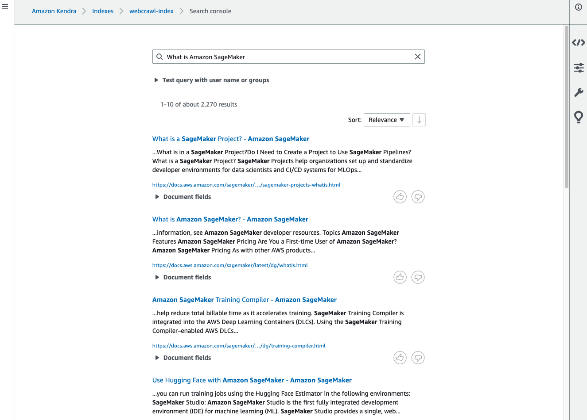

# RAG Application CDK Python project!


This is Amazon Kendra example for CDK development with Python.
In this project, we will crawl web pages from amazon developer guides and
make them searchable.

The `cdk.json` file tells the CDK Toolkit how to execute your app.

This project is set up like a standard Python project.  The initialization
process also creates a virtualenv within this project, stored under the `.venv`
directory.  To create the virtualenv it assumes that there is a `python3`
(or `python` for Windows) executable in your path with access to the `venv`
package. If for any reason the automatic creation of the virtualenv fails,
you can create the virtualenv manually.

To manually create a virtualenv on MacOS and Linux:

```
$ python3 -m venv .venv
```

After the init process completes and the virtualenv is created, you can use the following
step to activate your virtualenv.

```
$ source .venv/bin/activate
```

If you are a Windows platform, you would activate the virtualenv like this:

```
% .venv\Scripts\activate.bat
```

Once the virtualenv is activated, you can install the required dependencies.

```
(.venv) $ pip install -r requirements.txt
```

### Upload Lambda Layer code

Before deployment, you should uplad zipped code files to s3 like this example:

> :warning: **Important**: Replace `lambda-layer-resources` with your s3 bucket name for lambda layer zipped code.
> :warning: To create a bucket outside of the `us-east-1` region, `aws s3api create-bucket` command requires the appropriate **LocationConstraint** to be specified in order to create the bucket in the desired region. For more information, see these [examples](https://awscli.amazonaws.com/v2/documentation/api/latest/reference/s3api/create-bucket.html#examples).

> :warning: Make sure you have **Docker** installed.

<pre>
(.venv) $ aws s3api create-bucket --bucket lambda-layer-resources --region <i>us-east-1</i>
(.venv) $ cat <<EOF>requirements-lambda_layer.txt
 > cfnresponse==1.1.2
 > urllib3<2
 > EOF
(.venv) $ docker run -v "$PWD":/var/task "public.ecr.aws/sam/build-python3.10" /bin/sh -c "pip install -r requirements-lambda_layer.txt -t python/lib/python3.10/site-packages/; exit"
(.venv) $ zip -r cfnresponse-lib.zip python > /dev/null
(.venv) $ aws s3 cp cfnresponse-lib.zip s3://lambda-layer-resources/pylambda-layer/
</pre>

For more information about how to create a package for Amazon Lambda Layer, see [here](https://aws.amazon.com/premiumsupport/knowledge-center/lambda-layer-simulated-docker/).

### Deploy

Before to synthesize the CloudFormation template for this code, you should update `cdk.context.json` file.<br/>
In particular, you need to fill the s3 location of the previously created lambda lay codes.

For example,
<pre>
{
  "lambda_layer_lib_s3_path": "s3://lambda-layer-resources/pylambda-layer/cfnresponse-lib.zip",
  "kendra_index": {
    "name": "webcrawl-index",
    "edition": "ENTERPRISE_EDITION"
  },
  "kendra_data_source": {
    "name": "webcrawl-ds",
    "web_crawler_configuration": {
      "site_maps": [
        "https://docs.aws.amazon.com/lex/latest/dg/sitemap.xml",
        "https://docs.aws.amazon.com/kendra/latest/dg/sitemap.xml",
        "https://docs.aws.amazon.com/sagemaker/latest/dg/sitemap.xml"
      ],
      "url_inclusion_patterns": [
        ".*https://docs.aws.amazon.com/lex/.*",
        ".*https://docs.aws.amazon.com/kendra/.*",
        ".*https://docs.aws.amazon.com/sagemaker/.*"
      ]
    }
  }
}
</pre>

Now you are ready to synthesize the CloudFormation template for this code.

At this point you can now synthesize the CloudFormation template for this code.

```
(.venv) $ export CDK_DEFAULT_ACCOUNT=$(aws sts get-caller-identity --query Account --output text)
(.venv) $ export CDK_DEFAULT_REGION=$(aws configure get region)
(.venv) $ cdk synth --all
```

Use `cdk deploy` command to create the stack shown above.

```
(.venv) $ cdk deploy --require-approval never --all
```

Or, we can provision each CDK stack one at a time like this:

#### Step 1: List all CDK Stacks

```
(.venv) $ cdk list
KendraIndexStack
KendraDataSourceStack
KendraDSSyncLambdaStack
KendraDSSyncStack
```

#### Step 2: Create Amazon Kendra

```
(.venv) $ cdk deploy --require-approval never RAGwithKendraIndexStack RAGwithKendraDataSourceStack
```

#### Step 3: Ingest documents into Amazon Kendra

```
(.venv) $ cdk deploy --require-approval never RAGwithKendraDSSyncLambdaStack RAGwithKendraDSSyncStack
```

> :warning: Launching the Amazon Kendra stacks (i.e., **Step 2, 3**) requires about 30 minutes followed by about 15 minutes to synchronize it and ingest the data in the index. Therefore, wait for about 45 minutes after launching the stacks. Note the index ID on the `KendraIndexStack`’s **Outputs** tab.

> :information_source: To add additional dependencies, for example other CDK libraries, just add
them to your `setup.py` file and rerun the `pip install -r requirements.txt`
command.

Once all CDK stacks have been successfully created, we can search documents with Amazon Kendra like this:



## Clean Up

Delete the CloudFormation stack by running the below command.

```
(.venv) $ cdk destroy --force --all
```

## Useful commands

 * `cdk ls`          list all stacks in the app
 * `cdk synth`       emits the synthesized CloudFormation template
 * `cdk deploy`      deploy this stack to your default AWS account/region
 * `cdk diff`        compare deployed stack with current state
 * `cdk docs`        open CDK documentation

Enjoy!

## References

  * [AWS CDK TypeScript Example - Custom Resource](https://github.com/aws-samples/aws-cdk-examples/tree/master/typescript/custom-resource)
  * [How to create a Lambda layer using a simulated Lambda environment with Docker](https://aws.amazon.com/premiumsupport/knowledge-center/lambda-layer-simulated-docker/)
    ```
    $ cat <<EOF>requirements-lambda_layer.txt
    > cfnresponse==1.1.2
    > urllib3<2
    > EOF

    $ docker run -v "$PWD":/var/task "public.ecr.aws/sam/build-python3.10" /bin/sh -c "pip install -r requirements-lambda_layer.txt -t python/lib/python3.10/site-packages/; exit"

    $ zip -r cfnresponse-lib.zip python > /dev/null

    $ aws s3 mb s3://my-bucket-for-lambda-layer-packages

    $ aws s3 cp cfnresponse-lib.zip s3://my-bucket-for-lambda-layer-packages/pylambda-layer/
    ```

## Troubleshooting

  * [(AWS re:Post) Stack deletion stuck as DELETE_IN_PROGRESS](https://repost.aws/questions/QUoEeYfGTeQHSyJSrIDymAoQ/stack-deletion-stuck-as-delete-in-progress)
  * [(Video) How do I delete an AWS Lambda-backed custom resource that’s stuck deleting in AWS CloudFormation?](https://youtu.be/hlJkMoCxR-I?si=NgaNwr9vH15daUBz)
  * [(Stack Overflow)"cannot import name 'DEFAULT_CIPHERS' from 'urllib3.util.ssl_'" on AWS Lambda using a layer](https://stackoverflow.com/questions/76414514/cannot-import-name-default-ciphers-from-urllib3-util-ssl-on-aws-lambda-us)
    * **Error message**:
      ```
      cannot import name 'DEFAULT_CIPHERS' from 'urllib3.util.ssl_' (/opt/python/lib/python3.10/site-packages/urllib3/util/ssl_.py
      ```
    * **Solution**: You’ll need to explicitly pin to `urllib3<2` in your project to ensure `urllib3 2.0` isn’t brought into your environment.
      ```
      urllib3<2
      ```
