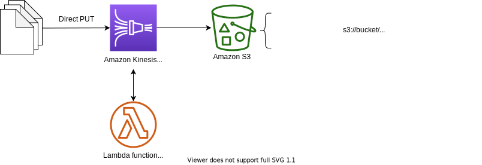

# Amazon Kinesis Data Firehose with Data Transformation



This is a data transform in kinesis data firehose for Python development with CDK.

The `cdk.json` file tells the CDK Toolkit how to execute your app.

This project is set up like a standard Python project.  The initialization
process also creates a virtualenv within this project, stored under the `.venv`
directory.  To create the virtualenv it assumes that there is a `python3`
(or `python` for Windows) executable in your path with access to the `venv`
package. If for any reason the automatic creation of the virtualenv fails,
you can create the virtualenv manually.

To manually create a virtualenv on MacOS and Linux:

```
$ python3 -m venv .venv
```

After the init process completes and the virtualenv is created, you can use the following
step to activate your virtualenv.

```
$ source .venv/bin/activate
```

If you are a Windows platform, you would activate the virtualenv like this:

```
% .venv\Scripts\activate.bat
```

Once the virtualenv is activated, you can install the required dependencies.

```
(.venv) $ pip install -r requirements.txt
```

### Upload Lambda Layer code

Before deployment, you should uplad zipped code files to s3 like this:
<pre>
(.venv) $ aws s3api create-bucket --bucket <i>your-s3-bucket-name-for-lambda-layer-code</i> --region <i>region-name</i>
(.venv) $ ./build-aws-lambda-layer.sh <i>your-s3-bucket-name-for-lambda-layer-code</i>
</pre>
(:warning: Make sure you have **Docker** installed.)

For example,
<pre>
(.venv) $ aws s3api create-bucket --bucket lambda-layer-resources --region us-east-1
(.venv) $ ./build-aws-lambda-layer-package.sh lambda-layer-resources
</pre>

### Deploy

Before to synthesize the CloudFormation template for this code, you should update `cdk.context.json` file.
In particular, you need to fill the s3 location of the previously created lambda lay codes.

For example,

<pre>
{
  "firehose_data_tranform_lambda": {
    "s3_bucket_name": "<i>lambda-layer-resources</i>",
    "s3_object_key": "<i>var/fastavro-lib.zip</i>"
  }
}
</pre>

Now you are ready to synthesize the CloudFormation template for this code.

<pre>
(.venv) $ export CDK_DEFAULT_ACCOUNT=$(aws sts get-caller-identity --query Account --output text)
(.venv) $ export CDK_DEFAULT_REGION=$(aws configure get region)
(.venv) $ cdk synth --all \
  --parameters FirehoseStreamName=<i>'your-delivery-stream-name'</i> \
  --parameters FirehosePrefix=<i>'your-s3-bucket-prefix'</i>
</pre>

For example,

<pre>
(.venv) $ export CDK_DEFAULT_ACCOUNT=$(aws sts get-caller-identity --query Account --output text)
(.venv) $ export CDK_DEFAULT_REGION=$(aws configure get region)
(.venv) $ cdk synth --all \
  --parameters FirehoseStreamName='PUT-S3-DataTransform' \
  --parameters FirehosePrefix='json-data/year=!{timestamp:yyyy}/month=!{timestamp:MM}/day=!{timestamp:dd}/hour=!{timestamp:HH}/'
</pre>

Use `cdk deploy` command to create the stack shown above.

<pre>
(.venv) $ cdk deploy --all \
  --parameters FirehoseStreamName=<i>'your-delivery-stream-name'</i> \
  --parameters FirehosePrefix=<i>'your-s3-bucket-prefix'</i>
</pre>

For example,
<pre>
(.venv) $ cdk deploy --all \
  --parameters FirehoseStreamName='PUT-S3-DataTransform' \
  --parameters FirehosePrefix='json-data/year=!{timestamp:yyyy}/month=!{timestamp:MM}/day=!{timestamp:dd}/hour=!{timestamp:HH}/'
</pre>

### Verify

If you want to generate sample data and verify it is being processed and stored as follows: `Direct Put -> Kinesis Data Firehose -> S3`, <br/>
Run `gen_fake_firehose_data.py` script on the EC2 instance by entering the following command:

<pre>
(.venv) $ cd ..
(.venv) $ ls src/main/python/
gen_fake_firehose_data.py
(.venv) $ pip install boto3 Faker # pip install -r requirements.txt
(.venv) $ python src/utils/gen_fake_firehose_data.py --stream-name <i>'your-delivery-stream-name'</i> --max-count -1
</pre>

If you would like to know more about the usage of this command, you can type

<pre>
(.venv) $ python src/utils/gen_fake_firehose_data.py --help
</pre>

### Schema validation with an AWS Lambda function

For example, let's validate schema of the record with an AWS Lambda function for the following sample data.

```
{
   "type": {
    "device": "mobile",
    "event": "view"
  },
  "customer_id": "123456789012",
  "event_timestamp": 1565382027, #epoch timestamp
  "region": "us-east-1"
}
```

You can validate the schema of incomming records with the data transform Lambda function.
For example, you can define record schema in Avro<sup>TM</sup> and validate incomming records with [fastavro](https://fastavro.readthedocs.io/) like this:

```python
import fastavro

ORIGINAL_SCHEMA = {
  'name': 'Interactions',
  'type': 'record',
  'fields': [
    {
      'name': 'type',
      'type': {
        'name': 'EventType',
        'type': 'record',
        'fields':[
          {
            'name': 'device',
            'type': {
              'name': 'DeviceType',
              'type': 'enum',
              'symbols': ['pc', 'mobile', 'tablet']
            }
          },
          {
            'name': 'event',
            'type': 'string'
          }
        ]
      }
    },
    {
      'name': 'customer_id',
      'type': 'string'
    },
    {
      'name': 'event_timestamp',
      'type': 'long',
      'logicalType': 'timestamp-millis'
    },
    {
      'name': 'region',
      'type': ['string', 'null']
    }
  ]
}

PARSED_SCHEMA = fastavro.parse_schema(ORIGINAL_SCHEMA)

def check_schema(record):
  try:
    return fastavro.validation.validate(record, PARSED_SCHEMA, raise_errors=False)
  except Exception as ex:
    return False

def lambda_handler(firehose_records_input, context):
  # Create return value.
  firehose_records_output = {'records': []}

  # Create result object.
  # Go through records and process them
  for firehose_record_input in firehose_records_input['records']:
    # Get user payload
    payload = base64.b64decode(firehose_record_input['data'])
    json_value = json.loads(payload)

    # check if schema is valid
    is_valid = check_schema(json_value)

    # Create output Firehose record and add modified payload and record ID to it.
    firehose_record_output = {
      'recordId': firehose_record_input['recordId'],
      'data': firehose_record_input['data'],
      # 'ProcessFailed' record will be put into error bucket in S3
      'result': 'Ok' if is_valid else 'ProcessingFailed'
    }

    # Add the record to the list of output records.
    firehose_records_output['records'].append(firehose_record_output)

  # At the end return processed records
  return firehose_records_output
```

To add additional dependencies, for example other CDK libraries, just add
them to your `setup.py` file and rerun the `pip install -r requirements.txt`
command.

## Clean Up

Delete the CloudFormation stack by running the below command.

```
(.venv) $ cdk destroy --force --all
```

## Useful commands

 * `cdk ls`          list all stacks in the app
 * `cdk synth`       emits the synthesized CloudFormation template
 * `cdk deploy`      deploy this stack to your default AWS account/region
 * `cdk diff`        compare deployed stack with current state
 * `cdk docs`        open CDK documentation

## References

 * [Web Log Analytics with Amazon Kinesis Data Streams Proxy using Amazon API Gateway](https://github.com/aws-samples/web-analytics-on-aws)
 * [fastavro](https://fastavro.readthedocs.io/) - Fast read/write of `AVRO` files
 * [Apache Avro Specification](https://avro.apache.org/docs/current/spec.html)
 * [How to create a Lambda layer using a simulated Lambda environment with Docker](https://aws.amazon.com/premiumsupport/knowledge-center/lambda-layer-simulated-docker/)
   ```
   $ cat <<EOF > requirements-Lambda-Layer.txt
   > fastavro==1.6.1
   > EOF
   $ docker run -v "$PWD":/var/task "public.ecr.aws/sam/build-python3.9" /bin/sh -c "pip install -r requirements-Lambda-Layer.txt -t python/lib/python3.9/site-packages/; exit"
   $ zip -r fastavro-lib.zip python > /dev/null
   $ aws s3 mb s3://my-bucket-for-lambda-layer-packages
   $ aws s3 cp fastavro-lib.zip s3://my-bucket-for-lambda-layer-packages/var/
   ```

Enjoy!
