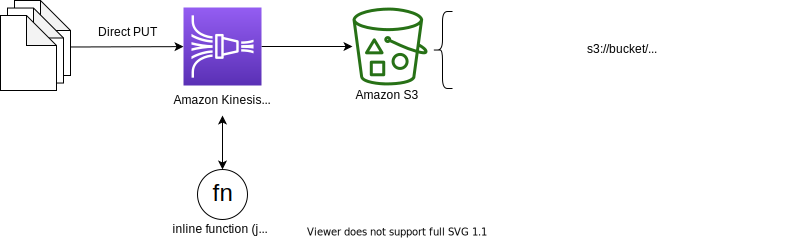

# Dynamic Partitioning in Kinesis Data Firehose: Creating partitioning keys with inline parsing



This is a kinesis data firehose dynamic partitioning project for Python development with CDK.

The `cdk.json` file tells the CDK Toolkit how to execute your app.

This project is set up like a standard Python project.  The initialization
process also creates a virtualenv within this project, stored under the `.venv`
directory.  To create the virtualenv it assumes that there is a `python3`
(or `python` for Windows) executable in your path with access to the `venv`
package. If for any reason the automatic creation of the virtualenv fails,
you can create the virtualenv manually.

To manually create a virtualenv on MacOS and Linux:

```
$ python3 -m venv .venv
```

After the init process completes and the virtualenv is created, you can use the following
step to activate your virtualenv.

```
$ source .venv/bin/activate
```

If you are a Windows platform, you would activate the virtualenv like this:

```
% .venv\Scripts\activate.bat
```

Once the virtualenv is activated, you can install the required dependencies.

```
(.venv) $ pip install -r requirements.txt
```

At this point you can now synthesize the CloudFormation template for this code.

<pre>
(.venv) $ export CDK_DEFAULT_ACCOUNT=$(aws sts get-caller-identity --query Account --output text)
(.venv) $ export CDK_DEFAULT_REGION=$(aws configure get region)
(.venv) $ cdk synth \
  --parameters FirehoseStreamName=<i>'your-delivery-stream-name'</i> \
  --parameters FirehoseDynamicPartitionKeys=<i>'your-jq-expressions-to-parse-dynamic-partition-keys'</i> \
  --parameters FirehosePrefix=<i>'your-s3-bucket-prefix-for-dynamic-partitioning'</i>
</pre>

### Creating partitioning keys with inline parsing

For example, let's define partitioning keys for it with inline parsing for the following sample data

```
{
   "type": {
    "device": "mobile",
    "event": "view"
  },
  "customer_id": "123456789012",
  "event_timestamp": 1565382027, #epoch timestamp
  "region": "us-east-1"
}
```

For example, you are going to choose to partition your data based on `region`, `device`, and `event_timestamp`.
After selecting data parameters for your partitioning keys, you then map each parameter to a valid jq expression.
The following table shows such a mapping of parameters to jq expressions:

| Parameter	| jq expression |
|-----------|---------------|
| region | .region |
| device | .type.device |
| year | .event_timestamp\| strftime("%Y") |
| month	| .event_timestamp\| strftime("%m") |
| day | .event_timestamp\| strftime("%d") |
| hour | .event_timestamp\| strftime("%H") |

Now you can create kinesis data firehose with the above mapping of parameters to jq expressions like this:

<pre>
(.venv) $ export CDK_DEFAULT_ACCOUNT=$(aws sts get-caller-identity --query Account --output text)
(.venv) $ export CDK_DEFAULT_REGION=$(aws configure get region)
(.venv) $ cdk synth \
  --parameters FirehoseStreamName='PUT-S3-inline' \
  --parameters FirehoseDynamicPartitionKeys='{region:.region,device:.type.device,year:.event_timestamp|strftime("%Y"),month:.event_timestamp|strftime("%m"),day:.event_timestamp|strftime("%d"),hour:.event_timestamp|strftime("%H")}' \
  --parameters FirehosePrefix='region=!{partitionKeyFromQuery:region}/device=!{partitionKeyFromQuery:device}/year=!{partitionKeyFromQuery:year}/month=!{partitionKeyFromQuery:month}/day=!{partitionKeyFromQuery:day}/hour=!{partitionKeyFromQuery:hour}/'
</pre>

Use `cdk deploy` command to create the stack shown above.

<pre>
(.venv) $ cdk deploy \
  --parameters FirehoseStreamName=<i>'your-delivery-stream-name'</i> \
  --parameters FirehoseDynamicPartitionKeys=<i>'your-jq-expressions-to-parse-dynamic-partition-keys'</i> \
  --parameters FirehosePrefix=<i>'your-s3-bucket-prefix-for-dynamic-partitioning'</i>
</pre>

For example,
<pre>
(.venv) $ cdk deploy \
  --parameters FirehoseStreamName='PUT-S3-inline' \
  --parameters FirehoseDynamicPartitionKeys='{region:.region,device:.type.device,year:.event_timestamp|strftime("%Y"),month:.event_timestamp|strftime("%m"),day:.event_timestamp|strftime("%d"),hour:.event_timestamp|strftime("%H")}' \
  --parameters FirehosePrefix='region=!{partitionKeyFromQuery:region}/device=!{partitionKeyFromQuery:device}/year=!{partitionKeyFromQuery:year}/month=!{partitionKeyFromQuery:month}/day=!{partitionKeyFromQuery:day}/hour=!{partitionKeyFromQuery:hour}/'
</pre>

After `cdk deploy` has been completed, you can check dynamic partitioning configuration of kinesis data firehose as running the following command:

<pre>
(.venv) $ aws firehose describe-delivery-stream \
  --delivery-stream-name <i>'your-delivery-stream-name'</i> \
  | jq '.DeliveryStreamDescription.Destinations[0].ExtendedS3DestinationDescription'
</pre>

For example,

<pre>
(.venv) $ aws firehose describe-delivery-stream \
  --delivery-stream-name PUT-S3-inline \
  | jq '.DeliveryStreamDescription.Destinations[0].ExtendedS3DestinationDescription'

{
  "RoleARN": "arn:aws:iam::123456789012:role/KinesisFirehoseServiceRole-PUT-S3-inline-us-east-1",
  "BucketARN": "arn:aws:s3:::firehose-to-s3-us-east-1-we13viq",
  "Prefix": "region=!{partitionKeyFromQuery:region}/device=!{partitionKeyFromQuery:device}/year=!{partitionKeyFromQuery:year}/month=!{partitionKeyFromQuery:month}/day=!{partitionKeyFromQuery:day}/hour=!{partitionKeyFromQuery:hour}/",
  "ErrorOutputPrefix": "error/year=!{timestamp:yyyy}/month=!{timestamp:MM}/day=!{timestamp:dd}/hour=!{timestamp:HH}/!{firehose:error-output-type}",
  "BufferingHints": {
    "SizeInMBs": 128,
    "IntervalInSeconds": 60
  },
  "CompressionFormat": "UNCOMPRESSED",
  "EncryptionConfiguration": {
    "NoEncryptionConfig": "NoEncryption"
  },
  "CloudWatchLoggingOptions": {
    "Enabled": true,
    "LogGroupName": "/aws/kinesisfirehose/PUT-S3-inline",
    "LogStreamName": "DestinationDelivery"
  },
  "ProcessingConfiguration": {
    "Enabled": true,
    "Processors": [
      {
        "Type": "RecordDeAggregation",
        "Parameters": [
          {
            "ParameterName": "SubRecordType",
            "ParameterValue": "JSON"
          }
        ]
      },
      {
        "Type": "AppendDelimiterToRecord",
        "Parameters": []
      },
      {
        "Type": "MetadataExtraction",
        "Parameters": [
          {
            "ParameterName": "MetadataExtractionQuery",
            "ParameterValue": "{region:.region,device:.type.device,year:.event_timestamp|strftime(\"%Y\"),month:.event_timestamp|strftime(\"%m\"),day:.event_timestamp|strftime(\"%d\"),hour:.event_timestamp|strftime(\"%H\")}"
          },
          {
            "ParameterName": "JsonParsingEngine",
            "ParameterValue": "JQ-1.6"
          }
        ]
      }
    ]
  },
  "S3BackupMode": "Disabled",
  "DataFormatConversionConfiguration": {
    "Enabled": false
  }
}
</pre>

### Verify

If you want to generate sample data and verify it is being processed and stored as follows: `Direct Put -> Kinesis Data Firehose -> S3`, <br/>
Run `gen_fake_firehose_data.py` script on the EC2 instance by entering the following command:

<pre>
(.venv) $ cd ..
(.venv) $ ls src/main/python/
gen_fake_firehose_data.py
(.venv) $ pip install boto3 Faker # pip install -r requirements.txt
(.venv) $ python src/main/python/gen_fake_firehose_data.py --stream-name <i>'your-delivery-stream-name'</i> --max-count -1
</pre>

If you would like to know more about the usage of this command, you can type

<pre>
(.venv) $ python src/main/python/gen_fake_firehose_data.py --help
</pre>

To add additional dependencies, for example other CDK libraries, just add
them to your `setup.py` file and rerun the `pip install -r requirements.txt`
command.

## Clean Up

Delete the CloudFormation stack by running the below command.

```
(.venv) $ cdk destroy
```

## Useful commands

 * `cdk ls`          list all stacks in the app
 * `cdk synth`       emits the synthesized CloudFormation template
 * `cdk deploy`      deploy this stack to your default AWS account/region
 * `cdk diff`        compare deployed stack with current state
 * `cdk docs`        open CDK documentation

## Learn more
 * [Dynamic Partitioning in Kinesis Data Firehose](https://docs.aws.amazon.com/firehose/latest/dev/dynamic-partitioning.html)
 * [Kinesis Data Firehose now supports dynamic partitioning to Amazon S3](https://aws.amazon.com/blogs/big-data/kinesis-data-firehose-now-supports-dynamic-partitioning-to-amazon-s3/)
 * [Kinesis Data Firehose Immersion Day](https://catalog.us-east-1.prod.workshops.aws/workshops/32e6bc9a-5c03-416d-be7c-4d29f40e55c4/en-US)
   * **Lab 3 - Customize partitioning of streaming data**

Enjoy!
