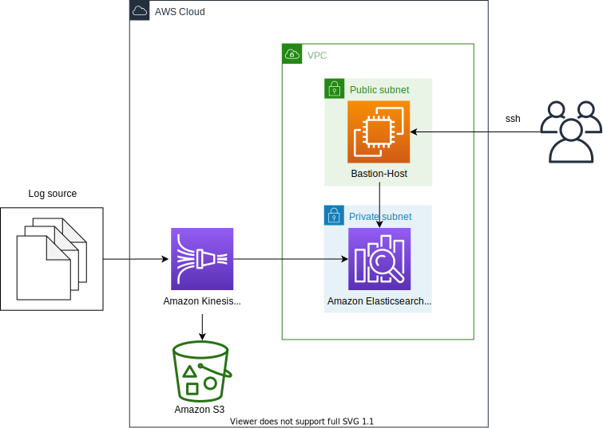

# EKK (Amazon Elasticsearch Service - Kinesis Data Firehose - Kibana) Stack



This is a collection of projects for Python development with CDK.

The `cdk.json` file tells the CDK Toolkit how to execute your app.

This project is set up like a standard Python project.  The initialization
process also creates a virtualenv within this project, stored under the .env
directory.  To create the virtualenv it assumes that there is a `python3`
(or `python` for Windows) executable in your path with access to the `venv`
package. If for any reason the automatic creation of the virtualenv fails,
you can create the virtualenv manually.

To manually create a virtualenv on MacOS and Linux:

```
$ python3 -m venv .env
```

After the init process completes and the virtualenv is created, you can use the following
step to activate your virtualenv.

```
$ source .env/bin/activate
```

If you are a Windows platform, you would activate the virtualenv like this:

```
% .env\Scripts\activate.bat
```

Once the virtualenv is activated, you can install the required dependencies.

```
$ pip install -r requirements.txt
```

At this point you can now synthesize the CloudFormation template for this code.

```
$ export CDK_DEFAULT_ACCOUNT=$(aws sts get-caller-identity --query Account --output text)
$ export CDK_DEFAULT_REGION=$(aws configure get region)
$ cdk -c es_domain_name='your-es-domain-name' \
      -c es_index_name='your-es-index-name' \
      synth
```

Use cdk deploy command to create the stack shown above.

```
$ cdk -c es_domain_name='your-es-domain-name' \
      -c es_index_name='your-es-index-name' \
      deploy
```

To add additional dependencies, for example other CDK libraries, just add
them to your `setup.py` file and rerun the `pip install -r requirements.txt`
command.

## Useful commands

 * `cdk ls`          list all stacks in the app
 * `cdk synth`       emits the synthesized CloudFormation template
 * `cdk deploy`      deploy this stack to your default AWS account/region
 * `cdk diff`        compare deployed stack with current state
 * `cdk docs`        open CDK documentation

Enjoy!

## Test
1. Checkout the code to generate sample data into Kinesis Data Firehose.

    ```
    $ python3 -m venv .env
    $ source .env/bin/activate
    (.env) $ ls -1
    README.md
    amazon-ekk-stack-arch.svg
    app.py
    cdk.context.json
    cdk.json
    requirements.txt
    resources
    test
    (.env) $ ls test
    gen_firehose_data.py
    (.env) $
    ```

2. Run the test code. For example,
   - AWS Region: `us-east-1`
   - Kinesis Data Fireshose Stream Name: `retail-trans`

    ```
    (.env) $ python test/gen_firehose_data.py --region-name us-east-1 --stream-name retail-trans --count 10
    (.env) $
    ```

## Remotely access your Amazon Elasticsearch Cluster using SSH tunnel from local machine
1. Generate the new private and public keys `mynew_key` and `mynew_key.pub`, respectively:

   ```
   $ ssh-keygen -t rsa -f mynew_key
   ```

2. To access the Elasticsearch Cluster, add the ssh tunnel configuration to the ssh config file of the personal local PC as follows

    ```
    # Elasticsearch Tunnel
    Host estunnel
        HostName <EC2 Public IP of Bastion Host>
        User ec2-user
        IdentitiesOnly yes
        IdentityFile <Path to SSH Public Key>
        LocalForward 9200 <Elasticsearch Endpoint>:443
    ```

    ex)

    ```
    ~$ ls -1 .ssh/
    config
    mynew_key
    mynew_key.pub

    ~$ tail .ssh/config
    # Elasticsearch Tunnel
    Host estunnel
        HostName 214.132.71.219
        User ubuntu
        IdentitiesOnly yes
        IdentityFile ~/.ssh/mynew_key.pub
        LocalForward 9200 vpc-ekk-stack-hol-qvwlxanar255vswqna37p2l2cy.us-east-1.es.amazonaws.com:443

    ~$
    ```

3. Use the following AWS CLI command to authorize the user and push the public key to the instance using the `send-ssh-public-key` command. To support this, you need the latest version of the AWS CLI.

   ex) Bastion Host's instance details
   - Instance ID: `i-0989ec3292613a4f9`
   - Availability Zone: `us-east-1a`
   - Instance OS User: `ec2-user`

   ```
   $ aws ec2-instance-connect send-ssh-public-key \
       --region us-east-1 \
       --instance-id i-0989ec3292613a4f9 \
       --availability-zone us-east-1a \
       --instance-os-user ec2-user \
       --ssh-public-key file://${HOME}/.ssh/mynew_key.pub

   {
     "RequestId": "505f8675-710a-11e9-9263-4d440e7745c6",
     "Success": true
   }
   ```

4. Run `ssh -N estunnel` in Terminal.
5. Connect to `https://localhost:9200/_plugin/kibana/` in a web browser.
6. After selecting **Advanced Settings** from the left sidebar menu, set **Timezone** for date formatting to `Etc/UTC`.
   Since the log creation time of the test data is based on UTC, Kibana’s Timezone is also set to UTC.
   

#### References
- [Windows SSH / Tunnel for Kibana Instructions - Amazon Elasticsearch Service](https://search-sa-log-solutions.s3-us-east-2.amazonaws.com/logstash/docs/Kibana_Proxy_SSH_Tunneling_Windows.pdf)
- [Use an SSH Tunnel to access Kibana within an AWS VPC with PuTTy on Windows](https://amazonmsk-labs.workshop.aws/en/mskkdaflinklab/createesdashboard.html)

## Considerations
Check the following questions before using Kinesis Data Firehose to ingest documents into Amazon Elasticsearch Service
- [ ] Need to change `_type`?
- [ ] Should update documents in Amazon Elasticsearch Service?
- [ ] Want to use custome `_id` instead of auto generated `_id` by Elasticsearch?
