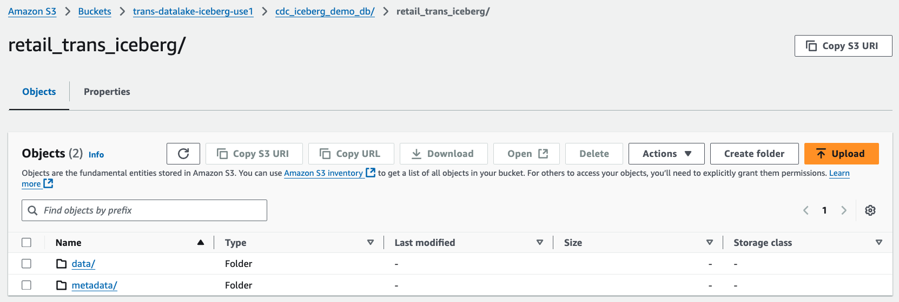
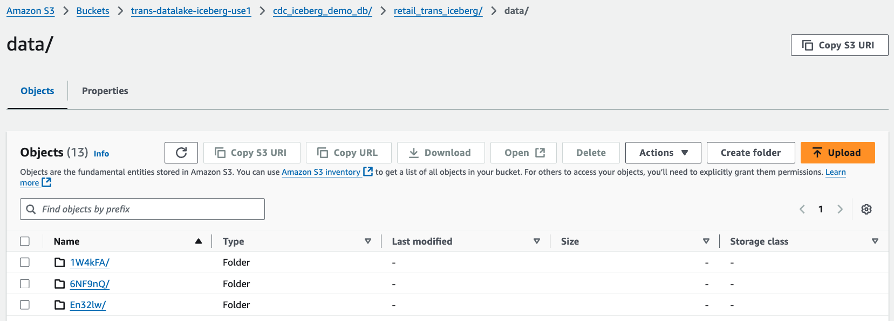
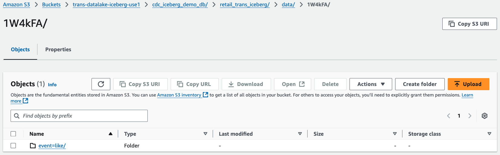
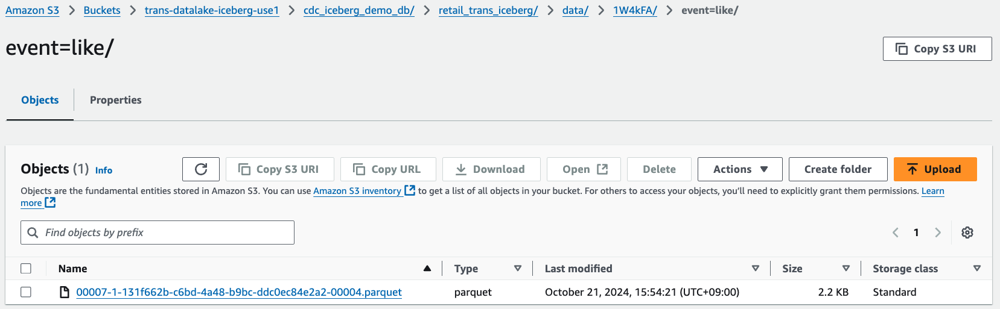

# Deliver data to Apache Iceberg Tables with Amazon Data Firehose


This repository contains cdk scripts and sample code for directly delivering data
  to Apace Iceberg tables in Amazon S3 using Amazon Data Firehose.

The `cdk.json` file tells the CDK Toolkit how to execute your app.

This project is set up like a standard Python project.  The initialization
process also creates a virtualenv within this project, stored under the `.venv`
directory.  To create the virtualenv it assumes that there is a `python3`
(or `python` for Windows) executable in your path with access to the `venv`
package. If for any reason the automatic creation of the virtualenv fails,
you can create the virtualenv manually.

To manually create a virtualenv on MacOS and Linux:

```
$ python3 -m venv .venv
```

After the init process completes and the virtualenv is created, you can use the following
step to activate your virtualenv.

```
$ source .venv/bin/activate
```

If you are a Windows platform, you would activate the virtualenv like this:

```
% .venv\Scripts\activate.bat
```

Once the virtualenv is activated, you can install the required dependencies.

```
(.venv) $ pip install -r requirements.txt
```

To add additional dependencies, for example other CDK libraries, just add
them to your `setup.py` file and rerun the `pip install -r requirements.txt`
command.

## Prerequisites

Before synthesizing the CloudFormation, you need to prepare the followings:

### (1) Amazon S3 Bucket for Apache Iceberg Tables

- You already have s3 bucket for Apache Iceberg tables.<br/>
  (e.g., `aws s3 mb s3://trans-datalake-iceberg-use1 --region us-east-1`)

### (2) AWS Glue Catalog for Apache Iceberg Table

- Go to [Athena](https://console.aws.amazon.com/athena/home) on the AWS Management console.
- Create an Apache Iceberg table.<br/>
  For example, a table named `retail_trans_iceberg` is created in the `cdc_iceberg_demo_db` database by running the following query.

  ```
  CREATE DATABASE IF NOT EXISTS cdc_iceberg_demo_db;

  CREATE TABLE cdc_iceberg_demo_db.retail_trans_iceberg (
    trans_id int,
    customer_id string,
    event string,
    sku string,
    amount int,
    device string,
    trans_datetime timestamp
  )
  PARTITIONED BY (`event`)
  LOCATION 's3://trans-datalake-iceberg-use1/cdc_iceberg_demo_db/retail_trans_iceberg'
  TBLPROPERTIES (
    'table_type'='iceberg',
    'format'='parquet',
    'write_compression'='snappy',
    'optimize_rewrite_delete_file_threshold'='10'
  );
  ```

### (3) Set up `cdk.context.json`

Then, you should set approperly the cdk context configuration file, `cdk.context.json`.

For example,

<pre>
{
  "stream_name": "PUT-ICE-6prtr",
  "buffering_hints": {
    "interval_in_seconds": 60,
    "size_in_mbs": 128
  },
  "transform_records_with_aws_lambda": {
    "buffer_size": 3,
    "buffer_interval": 300,
    "number_of_retries": 3
  },
  "destination_iceberg_table_configuration": {
    "database_name": "cdc_iceberg_demo_db",
    "table_name": "retail_trans_iceberg",
    "unique_keys": ["trans_id"]
  },
  "s3_bucket_name": "trans-datalake-iceberg-use1",
  "output_prefix": "cdc_iceberg_demo_db/retail_trans_iceberg",
  "error_output_prefix": "error/cdc_iceberg_demo_db/retail_trans_iceberg/year=!{timestamp:yyyy}/month=!{timestamp:MM}/day=!{timestamp:dd}/hour=!{timestamp:HH}/!{firehose:error-output-type}"
}
</pre>

## Deploy

At this point you can now synthesize the CloudFormation template for this code.

```
(.venv) $ export CDK_DEFAULT_ACCOUNT=$(aws sts get-caller-identity --query Account --output text)
(.venv) $ export CDK_DEFAULT_REGION=$(aws configure get region)
(.venv) $ cdk synth --all
```

Use `cdk deploy` command to create the stack shown above.

```
(.venv) $ cdk deploy --require-approval never --all
```

## Run Test

1. Generate test data.

    ```
    (.venv) $ pip install -r requirements-dev.txt

    (.venv) $ python src/utils/gen_fake_cdc_data.py \
                      --region-name us-east-1 \
                      --stream-name PUT-ICE-6prtr \
                      --cdc-type insert-only \
                      --console

    (.venv) $ python src/utils/gen_fake_cdc_data.py \
                      --region-name us-east-1 \
                      --stream-name PUT-ICE-6prtr \
                      --cdc-type insert-update-or-delete \
                      --console
    ```

2. Check streaming data in S3

   After `3~5` minutes, you can see that the streaming data have been delivered from **Kinesis Data Firehose** to **S3**.

   
   
   
   

3. Run test query using Amazon Athena

   Enter the following SQL statement and execute the query.
   <pre>
   SELECT COUNT(*)
   FROM default.retail_trans_iceberg;
   </pre>


## Clean Up

Delete the CloudFormation stack by running the below command.

```
(.venv) $ cdk destroy --force --all
```

## Useful commands

 * `cdk ls`          list all stacks in the app
 * `cdk synth`       emits the synthesized CloudFormation template
 * `cdk deploy`      deploy this stack to your default AWS account/region
 * `cdk diff`        compare deployed stack with current state
 * `cdk docs`        open CDK documentation

## References

 * [(AWS Developer Guide) Deliver data to Apache Iceberg Tables with Amazon Data Firehose](https://docs.aws.amazon.com/firehose/latest/dev/apache-iceberg-destination.html)

Enjoy!
