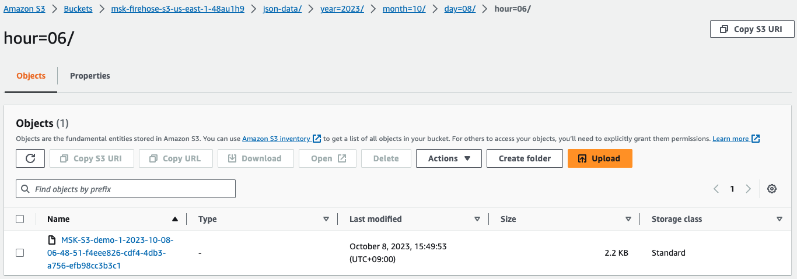

# Amazon MSK - Managed Data Delivery from Apache Kafka to Amazon S3 CDK Python project!


This is a CDK Python project to show how to continuously load data
from an Apache Kafka cluster to Amazon Simple Storage Service (Amazon S3).

The `cdk.json` file tells the CDK Toolkit how to execute your app.

This project is set up like a standard Python project.  The initialization
process also creates a virtualenv within this project, stored under the `.venv`
directory.  To create the virtualenv it assumes that there is a `python3`
(or `python` for Windows) executable in your path with access to the `venv`
package. If for any reason the automatic creation of the virtualenv fails,
you can create the virtualenv manually.

To manually create a virtualenv on MacOS and Linux:

```
$ python3 -m venv .venv
```

After the init process completes and the virtualenv is created, you can use the following
step to activate your virtualenv.

```
$ source .venv/bin/activate
```

If you are a Windows platform, you would activate the virtualenv like this:

```
% .venv\Scripts\activate.bat
```

Once the virtualenv is activated, you can install the required dependencies.

```
(.venv) $ pip install -r requirements.txt
```

### Deploy

Before synthesizing the CloudFormation, you should set approperly the cdk context configuration file, `cdk.context.json`.

For example:

<pre>
{
  "msk_cluster_name": "<i>demo-msk</i>",
  "firehose": {
    "buffering_hints": {
      "intervalInSeconds": 300,
      "sizeInMBs": 100
    },
    "topic_name": "<i>ev_stream_data</i>"
  }
}
</pre>

At this point you can now synthesize the CloudFormation template for this code.

```
(.venv) $ export CDK_DEFAULT_ACCOUNT=$(aws sts get-caller-identity --query Account --output text)
(.venv) $ export CDK_DEFAULT_REGION=$(aws configure get region)
(.venv) $ cdk synth --all
```

To add additional dependencies, for example other CDK libraries, just add
them to your `setup.py` file and rerun the `pip install -r requirements.txt`
command.

We can provision each CDK stack one at a time like this:

#### Step 1: List all CDK Stacks

```
(.venv) $ cdk list
MSKVpcStack
MSKProvisionedStack
MSKClusterPolicyForFirehose
MSKClientEC2InstanceStack
MSKtoS3AsFirehoseDestinationStack
FirehosefromMSKtoS3Stack
```

#### Step 2: Create MSK cluster

```
(.venv) $ cdk deploy --require-approval never MSKVpcStack \
                                              MSKProvisionedStack
```

Once MSK cluster has been successfully created,
you should update the MSK cluster configuration by running the following python scripts
in order to grant Kinesis Data Firehose to access Amazon MSK cluster.

It will take at least `20~25` minutes to update the settings.
Please wait until the MSK cluster status is `ACTIVE`.

(1) Update **Security settings**

<pre>
import boto3

cluster_arn = 'arn:aws:kafka:<i>{region}</i>:cluster/<i>{msk-cluster-name}</i>/{random-identifier}'
region = '{<i>region</i>}'

client = boto3.client('kafka', region_name=region)
cluster_info = client.describe_cluster_v2(ClusterArn=cluster_arn)
current_version = cluster_info['ClusterInfo']['CurrentVersion']

client_authentication= {
  "Sasl": {
    "Scram": {
      "Enabled": False
    },
    "Iam": {
      "Enabled": True
    }
  },
  "Unauthenticated": {
    "Enabled": False
  }
}

response = client.update_security(ClientAuthentication=client_authentication,
                                  ClusterArn=cluster_arn,
                                  CurrentVersion=current_version)
</pre>

(2) Update **Network settings**

<pre>
import boto3

cluster_name = '<i>{msk-cluster-name}</i>'
region = '{<i>region</i>}'

client = boto3.client('kafka', region_name=region)

cluster_info_list = client.list_clusters_v2(ClusterNameFilter=cluster_name)['ClusterInfoList']
cluster_info = [elem for elem in cluster_info_list if elem['ClusterName'] == cluster_name][0]

cluster_arn = cluster_info['ClusterArn']
current_version = cluster_info['CurrentVersion']

connectivity_info= {
  "VpcConnectivity": {
    "ClientAuthentication": {
      "Sasl": {
        "Scram": {
          "Enabled": False
        },
        "Iam": {
          "Enabled": True
        }
      }
    }
  }
}

response = client.update_connectivity(ClusterArn=cluster_arn,
                                      ConnectivityInfo=connectivity_info,
                                      CurrentVersion=current_version)
</pre>

Once MSK cluster **Security**, and **Network settings** has been successfully updated, you should see client information similar to the following example.


## Step 3: Updating MSK Cluster Policy for Kinesis Data Firehose to be granted to access

<pre>
(.venv) $ cdk deploy MSKClusterPolicyForFirehose
</pre>

Once MSK cluster has been successfully created, you should see a msk cluster policy similar to the following example on the terminal.
<pre>
$ aws kafka get-cluster-policy --cluster-arn arn:aws:kafka:<i>us-east-1</i>:<i>123456789012</i>:cluster/<i>demo-msk</i>/a4c4ef8f-1cd4-4ca2-aa5b-7d215b523b18-s1
{
  "CurrentVersion": "KTVPDKIKX0DER",
  "Policy": "{\"Version\":\"2012-10-17\",\"Statement\":[{\"Effect\":\"Allow\",\"Principal\":{\"Service\":\"firehose.amazonaws.com\"},\"Action\":\"kafka:CreateVpcConnection\",\"Resource\":\"arn:aws:kafka:<i>us-east-1</i>:<i>123456789012</i>:cluster/<i>demo-msk</i>/a4c4ef8f-1cd4-4ca2-aa5b-7d215b523b18-s1\"}]}"
}
</pre>

#### Step 4: Set up an EC2 Instance to access MSK Cluster

```
(.venv) $ cdk deploy --require-approval never MSKClientEC2InstanceStack
```

**Once all CDK stacks have been successfully created, proceed with the remaining steps.**

#### Step 5: Create a Kafka Topic

(1) Get Broker servers information

<pre>
$ export MSK_CLUSTER_ARN=$(aws kafka list-clusters-v2 | jq -r '.ClusterInfoList[] | select(.ClusterName == "your-msk-cluster-name") | .ClusterArn')
$ aws kafka get-bootstrap-brokers --cluster-arn $MSK_CLUSTER_ARN
{
   "BootstrapBrokerStringSaslIam": "b-3.<i>{msk-cluster-name}</i>.dermq4.c3.kafka.<i>{regon-name}</i>.amazonaws.com:9098,b-1.<i>{msk-cluster-name}</i>.<i>{msk-cluster-name}</i>.c3.kafka.<i>{regon-name}</i>.amazonaws.com:9098,b-2.msklcnro.dermq4.c3.kafka.<i>{regon-name}</i>.amazonaws.com:9098",
   "BootstrapBrokerStringVpcConnectivitySaslIam": "b-3.iam.<i>{msk-cluster-name}</i>.dermq4.c3.kafka.<i>{regon-name}</i>.amazonaws.com:14003,b-1.iam.<i>{msk-cluster-name}</i>.dermq4.c3.kafka.<i>{regon-name}</i>.amazonaws.com:14001,b-2.iam.<i>{msk-cluster-name}</i>.dermq4.c3.kafka.<i>{regon-name}</i>.amazonaws.com:14002"
}
</pre>

(2) Connect the MSK client EC2 Host.

You can connect to an EC2 instance using the EC2 Instance Connect CLI.<br/>
Install `ec2instanceconnectcli` python package and Use the **mssh** command with the instance ID as follows.

<pre>
$ sudo pip install ec2instanceconnectcli
$ mssh ec2-user@<i>i-001234a4bf70dec41EXAMPLE</i>
</pre>

(3) Create an Apache Kafka topic
After connect your EC2 Host, you use the client machine to create a topic on the cluster.
Run the following command to create a topic called `ev_stream_data`.
<pre>
[ec2-user@ip-172-31-0-180 ~]$ export PATH=$HOME/opt/kafka/bin:$PATH
[ec2-user@ip-172-31-0-180 ~]$ export BS=<i>{BootstrapBrokerStringSaslIam}</i>
[ec2-user@ip-172-31-0-180 ~]$ kafka-topics.sh --bootstrap-server $BS \
                                              --command-config client.properties \
                                              --create \
                                              --topic <i>ev_stream_data</i> \
                                              --partitions 3 \
                                              --replication-factor 2
</pre>

`client.properties` is a property file containing configs to be passed to Admin Client. This is used only with `--bootstrap-server` option for describing and altering broker configs.<br/>
For more information, see [Getting started using MSK Serverless clusters - Step 3: Create a client machine](https://docs.aws.amazon.com/msk/latest/developerguide/create-serverless-cluster-client.html)
<pre>
[ec2-user@ip-172-31-0-180 ~]$ cat client.properties
security.protocol=SASL_SSL
sasl.mechanism=AWS_MSK_IAM
sasl.jaas.config=software.amazon.msk.auth.iam.IAMLoginModule required;
sasl.client.callback.handler.class=software.amazon.msk.auth.iam.IAMClientCallbackHandler
</pre>


#### Step 6: Create a S3 bucket for Kinesis Data Firehose's destination to store incoming data from MSK

```
(.venv) $ cdk deploy --require-approval never MSKtoS3AsFirehoseDestinationStack
```

## Step 7: Create a Kinesis Data Firehose

<pre>
(.venv) $ cdk deploy FirehosefromMSKtoS3Stack
</pre>

The above command creates the Kinesis Data Firehose with the following configurations:

(1) Choose source and destination
  - Source: `Amazon MSK`
  - Destination: `Amazon S3`

(2) Source settings
  - Amazon MSK cluster connectivity: `Private bootstrap brokers`
  - Amazon MSK Cluster: <pre>{<i>msk-cluster-name</i> (e.g., <i>demo-msk</i>)}</pre>
  - Topic: <pre>{<i>kafka-topic-name</i> (e.g., <i>ev_stream_data</i>)}</pre>

(3) Delivery stream name
  - Delivery stream name: `demo-msk-to-s3`

(4) Destination settings
  - S3 bucket: <pre>s3://msk-firehose-s3-us-east-1-{<i>random-identifier</i>}</pre>
  - S3 bucket prefix: <pre>json-data/year=!{timestamp:yyyy}/month=!{timestamp:MM}/day=!{timestamp:dd}/hour=!{timestamp:HH}/</pre>
  - S3 bucket error output prefix: <pre>error/year=!{timestamp:yyyy}/month=!{timestamp:MM}/day=!{timestamp:dd}/hour=!{timestamp:HH}/!{firehose:error-output-type}</pre>


## Run Test

1. Produce and consume data

   **(1) To produce messages**

   Run the following command to generate messages into the topic on the cluster.

   <pre>
   [ec2-user@ip-172-31-0-180 ~]$ python3 gen_fake_data.py | kafka-console-producer.sh \
      --bootstrap-server $BS --producer.config client.properties --topic <i>ev_stream_data</i>
   </pre>

   **(2) To consume messages**

   Keep the connection to the client machine open, and then open a second, separate connection to that machine in a new window.

   <pre>
   [ec2-user@ip-172-31-0-180 ~]$ kafka-console-consumer.sh \
      --bootstrap-server $BS \
      --consumer.config client.properties \
      --topic <i>ev_stream_data</i> \
      --from-beginning
   </pre>

   You start seeing the messages you entered earlier when you used the console producer command.
   Enter more messages in the producer window, and watch them appear in the consumer window.

2. Check streaming data in S3

    After `5~7` minutes, you can see that the streaming data have been delivered from MSK to S3.

    For example,
    
    


## Clean Up

Delete the CloudFormation stacks by running the below command.

```
(.venv) $ cdk destroy --all
```


## Useful commands

 * `cdk ls`          list all stacks in the app
 * `cdk synth`       emits the synthesized CloudFormation template
 * `cdk deploy`      deploy this stack to your default AWS account/region
 * `cdk diff`        compare deployed stack with current state
 * `cdk docs`        open CDK documentation

Enjoy!


## References

 * [Amazon MSK Introduces Managed Data Delivery from Apache Kafka to Your Data Lake (2023-09-27)](https://aws.amazon.com/blogs/aws/amazon-msk-introduces-managed-data-delivery-from-apache-kafka-to-your-data-lake/)
   
 * [Grant Kinesis Data Firehose Access to your Private Amazon MSK Clusters](https://docs.aws.amazon.com/firehose/latest/dev/controlling-access.html#access-to-msk)
 * [Amazon MSK integrations - Kinesis Data Firehose](https://docs.aws.amazon.com/msk/latest/developerguide/integrations-kinesis-data-firehose.html)
 * [Amazon MSK multi-VPC private connectivity in a single Region](https://docs.aws.amazon.com/msk/latest/developerguide/aws-access-mult-vpc.html)
   * **Requirements and limitations for multi-VPC private connectivity**
     * Multi-VPC private connectivity is supported only on Apache Kafka 2.7.1 or higher. Make sure that any clients that you use with the MSK cluster are running Apache Kafka versions that are compatible with the cluster.
     * Multi-VPC private connectivity supports auth types IAM, TLS and SASL/SCRAM. Unauthenticated clusters can't use multi-VPC private connectivity.
     * Multi-VPC private connectivity doesn’t support the t3.small instance type.
   * [Amazon MSK - Update the authorization schemes on a cluster](https://docs.aws.amazon.com/msk/latest/developerguide/mvpc-cross-account-update-authschemes.html)
 * [Connect Kafka client applications securely to your Amazon MSK cluster from different VPCs and AWS accounts (2023-04-28)](https://aws.amazon.com/blogs/big-data/connect-kafka-client-applications-securely-to-your-amazon-msk-cluster-from-different-vpcs-and-aws-accounts/)
   
 * [Connect using the EC2 Instance Connect CLI](https://docs.aws.amazon.com/AWSEC2/latest/UserGuide/ec2-instance-connect-methods.html#ec2-instance-connect-connecting-ec2-cli)
   <pre>
   $ sudo pip install ec2instanceconnectcli
   $ mssh --region us-east-1 ec2-user@i-001234a4bf70dec41EXAMPLE
   </pre>


## Kafka Commands CheatSheet

 * Set up `client.properties`

   <pre>
   $ cat client.properties
   security.protocol=SASL_SSL
   sasl.mechanism=AWS_MSK_IAM
   sasl.jaas.config=software.amazon.msk.auth.iam.IAMLoginModule required;
   sasl.client.callback.handler.class=software.amazon.msk.auth.iam.IAMClientCallbackHandler
   </pre>

    :information_source: `client.properties` is a property file containing configs to be passed to Admin Client. This is used only with `--bootstrap-server` option for describing and altering broker configs.<br/>
    For more information, see [Getting started using MSK Serverless clusters - Step 3: Create a client machine](https://docs.aws.amazon.com/msk/latest/developerguide/create-serverless-cluster-client.html)

 * Get Bootstrap server information
   <pre>
   $ aws kafka get-bootstrap-brokers --cluster-arn <i>msk_cluster_arn</i>
   $ export BS=<i>{BootstrapBrokerStringSaslIam}</i>
   </pre>

 * List Kafka toipics
   <pre>
   $ kafka-topics.sh --bootstrap-server $BS \
                     --command-config client.properties \
                     --list
   </pre>

 * Create a Kafka toipic
   <pre>
   $ kafka-topics.sh --bootstrap-server $BS \
                     --command-config client.properties \
                     --create \
                     --topic <i>topic_name</i> \
                     --partitions 3 \
                     --replication-factor 2
   </pre>

 * Consume records from a Kafka toipic
   <pre>
   $ kafka-console-consumer.sh --bootstrap-server $BS \
                               --consumer.config client.properties \
                               --topic <i>topic_name</i> \
                               --from-beginning
   </pre>

 * Produce records into a Kafka toipic
   <pre>
   $ kafka-console-producer.sh --bootstrap-server $BS \
                               --producer.config client.properties \
                               --topic <i>topic_name</i>
   </pre>
