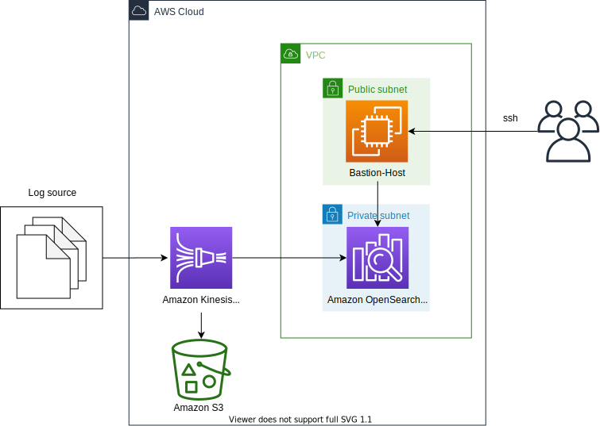
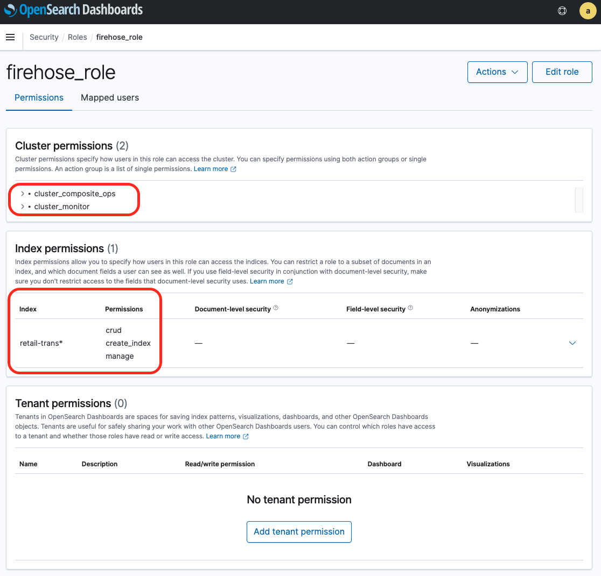
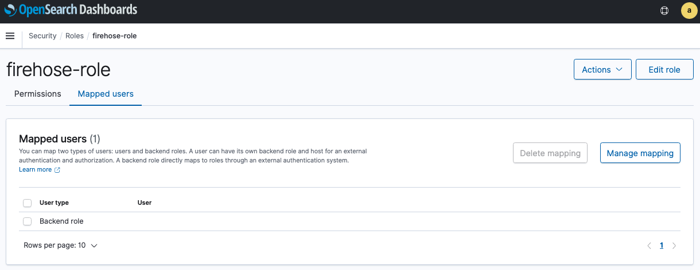
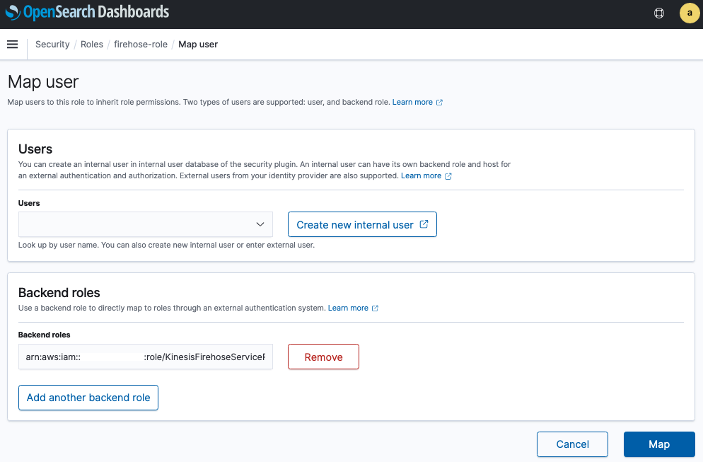

# OPSKK (Amazon OpenSearch Service - Kinesis Data Firehose - Kibana) Stack



This is a collection of projects for Python development with CDK.

The `cdk.json` file tells the CDK Toolkit how to execute your app.

This project is set up like a standard Python project.  The initialization
process also creates a virtualenv within this project, stored under the .env
directory.  To create the virtualenv it assumes that there is a `python3`
(or `python` for Windows) executable in your path with access to the `venv`
package. If for any reason the automatic creation of the virtualenv fails,
you can create the virtualenv manually.

To manually create a virtualenv on MacOS and Linux:

```
$ python3 -m venv .env
```

After the init process completes and the virtualenv is created, you can use the following
step to activate your virtualenv.

```
$ source .env/bin/activate
```

If you are a Windows platform, you would activate the virtualenv like this:

```
% .env\Scripts\activate.bat
```

Once the virtualenv is activated, you can install the required dependencies.

```
$ pip install -r requirements.txt
```

At this point you can now synthesize the CloudFormation template for this code.

<pre>
(.venv) $ export CDK_DEFAULT_ACCOUNT=$(aws sts get-caller-identity --query Account --output text)
(.venv) $ export CDK_DEFAULT_REGION=$(aws configure get region)
(.venv) $ cdk synth --all \
              -c OpenSearchDomainName="<i>your-opensearch-domain-name</i>" \
              -c SearchIndexName="<i>your-opensearch-index-name</i>" \
              -c EC2KeyPairName="<i>your-ec2-key-pair-name(exclude .pem extension)</i>"
</pre>

Use `cdk deploy` command to create the stack shown above.

<pre>
(.venv) $ cdk deploy --all \
              -c OpenSearchDomainName="<i>your-opensearch-domain-name</i>" \
              -c SearchIndexName="<i>your-opensearch-index-name</i>" \
              -c EC2KeyPairName="<i>your-ec2-key-pair-name(exclude .pem extension)</i>"
</pre>

To add additional dependencies, for example other CDK libraries, just add
them to your `setup.py` file and rerun the `pip install -r requirements.txt`
command.

## Clean Up

Delete the CloudFormation stack by running the below command.

```
(.venv) $ cdk destroy --force --all
```

## Useful commands

 * `cdk ls`          list all stacks in the app
 * `cdk synth`       emits the synthesized CloudFormation template
 * `cdk deploy`      deploy this stack to your default AWS account/region
 * `cdk diff`        compare deployed stack with current state
 * `cdk docs`        open CDK documentation

Enjoy!

## Test
1. Checkout the code to generate sample data into Kinesis Data Firehose.

    ```
    $ python3 -m venv .env
    $ source .env/bin/activate
    (.env) $ ls -1
    README.md
    amazon-oskk-stack-arch.svg
    app.py
    cdk.context.json
    cdk.json
    requirements.txt
    resources
    test
    (.env) $ ls test
    gen_firehose_data.py
    (.env) $
    ```

2. Run the test code. For example,
   - AWS Region: `us-east-1`
   - Kinesis Data Fireshose Stream Name: `retail-trans`

    ```
    (.env) $ python test/gen_firehose_data.py --region-name us-east-1 --stream-name retail-trans --count 10
    (.env) $
    ```

## Remotely access your Amazon OpenSearch Cluster using SSH tunnel from local machine
#### Access to your Amazon OpenSearch Dashboards with web browser
1. To access the OpenSearch Cluster, add the ssh tunnel configuration to the ssh config file of the personal local PC as follows

    <pre>
    # OpenSearch Tunnel
    Host opstunnel
        HostName <i>EC2-Public-IP-of-Bastion-Host</i>
        User ec2-user
        IdentitiesOnly yes
        IdentityFile <i>Path-to-SSH-Public-Key</i>
        LocalForward 9200 <i>OpenSearch-Endpoint</i>:443
    </pre>

    ex)

    ```
    ~$ ls -1 .ssh/
    config
    my-ec2-key-pair.pem

    ~$ tail .ssh/config
    # OpenSearch Tunnel
    Host opstunnel
        HostName 214.132.71.219
        User ec2-user
        IdentitiesOnly yes
        IdentityFile ~/.ssh/my-ec2-key-pair.pem
        LocalForward 9200 vpc-search-domain-qvwlxanar255vswqna37p2l2cy.us-east-1.es.amazonaws.com:443

    ~$
    ```

    You can find the bastion host's public ip address as running the commands like this:

    <pre>
    $ BASTION_HOST_ID=$(aws cloudformation describe-stacks --stack-name <i>your-cloudformation-stack-name</i> | jq -r '.Stacks[0].Outputs | map(select(.OutputKey == "BastionHostBastionHostId")) | .[0].OutputValue')
    $ aws ec2 describe-instances --instance-ids ${BASTION_HOST_ID} | jq -r '.Reservations[0].Instances[0].PublicIpAddress'
    </pre>

2. Run `ssh -N opstunnel` in Terminal.
3. Connect to `https://localhost:9200/_dashboards/` in a web browser.
4. Enter the master user and password that you set up when you created the Amazon OpenSearch Service endpoint.
5. In the Welcome screen, click the toolbar icon to the left side of **Home** button. Choose **Stack Managerment**
   
6. After selecting **Advanced Settings** from the left sidebar menu, set **Timezone** for date formatting to `Etc/UTC`.
   Since the log creation time of the test data is based on UTC, OpenSearch Dashboard’s Timezone is also set to UTC.
   
7. If you would like to access the OpenSearch Cluster in a termial, open another terminal window, and then run the following commands: (in here, <i>`your-cloudformation-stack-name`</i> is `OpensearchStack`)

    <pre>
    $ MASTER_USER_SECRET_ID=$(aws cloudformation describe-stacks --stack-name <i>your-cloudformation-stack-name</i> | jq -r '.Stacks[0].Outputs | map(select(.OutputKey == "MasterUserSecretId")) | .[0].OutputValue')
    $ export OPS_SECRETS=$(aws secretsmanager get-secret-value --secret-id ${MASTER_USER_SECRET_ID} | jq -r '.SecretString | fromjson | "\(.username):\(.password)"')
    $ export OPS_DOMAIN=$(aws cloudformation describe-stacks --stack-name <i>your-cloudformation-stack-name</i> | jq -r '.Stacks[0].Outputs | map(select(.OutputKey == "OpenSearchDomainEndpoint")) | .[0].OutputValue')
    $ curl -XGET --insecure -u "${OPS_SECRETS}" https://localhost:9200/_cluster/health?pretty=true
    $ curl -XGET --insecure -u "${OPS_SECRETS}" https://localhost:9200/_cat/nodes?v
    $ curl -XGET --insecure -u "${OPS_SECRETS}" https://localhost:9200/_nodes/stats?pretty=true
    </pre>

#### Enable Kinesis Data Firehose to ingest records into Amazon OpenSearch
Kinesis Data Firehose uses the delivery role to sign HTTP (Signature Version 4) requests before sending the data to the Amazon OpenSearch Service endpoint.
You manage Amazon OpenSearch Service fine-grained access control permissions using roles, users, and mappings.
This section describes how to create roles and set permissions for Kinesis Data Firehose.

Complete the following steps:

1. Navigate to Kibana (you can find the URL on the Amazon OpenSearch Service console).
2. Enter the master user and password that you set up when you created the Amazon OpenSearch Service endpoint.
3. Under **Security**, choose **Roles**.
4. Choose **Create role**.
5. Name your role; for example, `firehose_role`.
6. For cluster permissions, add `cluster_composite_ops` and `cluster_monitor`.
7. Under **Index permissions**, choose **Index Patterns** and enter <i>index-name*</i>; for example, `retail-trans*`.
8. Under **Permissions**, add three action groups: `crud`, `create_index`, and `manage`.
9. Choose **Create**.
    

In the next step, you map the IAM role that Kinesis Data Firehose uses to the role you just created.

10. Choose the **Mapped users** tab.
    
11. Choose **Manage mapping** and under **Backend roles**,
12. For **Backend Roles**, enter the IAM ARN of the role Kinesis Data Firehose uses:
    `arn:aws:iam::123456789012:role/firehose_stream_role_name`.
    
13. Choose **Map**.

**Note**: After OpenSearch Role mapping for Kinesis Data Firehose, you would not be supposed to meet a data delivery failure with Kinesis Data Firehose like this:

<pre>
"errorMessage": "Error received from Elasticsearch cluster. {\"error\":{\"root_cause\":[{\"type\":\"security_exception\",\"reason\":\"no permissions for [indices:data/write/bulk] and User [name=arn:aws:iam::123456789012:role/KinesisFirehoseServiceRole-<i>firehose_stream_name</i>-<i>region_name</i>, backend_roles=[arn:aws:iam::123456789012:role/KinesisFirehoseServiceRole-<i>firehose_stream_name</i>-<i>region_name</i>], requestedTenant=null]\"}],\"type\":\"security_exception\",\"reason\":\"no permissions for [indices:data/write/bulk] and User [name=arn:aws:iam::123456789012:role/KinesisFirehoseServiceRole-<i>firehose_stream_name</i>-<i>region_name</i>, backend_roles=[arn:aws:iam::123456789012:role/KinesisFirehoseServiceRole-<i>firehose_stream_name</i>-<i>region_name</i>], requestedTenant=null]\"},\"status\":403}",
</pre>

## Considerations
Check the following questions before using Kinesis Data Firehose to ingest documents into Amazon OpenSearch Service
- [ ] Need to change `_type`?
- [ ] Should update documents in Amazon OpenSearch Service?
- [ ] Want to use custome `_id` instead of auto generated `_id` by OpenSearch?

## References
1. [Windows SSH / Tunnel for Kibana Instructions - Amazon Elasticsearch Service](https://search-sa-log-solutions.s3-us-east-2.amazonaws.com/logstash/docs/Kibana_Proxy_SSH_Tunneling_Windows.pdf)
2. [Use an SSH Tunnel to access Kibana within an AWS VPC with PuTTy on Windows](https://amazonmsk-labs.workshop.aws/en/mskkdaflinklab/createesdashboard.html)
3. [OpenSearch Popular APIs](https://opensearch.org/docs/latest/opensearch/popular-api/)
4. [Why am I experiencing a data delivery failure with Kinesis Data Firehose?](https://aws.amazon.com/premiumsupport/knowledge-center/kinesis-data-firehose-delivery-failure/)
5. [Ingest streaming data into Amazon Elasticsearch Service within the privacy of your VPC with Amazon Kinesis Data Firehose](https://aws.amazon.com/blogs/big-data/ingest-streaming-data-into-amazon-elasticsearch-service-within-the-privacy-of-your-vpc-with-amazon-kinesis-data-firehose/)
6. [Fine-grained access control in Amazon OpenSearch Service](https://docs.aws.amazon.com/opensearch-service/latest/developerguide/fgac.html)
7. [How do I troubleshoot CloudWatch Logs so that it streams to my Amazon OpenSearch Service domain?](https://aws.amazon.com/premiumsupport/knowledge-center/opensearch-troubleshoot-cloudwatch-logs/)
8. [Build a Log Analytics Solution on AWS](https://aws.amazon.com/getting-started/hands-on/build-log-analytics-solution/)
9. [Hands-on guide to Build a Log Analytics Solution on AWS](https://d1.awsstatic.com/Projects/P4113850/aws-projects_build-log-analytics-solution-on-aws.pdf)
10. [Amazon Kinesis Data Firehose Immersion Day](https://catalog.us-east-1.prod.workshops.aws/workshops/32e6bc9a-5c03-416d-be7c-4d29f40e55c4/en-US) - Lab 4 - Data delivery to different targets > 4.1 - Amazon OpenSearch as destination

