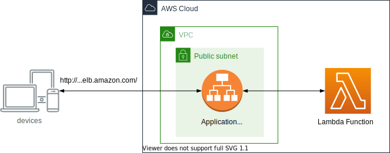

# Amazon Lambda with Application Load Balancer CDK Project

This is an Amazon Application Load Balancer Serverless Application with Lambda for CDK development with Python.



Application Load Balancer (ALB) can now trigger Lambda functions to serve HTTP/HTTPS requests enabling users to access serverless applications from the web browsers or mobile applications.

The `cdk.json` file tells the CDK Toolkit how to execute your app.

This project is set up like a standard Python project.  The initialization
process also creates a virtualenv within this project, stored under the `.venv`
directory.  To create the virtualenv it assumes that there is a `python3`
(or `python` for Windows) executable in your path with access to the `venv`
package. If for any reason the automatic creation of the virtualenv fails,
you can create the virtualenv manually.

To manually create a virtualenv on MacOS and Linux:

```
$ python3 -m venv .venv
```

After the init process completes and the virtualenv is created, you can use the following
step to activate your virtualenv.

```
$ source .venv/bin/activate
```

If you are a Windows platform, you would activate the virtualenv like this:

```
% .venv\Scripts\activate.bat
```

Once the virtualenv is activated, you can install the required dependencies.

```
(.venv) $ pip install -r requirements.txt
```

At this point you can now synthesize the CloudFormation template for this code.

<pre>
(.venv) $ export CDK_DEFAULT_ACCOUNT=$(aws sts get-caller-identity --query Account --output text)
(.venv) $ export CDK_DEFAULT_REGION=$(aws configure get region)
(.venv) $ cdk -c vpc_name=<i>your-vpc-name</i> synth --all
</pre>

Use `cdk deploy` command to create the stack shown above.

<pre>
(.venv) $ cdk -c vpc_name=<i>your-vpc-name</i> deploy --require-approval never --all
</pre>

To add additional dependencies, for example other CDK libraries, just add
them to your `setup.py` file and rerun the `pip install -r requirements.txt`
command.

## Clean Up

Delete the CloudFormation stack by running the below command.

```
(.venv) $ cdk destroy --force --all
```

## Useful commands

 * `cdk ls`          list all stacks in the app
 * `cdk synth`       emits the synthesized CloudFormation template
 * `cdk deploy`      deploy this stack to your default AWS account/region
 * `cdk diff`        compare deployed stack with current state
 * `cdk docs`        open CDK documentation

Enjoy!

## References

 * [Amazon Application Load Balancers - Lambda functions as targets](https://docs.aws.amazon.com/elasticloadbalancing/latest/application/lambda-functions.html)
 * [Lambda functions as targets for Application Load Balancers](https://aws.amazon.com/ko/blogs/networking-and-content-delivery/lambda-functions-as-targets-for-application-load-balancers/)
 * [How do I achieve path-based routing on an Application Load Balancer?](https://aws.amazon.com/premiumsupport/knowledge-center/elb-achieve-path-based-routing-alb/)
 * [AWS CDK: Use Lambda with Application Load Balancer](https://sbstjn.com/blog/aws-cdk-lambda-loadbalancer-vpc-certificate/)
 * [Amazon Application Load Balancer Serverless App](https://github.com/aws/elastic-load-balancing-tools/tree/master/application-load-balancer-serverless-app)

