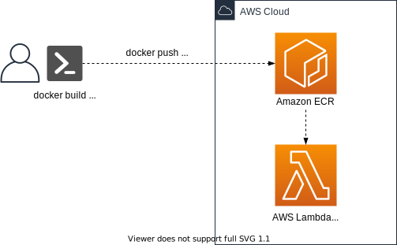
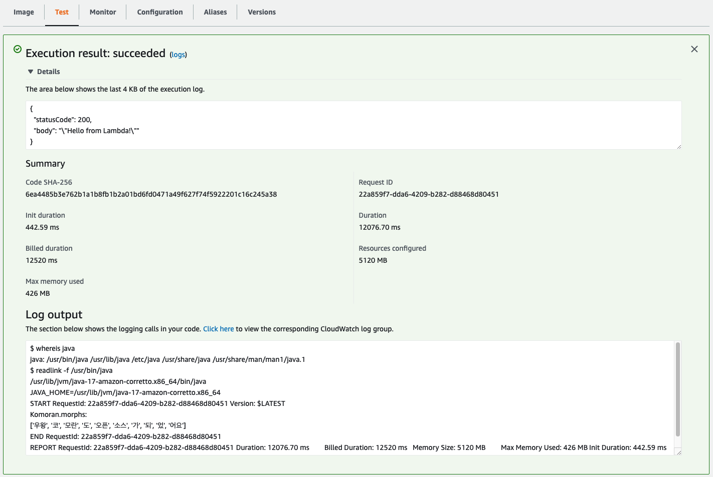

# AWS Lambda function with Custom Container

This is a CDK Python project to show how to deploy AWS Lambda function with a custom container.



It is useful to use the custom container when you need to more than two different run time enviroments for AWS Lambda function. For example, if you try to use a python package wrapping Java package (e.g., [KoNLpy](https://konlpy.org/ko/latest/)) in the AWS Lambda function, you would need both Python and Java run time.

The `cdk.json` file tells the CDK Toolkit how to execute your app.

This project is set up like a standard Python project.  The initialization
process also creates a virtualenv within this project, stored under the `.venv`
directory.  To create the virtualenv it assumes that there is a `python3`
(or `python` for Windows) executable in your path with access to the `venv`
package. If for any reason the automatic creation of the virtualenv fails,
you can create the virtualenv manually.

To manually create a virtualenv on MacOS and Linux:

```
$ python3 -m venv .venv
```

After the init process completes and the virtualenv is created, you can use the following
step to activate your virtualenv.

```
$ source .venv/bin/activate
```

If you are a Windows platform, you would activate the virtualenv like this:

```
% .venv\Scripts\activate.bat
```

Once the virtualenv is activated, you can install the required dependencies.

```
(.venv) $ pip install -r requirements.txt
```

## Deploy

At this point you can now synthesize the CloudFormation template for this code.

<pre>
(.venv) $ export CDK_DEFAULT_ACCOUNT=$(aws sts get-caller-identity --query Account --output text)
(.venv) $ export CDK_DEFAULT_REGION=$(aws configure get region)
(.venv) $ cdk synth
</pre>

Use `cdk deploy` command to create the stack shown above.

<pre>
(.venv) $ cdk deploy
</pre>

To add additional dependencies, for example other CDK libraries, just add
them to your `setup.py` file and rerun the `pip install -r requirements.txt`
command.

## Clean Up

Delete the CloudFormation stack by running the below command.

```
(.venv) $ cdk destroy
```

## Useful commands

 * `cdk ls`          list all stacks in the app
 * `cdk synth`       emits the synthesized CloudFormation template
 * `cdk deploy`      deploy this stack to your default AWS account/region
 * `cdk diff`        compare deployed stack with current state
 * `cdk docs`        open CDK documentation

Enjoy!

## Run Test

When you run `Test` in the lambda function, you can see the result like this:




## How to create and upload Docker image to the Amazon ECR repository
### Create an image from an AWS base image for Lambda

You can create the container image with an AWS base image for Lambda by following the instructions.

1. On your local machine, create a project directory for your new function.

2. Create a directory named `app` in the project directory, and then add your function handler code to the `app` directory.

3. Use a text editor to create a new Dockerfile.<br/>
In this project, you can find the examplary application in the `custom_container/app` directory.
   ```
   $ cd custom_container/app
   $ tree ./
   ./
   ├── app.py
   ├── Dockerfile
   └── requirements.txt

   0 directories, 3 files
   ```

1. Build your Docker image with the docker build command. Enter a name for the image. The following example names the image `hello-world`.
   <pre>
   docker build -t <i>hello-world</i> .
   </pre>

2. Start the Docker image with the `docker run` command. For this example, enter `hello-world` as the image name.
   <pre>
   docker run -p 9000:8080 <i>hello-world</i>
   </pre>

3. (Optional) Test your application locally using the [runtime interface emulator](https://docs.aws.amazon.com/lambda/latest/dg/images-test.html). From a new terminal window, post an event to the following endpoint using a curl command:
   <pre>
   curl -XPOST "http://localhost:9000/2015-03-31/functions/function/invocations" -d '{}'
   </pre>

### Upload the image to the Amazon ECR repository

In the following commands, replace `123456789012` with your **AWS account ID** and set the `region` value to the **region** where you want to create the Amazon ECR repository.

1. Authenticate the Docker CLI to your Amazon ECR registry.
   <pre>
   aws ecr get-login-password --region <i>us-east-1</i> | docker login --username AWS --password-stdin <i>123456789012</i>.dkr.ecr.<i>us-east-1</i>.amazonaws.com
   </pre>
2. Create a repository in Amazon ECR using the `create-repository` command.
   <pre>
   aws ecr create-repository --repository-name <i>hello-world</i> --image-scanning-configuration scanOnPush=true --image-tag-mutability MUTABLE
   </pre>
3. Tag your image to match your repository name, and deploy the image to Amazon ECR using the docker push command.
   <pre>
   docker tag <i>hello-world</i>:latest <i>123456789012</i>.dkr.ecr.<i>us-east-1</i>.amazonaws.com/<i>hello-world</i>:latest
   docker push <i>123456789012</i>.dkr.ecr.<i>us-east-1</i>.amazonaws.com/<i>hello-world</i>:latest
   </pre>


## References

 * [AWS Lambda - Creating images from AWS base images](https://docs.aws.amazon.com/lambda/latest/dg/images-create.html#images-create-from-base)
 * [AWS Lambda - Upload the image to the Amazon ECR repository](https://docs.aws.amazon.com/lambda/latest/dg/images-create.html#images-upload)
 * [New for AWS Lambda – Container Image Support](https://aws.amazon.com/ko/blogs/aws/new-for-aws-lambda-container-image-support/)
 * [AWS Lambda Base images for Lambda](https://docs.aws.amazon.com/lambda/latest/dg/runtimes-images.html)
 * [Amazon ECR Public Gallery](https://gallery.ecr.aws/lambda/provided)
 * [Testing AWS Lambda container images locally](https://docs.aws.amazon.com/lambda/latest/dg/images-test.html)

