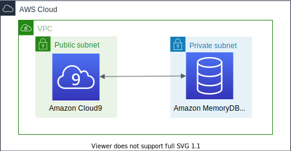

# Amazon MemoryDB for Redis



This is a collection of projects for Python development with CDK.

The `cdk.json` file tells the CDK Toolkit how to execute your app.

This project is set up like a standard Python project.  The initialization
process also creates a virtualenv within this project, stored under the `.venv`
directory.  To create the virtualenv it assumes that there is a `python3`
(or `python` for Windows) executable in your path with access to the `venv`
package. If for any reason the automatic creation of the virtualenv fails,
you can create the virtualenv manually.

To manually create a virtualenv on MacOS and Linux:

```
$ python3 -m venv .venv
```

After the init process completes and the virtualenv is created, you can use the following
step to activate your virtualenv.

```
$ source .venv/bin/activate
```

If you are a Windows platform, you would activate the virtualenv like this:

```
% .venv\Scripts\activate.bat
```

Once the virtualenv is activated, you can install the required dependencies.

```
(.venv) $ pip install -r requirements.txt
```

To add additional dependencies, for example other CDK libraries, just add
them to your `setup.py` file and rerun the `pip install -r requirements.txt`
command.

Before synthesizing the CloudFormation, you should set approperly the cdk context configuration file, `cdk.context.json`.

For example:

<pre>
{
  "memorydb_user_name": "<i>memdb-admin</i>",
  "memorydb_cluster_name": "<i>vectordb</i>"
}
</pre>

Now this point you can now synthesize the CloudFormation template for this code.

```
(.venv) $ export CDK_DEFAULT_ACCOUNT=$(aws sts get-caller-identity --query Account --output text)
(.venv) $ export CDK_DEFAULT_REGION=us-east-1 # your-aws-account-region
(.venv) $ cdk synth --all
```

Now we will be able to deploy all the CDK stacks at once like this:

```
(.venv) $ cdk deploy --require-approval never --all
```

## Verify

After a few minutes, the cluster is running and you can connect using the [Redis command line interface](https://redis.io/topics/rediscli) or any [Redis client](https://redis.io/clients).

All MemoryDB clusters run in a virtual private cloud (VPC). You need to EC2 instance or Cloud9 in your VPC to access MemoryDB clusters. Also either EC2 instance or Cloud9 must be given a proper security group such as `memorydb-client-sg` created in the stack above.

:information_source: The `username` and `password` are stored in the [AWS Secrets Manager](https://console.aws.amazon.com/secretsmanager/listsecrets) as a name such as `MemoryDBSecret-xxxxxxxxxxxx`.


### Connect to Amazon MemoryDB using Redis command line interface

<pre>
$ wget https://download.redis.io/releases/redis-6.2.6.tar.gz
$ tar -xzvf redis-6.2.6.tar.gz
$ cd redis-6.2.6
$ make MALLOC=jemalloc BUILD_TLS=yes
$ sudo make install
$ redis-cli -c --tls -h <i>memorydb-cluster-endpoint</i> --user <i>'user-name'</i> --askpass
Please input password: ****************
clustercfg.<i>your-memorydb-name</i>.memorydb.<i>region</i>.amazonaws.com:6379>
</pre>

### Connect to Amazon MemoryDB using Python Redis client

<pre>
$ pip install redis-py-cluster
$ python
Python 3.9.7 (default, Oct 13 2021, 06:44:56)
[GCC 4.8.5 20150623 (Red Hat 4.8.5-28)] on linux
Type "help", "copyright", "credits" or "license" for more information.
>>> from rediscluster import RedisCluster
>>> db_host = 'clustercfg.your-memorydb-name.memorydb.region.amazonaws.com'
>>> db_port = 6379
>>> db_username = 'user-name'
>>> db_password = 'user-password'
>>> redis_cluster_options = {
...   'startup_nodes': [{"host": db_host, "port": db_port}],
...   'decode_responses': True,
...   'skip_full_coverage_check': True,
...   'ssl': True,
...   'username': db_username,
...   'password': db_password
... }
>>> redis = RedisCluster(**redis_cluster_options)
>>> if redis.ping():
...     print("Connected to Redis")
...
Connected to Redis
>>>
</pre>

## Useful commands

 * `cdk ls`          list all stacks in the app
 * `cdk synth`       emits the synthesized CloudFormation template
 * `cdk deploy`      deploy this stack to your default AWS account/region
 * `cdk diff`        compare deployed stack with current state
 * `cdk docs`        open CDK documentation

## Learn more

 * [Introducing Amazon MemoryDB for Redis – A Redis-Compatible, Durable, In-Memory Database Service](https://aws.amazon.com/blogs/aws/introducing-amazon-memorydb-for-redis-a-redis-compatible-durable-in-memory-database-service/)
 * [Build with Redis data structures for microservices using Amazon MemoryDB for Redis and Amazon ECS](https://aws.amazon.com/blogs/database/build-with-redis-data-structures-for-microservices-using-amazon-memorydb-for-redis-and-amazon-ecs/)
 * [Amazon MemoryDB for Redis - Authenticating users with Access Control Lists (ACLs)](https://docs.aws.amazon.com/memorydb/latest/devguide/clusters.acls.html)
 * [Amazon MemoryDB for Redis engine versions](https://docs.aws.amazon.com/memorydb/latest/devguide/engine-versions.html)
 * [Amazon MemoryDB for Redis Samples](https://github.com/aws-samples/amazon-memorydb-for-redis-samples)
 * [Redis ACL](https://redis.io/topics/acl)
 * [Redis Documentation](https://redis.io/documentation)

Enjoy!
