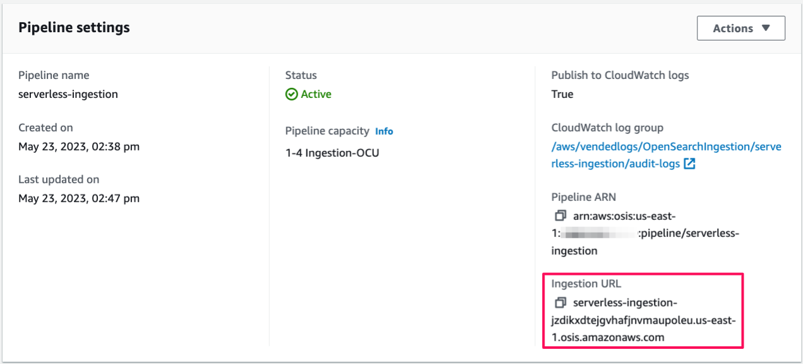

# Ingesting data into a collection using Amazon OpenSearch Ingestion


This is an Amazon OpenSearch ingestion project for CDK development with Python.

This project builds on the following tutorial: [Ingesting data into a collection using Amazon OpenSearch Ingestion](https://docs.aws.amazon.com/opensearch-service/latest/developerguide/osis-serverless-get-started.html).

This project shows you how to use Amazon OpenSearch Ingestion to configure a simple pipeline and ingest data into an Amazon OpenSearch Serverless collection.

The `cdk.json` file tells the CDK Toolkit how to execute your app.

This project is set up like a standard Python project.  The initialization
process also creates a virtualenv within this project, stored under the `.venv`
directory.  To create the virtualenv it assumes that there is a `python3`
(or `python` for Windows) executable in your path with access to the `venv`
package. If for any reason the automatic creation of the virtualenv fails,
you can create the virtualenv manually.

To manually create a virtualenv on MacOS and Linux:

```
$ python3 -m venv .venv
```

After the init process completes and the virtualenv is created, you can use the following
step to activate your virtualenv.

```
$ source .venv/bin/activate
```

If you are a Windows platform, you would activate the virtualenv like this:

```
% .venv\Scripts\activate.bat
```

Once the virtualenv is activated, you can install the required dependencies.

```
(.venv) $ pip install -r requirements.txt
```

At this point you can now synthesize the CloudFormation template for this code.

<pre>
(.venv) $ export CDK_DEFAULT_ACCOUNT=$(aws sts get-caller-identity --query Account --output text)
(.venv) $ export CDK_DEFAULT_REGION=$(aws configure get region)
(.venv) $ cdk synth -c iam_user_name=<i>your-iam-user-name</i> --all
</pre>

## A note about Service-Linked Role
Some cluster configurations (e.g VPC access) require the existence of the `AWSServiceRoleForAmazonOpenSearchServerless` Service-Linked Role.

When performing such operations via the AWS Console, this SLR is created automatically when needed. However, this is not the behavior when using CloudFormation. If an SLR(Service-Linked Role) is needed, but doesn’t exist, you will encounter a failure message simlar to:

<pre>
Before you can proceed, you must enable a service-linked role to give Amazon OpenSearch Service...
</pre>

To resolve this, you need to [create](https://docs.aws.amazon.com/IAM/latest/UserGuide/using-service-linked-roles.html#create-service-linked-role) the SLR. We recommend using the AWS CLI:

```
aws iam create-service-linked-role --aws-service-name observability.aoss.amazonaws.com
```

OpenSearch Ingestion uses the service-linked role named `AWSServiceRoleForAmazonOpenSearchIngestion`. The attached policy provides the permissions necessary for the role to create a virtual private cloud (VPC) between your account and OpenSearch Ingestion, and to publish CloudWatch metrics to your account.

So you need to [create](https://docs.aws.amazon.com/IAM/latest/UserGuide/using-service-linked-roles.html#create-service-linked-role) the SLR. We recommend using the AWS CLI:

```
aws iam create-service-linked-role --aws-service-name osis.amazon.com
```

:information_source: For more information, see [here](https://docs.aws.amazon.com/opensearch-service/latest/developerguide/slr.html).

## Required IAM permission for access to Amazon OpenSearch Serverelss

:warning: Amazon OpenSearch Serverless requires mandatory IAM permission for access to resources.
You are required to add these two IAM permissions for your OpenSearch Serverless **"aoss:APIAccessAll"** for Data Plane API access, and **"aoss:DashboardsAccessAll"** for Dashboards access. Failure to add the two new IAM permissions will result in 403 errors starting on May 10th, 2023

For a sample data-plane policy [here](https://docs.aws.amazon.com/opensearch-service/latest/developerguide/security-iam-serverless.html#security_iam_id-based-policy-examples-data-plane.html):

  - [Using OpenSearch Serverless in the console
](https://docs.aws.amazon.com/opensearch-service/latest/developerguide/security-iam-serverless.html#security_iam_serverless_id-based-policy-examples-console)
  - [Administering OpenSearch Serverless collections](https://docs.aws.amazon.com/opensearch-service/latest/developerguide/security-iam-serverless.html#security_iam_id-based-policy-examples-collection-admin)
  - [Viewing OpenSearch Serverless collections](https://docs.aws.amazon.com/opensearch-service/latest/developerguide/security-iam-serverless.html#security_iam_id-based-policy-examples-view-collections)
  - [Using data-plane policies](https://docs.aws.amazon.com/opensearch-service/latest/developerguide/security-iam-serverless.html#security_iam_id-based-policy-examples-data-plane)

## Deploy

Use `cdk deploy` command to create the stack shown above.

<pre>
(.venv) $ cdk deploy -c iam_user_name=<i>your-iam-user-name</i> --all
</pre>

To add additional dependencies, for example other CDK libraries, just add
them to your `setup.py` file and rerun the `pip install -r requirements.txt`
command.

## Clean Up

Delete the CloudFormation stack by running the below command.

<pre>
(.venv) $ cdk destroy -c iam_user_name=<i>your-iam-user-name</i> --force --all
</pre>

## Useful commands

 * `cdk ls`          list all stacks in the app
 * `cdk synth`       emits the synthesized CloudFormation template
 * `cdk deploy`      deploy this stack to your default AWS account/region
 * `cdk diff`        compare deployed stack with current state
 * `cdk docs`        open CDK documentation

Enjoy!

## Run Tests

#### Step 1: Ingest some sample data

First, get the ingestion URL from the **Pipeline settings** page:



Then, ingest some sample data. The following sample request uses [awscurl](https://github.com/okigan/awscurl) to send a single log file to the `my_logs` index:

<pre>
$ awscurl --service osis --region <i>us-east-1</i> \
  -X POST \
  -H "Content-Type: application/json" \
  -d '[{"time":"2014-08-11T11:40:13+00:00","remote_addr":"122.226.223.69","status":"404","req
uest":"GET http://www.k2proxy.com//hello.html HTTP/1.1","http_user_agent":"Mozilla/4.0 (compatible; WOW64; SLCC2;)"}]' \
https://<i>{pipeline-endpoint}.us-east-1</i>.osis.amazonaws.com/log-pipeline/test_ingestion_path
</pre>

You should see a `200 OK` response.

#### Step 2: Query the sample data

Now, query the `my_logs` index to ensure that the log entry was successfully ingested:

<pre>
$ awscurl --service aoss --region <i>us-east-1</i> \
     -X GET \
     https://<i>{collection-id}.us-east-1</i>.aoss.amazonaws.com/my_logs/_search | jq -r '.'
</pre>

**Sample response:**

<pre>
{
  "took": 367,
  "timed_out": false,
  "_shards": {
    "total": 0,
    "successful": 0,
    "skipped": 0,
    "failed": 0
  },
  "hits": {
    "total": {
      "value": 1,
      "relation": "eq"
    },
    "max_score": 1,
    "hits": [
      {
        "_index": "my_logs",
        "_id": "1%3A0%3ALkidTIgBbiu_ytx_zXnH",
        "_score": 1,
        "_source": {
          "time": "2014-08-11T11:40:13+00:00",
          "remote_addr": "122.226.223.69",
          "status": "404",
          "request": "GET http://www.k2proxy.com//hello.html HTTP/1.1",
          "http_user_agent": "Mozilla/4.0 (compatible; WOW64; SLCC2;)",
          "@timestamp": "2023-05-24T07:16:29.708Z"
        }
      }
    ]
  }
}
</pre>

## References

 * [Tutorial: Ingesting data into a collection using Amazon OpenSearch Ingestion](https://docs.aws.amazon.com/opensearch-service/latest/developerguide/osis-serverless-get-started.html)
 * [Amazon OpenSearch Ingestion Developer Guide](https://docs.aws.amazon.com/opensearch-service/latest/developerguide/ingestion.html)
 * [Data Prepper](https://opensearch.org/docs/latest/data-prepper/index/) - a server-side data collector capable of filtering, enriching, transforming, normalizing, and aggregating data for downstream analytics and visualization.
 * [Top strategies for high volume tracing with Amazon OpenSearch Ingestion (2023-04-27)](https://aws.amazon.com/blogs/big-data/top-strategies-for-high-volume-tracing-with-amazon-opensearch-ingestion/)
 * [Use cases for Amazon OpenSearch Ingestion
](https://docs.aws.amazon.com/opensearch-service/latest/developerguide/use-cases-overview.html) - some common use cases for Amazon OpenSearch Ingestion.
 * [Best practices for Amazon OpenSearch Ingestion](https://docs.aws.amazon.com/opensearch-service/latest/developerguide/osis-best-practices.html)
 * [Identity and Access Management for Amazon OpenSearch Serverless](https://docs.aws.amazon.com/opensearch-service/latest/developerguide/security-iam-serverless.html#security_iam_id-based-policy-examples-data-plane.html)
 * [Setting up roles and users in Amazon OpenSearch Ingestion](https://docs.aws.amazon.com/opensearch-service/latest/developerguide/pipeline-security-overview.html)
 * [AWS Signature Version 4 Signing Examples](https://github.com/aws-samples/sigv4a-signing-examples)
 * [awscurl](https://github.com/okigan/awscurl) - curl-like tool with AWS Signature Version 4 request signing.

