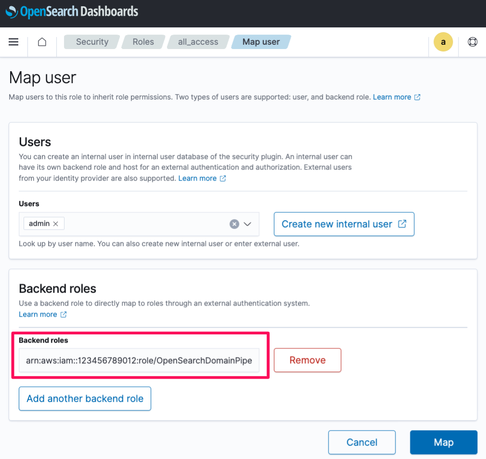

# Ingesting data into a domain using Amazon OpenSearch Ingestion


This is an Amazon OpenSearch ingestion project for CDK development with Python.

This project builds on the following tutorial: [Ingesting data into a domain using Amazon OpenSearch Ingestion](https://docs.aws.amazon.com/opensearch-service/latest/developerguide/osis-get-started.html).

This project shows you how to use Amazon OpenSearch Ingestion to configure a simple pipeline and ingest data into an Amazon OpenSearch.

The `cdk.json` file tells the CDK Toolkit how to execute your app.

This project is set up like a standard Python project.  The initialization
process also creates a virtualenv within this project, stored under the `.venv`
directory.  To create the virtualenv it assumes that there is a `python3`
(or `python` for Windows) executable in your path with access to the `venv`
package. If for any reason the automatic creation of the virtualenv fails,
you can create the virtualenv manually.

To manually create a virtualenv on MacOS and Linux:

```
$ python3 -m venv .venv
```

After the init process completes and the virtualenv is created, you can use the following
step to activate your virtualenv.

```
$ source .venv/bin/activate
```

If you are a Windows platform, you would activate the virtualenv like this:

```
% .venv\Scripts\activate.bat
```

Once the virtualenv is activated, you can install the required dependencies.

```
(.venv) $ pip install -r requirements.txt
```

At this point you can now synthesize the CloudFormation template for this code.

<pre>
(.venv) $ export CDK_DEFAULT_ACCOUNT=$(aws sts get-caller-identity --query Account --output text)
(.venv) $ export CDK_DEFAULT_REGION=$(aws configure get region)
(.venv) $ cdk synth --all
</pre>

To add additional dependencies, for example other CDK libraries, just add
them to your `setup.py` file and rerun the `pip install -r requirements.txt`
command.

## A note about Service-Linked Role
Some cluster configurations (e.g VPC access) require the existence of the `AWSServiceRoleForAmazonOpenSearchService` Service-Linked Role.

When performing such operations via the AWS Console, this SLR is created automatically when needed. However, this is not the behavior when using CloudFormation. If an SLR(Service-Linked Role) is needed, but doesn’t exist, you will encounter a failure message simlar to:

<pre>
Before you can proceed, you must enable a service-linked role to give Amazon OpenSearch Service...
</pre>

To resolve this, you need to [create](https://docs.aws.amazon.com/IAM/latest/UserGuide/using-service-linked-roles.html#create-service-linked-role) the SLR. We recommend using the AWS CLI:

```
aws iam create-service-linked-role --aws-service-name opensearchservice.amazonaws.com
```

OpenSearch Ingestion uses the service-linked role named `AWSServiceRoleForAmazonOpenSearchIngestion`. The attached policy provides the permissions necessary for the role to create a virtual private cloud (VPC) between your account and OpenSearch Ingestion, and to publish CloudWatch metrics to your account.

So you need to [create](https://docs.aws.amazon.com/IAM/latest/UserGuide/using-service-linked-roles.html#create-service-linked-role) the SLR. We recommend using the AWS CLI:

```
aws iam create-service-linked-role --aws-service-name osis.amazon.com
```

:information_source: For more information, see [here](https://docs.aws.amazon.com/opensearch-service/latest/developerguide/slr.html).

## Deploy

Use `cdk deploy` command to create the stack shown above.

#### Step 1: Create an OpenSearch Domain

<pre>
(.venv) $ cdk deploy --require-approval never \
                     OpsDomainVpc \
                     OpsDomainStack \
                     OpsClientEC2Stack
</pre>

#### Step 2: Create an OpenSearch Ingestion Pipeline Role

<pre>
(.venv) $ cdk deploy --require-approval never OpsDomainPipelineRoleStack
</pre>

The opensearch domain has been provisioned with [fine-grained access control](https://docs.aws.amazon.com/opensearch-service/latest/developerguide/fgac.html) for authentication.

Therefore, you need to take extra steps to provide the pipeline access to an OpenSearch domain.

The domain uses a master user in the internal user database and HTTP basic authentication for OpenSearch Dashboards.
So, you can't pass the master username and password directly into the pipeline configuration.
Instead, you need to map the pipeline role (`sts_role_arn`) to the OpenSearch `all_access` backend role.

In order to do that, complete the following steps:

1. The Amazon OpenSearch cluster is provisioned in a VPC. Hence, the Amazon OpenSearch endpoint and dashboard are not available over the internet. In order to access the endpoints, we have to create a ssh tunnel and do local port forwarding.
   1. Install EC2 Instance Connect CLI
       ```
       sudo pip install ec2instanceconnectcli
       ```
   2. Run
       <pre>mssh --region {<i>region</i>} ec2-user@{<i>bastion-ec2-instance-id</i>} -N -L 9200:{<i>opensearch-endpoint</i>}:443</pre>
     + ex)
       ```
       $ mssh --region us-east-1 ec2-user@i-0203f0d6f37ccbe5b -N -L 9200:vpc-retail-qvwlxanar255vswqna37p2l2cy.us-east-1.es.amazonaws.com:443
       ```

2. Connect to `https://localhost:9200/_dashboards/app/login?` in a web browser.
3. Enter the master user and password that you set up when you created the Amazon OpenSearch Service endpoint. The user and password are stored in the [AWS Secrets Manager](https://console.aws.amazon.com/secretsmanager/listsecrets) as a name such as `OpenSearchMasterUserSecret1-xxxxxxxxxxxx`.
   
4. In the Welcome screen, click the toolbar icon to the left side of **Home** button. Choose **Security**.
   
5. Choose **Security**, **Roles**, and then map the ingestion pipeline role to the `all_access` roles.
   

#### Step 3: Create an OpenSearch Ingestion Pipeline

<pre>
(.venv) $ cdk deploy OpsDomainIngestionStack
</pre>


## Clean Up

Delete the CloudFormation stack by running the below command.

<pre>
(.venv) $ cdk destroy --force --all
</pre>

## Useful commands

 * `cdk ls`          list all stacks in the app
 * `cdk synth`       emits the synthesized CloudFormation template
 * `cdk deploy`      deploy this stack to your default AWS account/region
 * `cdk diff`        compare deployed stack with current state
 * `cdk docs`        open CDK documentation

Enjoy!

## Run Test

#### Step 1: Ingest some sample data

First, get the ingestion URL from the **Pipeline settings** page:


Then, ingest some sample data. The following sample request uses [awscurl](https://github.com/okigan/awscurl) to send a single log file to the `my_logs` index:

<pre>
$ awscurl --service osis --region <i>us-east-1</i> \
     -X POST \
     -H "Content-Type: application/json" \
     -d '[{"time":"2014-08-11T11:40:13+00:00","remote_addr":"122.226.223.69","status":"404","req
   uest":"GET http://www.k2proxy.com//hello.html HTTP/1.1","http_user_agent":"Mozilla/4.0 (compatible; WOW64; SLCC2;)"}]' \
   https://<i>{pipeline-endpoint}.us-east-1</i>.osis.amazonaws.com/log-pipeline/test_ingestion_path
</pre>

You should see a `200 OK` response.

#### Step 2: Query the sample data

Now, query the `application_logs` index to ensure that the log entry was successfully ingested.

In OpenSearch Dashboards, choose **Dev Tools**, and run the following query:


<pre>
GET application_logs/_search
{
  "query": {
    "match_all": {}
  }
}
</pre>

**Sample response:**

<pre>
{
  "took": 21,
  "timed_out": false,
  "_shards": {
    "total": 5,
    "successful": 5,
    "skipped": 0,
    "failed": 0
  },
  "hits": {
    "total": {
      "value": 1,
      "relation": "eq"
    },
    "max_score": 1,
    "hits": [
      {
        "_index": "application_logs",
        "_id": "lyzBVYgBPgOW541j2YpC",
        "_score": 1,
        "_source": {
          "time": "2014-08-11T11:40:13+00:00",
          "remote_addr": "122.226.223.69",
          "status": "404",
          "request": "GET http://www.k2proxy.com//hello.html HTTP/1.1",
          "http_user_agent": "Mozilla/4.0 (compatible; WOW64; SLCC2;)",
          "@timestamp": "2023-05-24T07:16:29.708Z"
        }
      }
    ]
  }
}
</pre>

## References

 * [Tutorial: Ingesting data into a domain using Amazon OpenSearch Ingestion](https://docs.aws.amazon.com/opensearch-service/latest/developerguide/osis-get-started.html)
 * [Amazon OpenSearch Ingestion Developer Guide](https://docs.aws.amazon.com/opensearch-service/latest/developerguide/ingestion.html)
 * [Data Prepper](https://opensearch.org/docs/latest/data-prepper/index/) - a server-side data collector capable of filtering, enriching, transforming, normalizing, and aggregating data for downstream analytics and visualization.
 * [Top strategies for high volume tracing with Amazon OpenSearch Ingestion (2023-04-27)](https://aws.amazon.com/blogs/big-data/top-strategies-for-high-volume-tracing-with-amazon-opensearch-ingestion/)
 * [Use cases for Amazon OpenSearch Ingestion
](https://docs.aws.amazon.com/opensearch-service/latest/developerguide/use-cases-overview.html) - some common use cases for Amazon OpenSearch Ingestion.
 * [Best practices for Amazon OpenSearch Ingestion](https://docs.aws.amazon.com/opensearch-service/latest/developerguide/osis-best-practices.html)
 * [Identity and Access Management in Amazon OpenSearch Service](https://docs.aws.amazon.com/opensearch-service/latest/developerguide/ac.html)
 * [Setting up roles and users in Amazon OpenSearch Ingestion](https://docs.aws.amazon.com/opensearch-service/latest/developerguide/pipeline-security-overview.html)
 * [Fine-grained access control in Amazon OpenSearch Service](https://docs.aws.amazon.com/opensearch-service/latest/developerguide/fgac.html)
 * [Tutorial: Configure a domain with the internal user database and HTTP basic authentication](https://docs.aws.amazon.com/opensearch-service/latest/developerguide/fgac-walkthrough-basic.html)
 * [AWS Signature Version 4 Signing Examples](https://github.com/aws-samples/sigv4a-signing-examples)
 * [awscurl](https://github.com/okigan/awscurl) - curl-like tool with AWS Signature Version 4 request signing.
 * [Connect using the EC2 Instance Connect CLI](https://docs.aws.amazon.com/AWSEC2/latest/UserGuide/ec2-instance-connect-methods.html#ec2-instance-connect-connecting-ec2-cli)
   <pre>
   $ sudo pip install ec2instanceconnectcli
   $ mssh --region us-east-1 ec2-user@i-001234a4bf70dec41EXAMPLE
   </pre>
