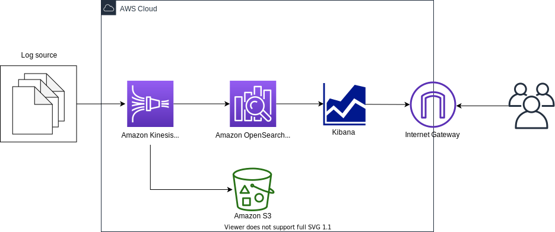
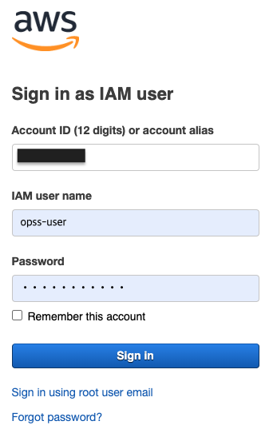
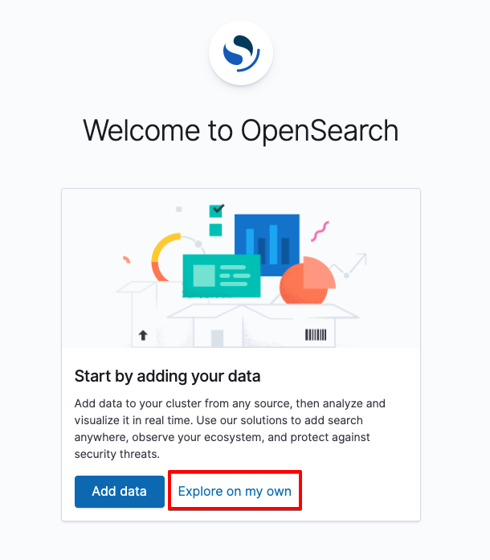
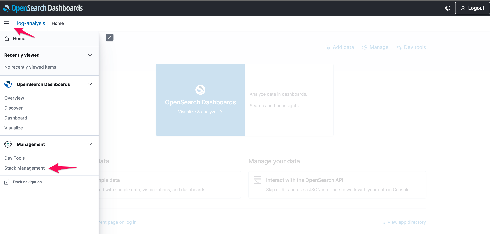
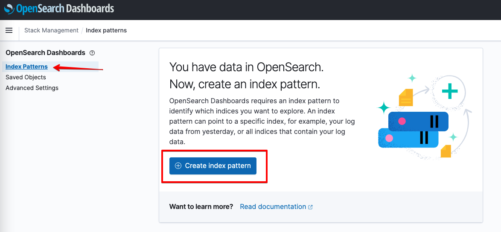
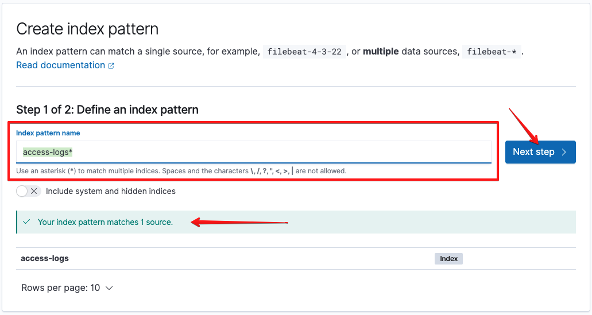
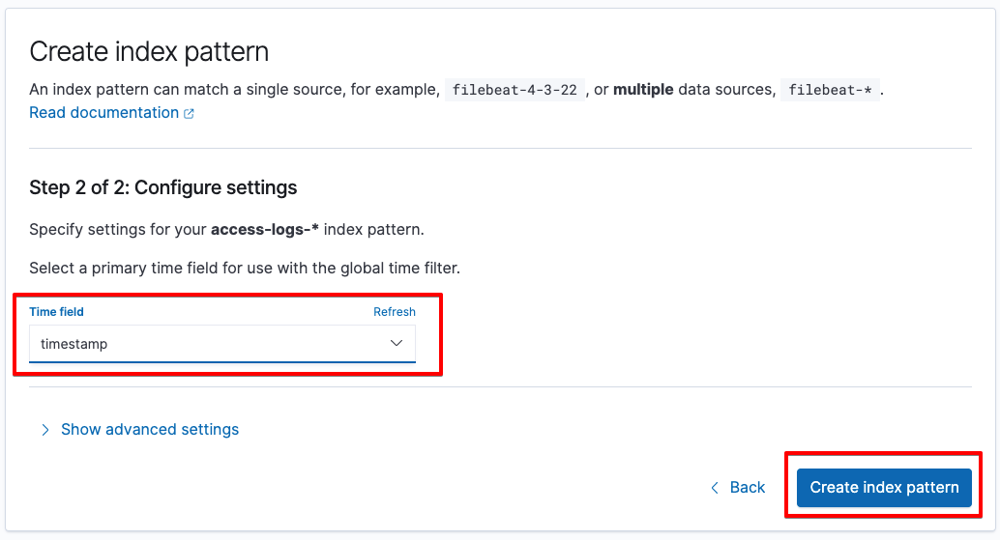
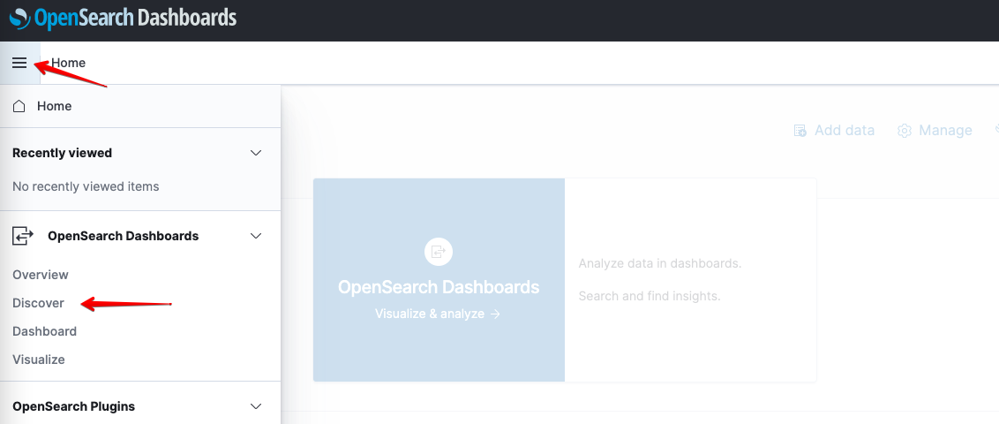
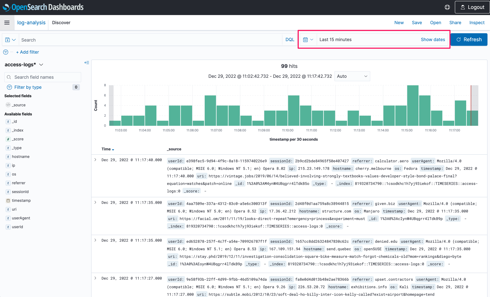

# Data Ingestion to Amazon OpenSearch Serverless using Kinesis Data Firehose



This is an Amazon OpenSearch Serverless project for CDK development with Python.

The `cdk.json` file tells the CDK Toolkit how to execute your app.

This project is set up like a standard Python project.  The initialization
process also creates a virtualenv within this project, stored under the `.venv`
directory.  To create the virtualenv it assumes that there is a `python3`
(or `python` for Windows) executable in your path with access to the `venv`
package. If for any reason the automatic creation of the virtualenv fails,
you can create the virtualenv manually.

To manually create a virtualenv on MacOS and Linux:

```
$ python3 -m venv .venv
```

After the init process completes and the virtualenv is created, you can use the following
step to activate your virtualenv.

```
$ source .venv/bin/activate
```

If you are a Windows platform, you would activate the virtualenv like this:

```
% .venv\Scripts\activate.bat
```

Once the virtualenv is activated, you can install the required dependencies.

```
(.venv) $ pip install -r requirements.txt
```

### Deploy

Before to synthesize the CloudFormation template for this code, you should update `cdk.context.json` file.

For example,
<pre>
{
  "firehose": {
    "buffer_size_in_mbs": 100,
    "buffer_interval_in_seconds": 300,
    "opensearch_index_name": "access-logs"
  },
  "opensearch_iam_user": {
    "user_name": "opss-user",
    "initial_password": "PassW0rd!"
  },
  "collection_name": "log-analysis"
}
</pre>

Now you are ready to synthesize the CloudFormation template for this code.

<pre>
(.venv) $ export CDK_DEFAULT_ACCOUNT=$(aws sts get-caller-identity --query Account --output text)
(.venv) $ export CDK_DEFAULT_REGION=$(curl -s 169.254.169.254/latest/dynamic/instance-identity/document | jq -r .region)
(.venv) $ cdk synth --all
</pre>

Use `cdk deploy` command to create the stack shown above.

<pre>
(.venv) $ cdk deploy --all
</pre>

To add additional dependencies, for example other CDK libraries, just add
them to your `setup.py` file and rerun the `pip install -r requirements.txt`
command.

## Clean Up

Delete the CloudFormation stack by running the below command.

<pre>
(.venv) $ cdk destroy --force --all
</pre>

## Useful commands

 * `cdk ls`          list all stacks in the app
 * `cdk synth`       emits the synthesized CloudFormation template
 * `cdk deploy`      deploy this stack to your default AWS account/region
 * `cdk diff`        compare deployed stack with current state
 * `cdk docs`        open CDK documentation

Enjoy!

## Run Tests

#### Send data to Kinesis Data Firehose using Direct PUT

1. Install python packages thare are required for the script to generate fake access logs
   <pre>
   (.venv) $ cat requirements-dev.txt
   boto3==1.26.38
   botocore==1.29.38
   mimesis==7.0.0
   (.venv) $ python install -r requirements-dev.txt
   </pre>

2. Run the script to send data to the Firehose.
   <pre>
   (.venv) $ python tests/gen_fake_data.py --stream-name <i>your-kinesis-firehose-stream-name</i> --max-count 1000
   </pre>

### Login to AWS Web console with the OpenSearch IAM User

To access Amazon OpenSearch Serverless data-plane APIs and OpenSearch Dashboards from the browser, you need to login to AWS Web console with the IAM User that is created.

You can find the IAM User name and initial password in the `cdk.context.json` file.

1. Sign into the Amazon Web console at [https://console.aws.amazon.com/](https://console.aws.amazon.com/console/home)
  
2. Change the password.
  
3. Check if successfuly logined.<br/>
   For example: `opss-user` login into the `N. Virgina (us-east-1)` region.
  

#### View incoming data in OpenSearch

After a couple of minutes, you will have enough data in your OpenSearch cluster for the next step. You can use OpenSearch dashboard to visualize or retrieve the data.

1. Navigate to OpenSearch collection in AWS console, and click on the **OpenSearch Dashboards URL**
2. If prompted to add data, select *Explore on my own*.
   
3. To start using your data, you need to create a **Search Pattern**. From the OpenSearch menu, click on *Stack Management* under **Management**.
   
4. On the left menu, click on *Index Patterns*, and then click on *Create index patterns*.
   
5. For **Index pattern** name, type `access-logs-*`. You should see a green prompt stating that `"Your index pattern matches ... source"`. Click on *Next step*.
   
6. In the next screen, Under **Time Field**, select *timestamp*. Then click on *Create index pattern*.
   
7. Now, let's take a look at some of the data records. Open the OpenSearch menu and click on *Discover* under **OpenSearch Dashboards**.
   
8. You can see a handful of your incoming data. You can search and filter using OpenSearch Dashboard Language here if you want.
   

## References

 * [Serverless logging with Amazon OpenSearch Serverless and Amazon Kinesis Data Firehose (2023-01-31)](https://aws.amazon.com/blogs/big-data/serverless-logging-with-amazon-opensearch-serverless-and-amazon-kinesis-data-firehose/)
 * [(Hands-on) Getting started with Amazon OpenSearch Serverless](https://catalog.us-east-1.prod.workshops.aws/workshops/f8d2c175-634d-4c5d-94cb-d83bbc656c6a/en-US)
 * [Amazon OpenSearch Serverless](https://docs.aws.amazon.com/opensearch-service/latest/developerguide/serverless.html)
 * [Identity and Access Management for Amazon OpenSearch Serverless](https://docs.aws.amazon.com/opensearch-service/latest/developerguide/security-iam-serverless.html)
 * [Configure SAML federation for Amazon OpenSearch Serverless with AWS IAM Identity Center (2023-04-18)](https://aws.amazon.com/blogs/big-data/configure-saml-federation-for-amazon-opensearch-serverless-with-aws-iam-identity-center/)
 * [Amazon Kinesis Data Firehose Immersion Day](https://catalog.us-east-1.prod.workshops.aws/workshops/32e6bc9a-5c03-416d-be7c-4d29f40e55c4/en-US)
 * [OpenSearch Popular APIs](https://opensearch.org/docs/latest/opensearch/popular-api/)
