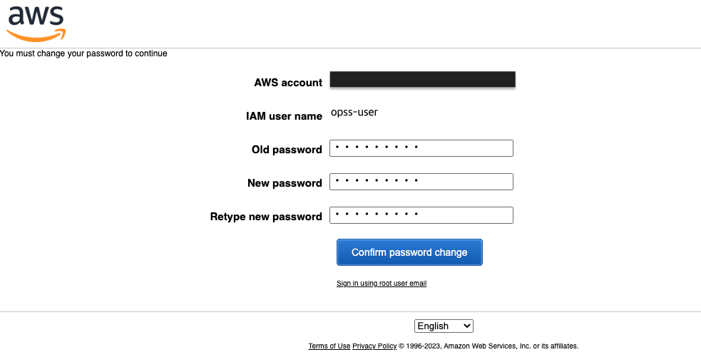

# Amazon OpenSearch Serverless CDK Python project for Search usecase!


This is an Amazon OpenSearch Serverless project for CDK development with Python.

The `cdk.json` file tells the CDK Toolkit how to execute your app.

This project is set up like a standard Python project.  The initialization
process also creates a virtualenv within this project, stored under the `.venv`
directory.  To create the virtualenv it assumes that there is a `python3`
(or `python` for Windows) executable in your path with access to the `venv`
package. If for any reason the automatic creation of the virtualenv fails,
you can create the virtualenv manually.

To manually create a virtualenv on MacOS and Linux:

```
$ python3 -m venv .venv
```

After the init process completes and the virtualenv is created, you can use the following
step to activate your virtualenv.

```
$ source .venv/bin/activate
```

If you are a Windows platform, you would activate the virtualenv like this:

```
% .venv\Scripts\activate.bat
```

Once the virtualenv is activated, you can install the required dependencies.

```
(.venv) $ pip install -r requirements.txt
```

Before synthesizing the CloudFormation, you should set approperly the cdk context configuration file, `cdk.context.json`.

For example:

```
{
  "opensearch_iam_user": {
    "user_name": "opss-user",
    "initial_password": "PassW0rd!"
  },
  "collection_name": "search-movies"
}
```

At this point you can now synthesize the CloudFormation template for this code.

<pre>
(.venv) $ export CDK_DEFAULT_ACCOUNT=$(aws sts get-caller-identity --query Account --output text)
(.venv) $ export CDK_DEFAULT_REGION=$(curl -s 169.254.169.254/latest/dynamic/instance-identity/document | jq -r .region)
(.venv) $ cdk synth --all \
              -c collection_name='<i>collection-name</i>'
</pre>

Use `cdk deploy` command to create the stack shown above.

<pre>
(.venv) $ cdk deploy --all \
              -c collection_name='<i>collection-name</i>'
</pre>

To add additional dependencies, for example other CDK libraries, just add
them to your `setup.py` file and rerun the `pip install -r requirements.txt`
command.

## Clean Up

Delete the CloudFormation stack by running the below command.

<pre>
(.venv) $ cdk destroy --force --all \
              -c collection_name='<i>collection-name</i>'
</pre>

## Useful commands

 * `cdk ls`          list all stacks in the app
 * `cdk synth`       emits the synthesized CloudFormation template
 * `cdk deploy`      deploy this stack to your default AWS account/region
 * `cdk diff`        compare deployed stack with current state
 * `cdk docs`        open CDK documentation

Enjoy!

## Run Test

### Step 1: Login to AWS Web console with the OpenSearch IAM User

To access Amazon OpenSearch Serverless data-plane APIs and OpenSearch Dashboards from the browser, you need to login to AWS Web console with the IAM User that is created.

You can find the IAM User name and initial password in the `cdk.context.json` file.

1. Sign into the Amazon Web console at [https://console.aws.amazon.com/](https://console.aws.amazon.com/console/home)
   
2. Change the password.
   
3. Check if successfuly logined.<br/>
   For example: `opss-user` login into the `N. Virgina (us-east-1)` region.
   

### Step 2: Upload and search data

If you would like to upload and search data, check out **Module 2 - Search usecase** in [Getting started with Amazon OpenSearch Serverless](https://catalog.us-east-1.prod.workshops.aws/workshops/f8d2c175-634d-4c5d-94cb-d83bbc656c6a/en-US)

The followings are examples using **Dev Tools** with the OpenSearch Dashboards console.

* Create a single index called `movies-index`
  <pre>
  PUT movies-index
  </pre>

* Upload Data using Bulk API
  <pre>
  POST /_bulk
  {"index": {"_index": "movies-index"}}
  {"directors": ["Joseph Gordon-Levitt"], "release_date": "2013-01-18T00:00:00Z", "rating": 7.4, "genres": ["Comedy", "Drama"], "image_url": "http://ia.media-imdb.com/images/M/MV5BMTQxNTc3NDM2MF5BMl5BanBnXkFtZTcwNzQ5NTQ3OQ@@._V1_SX400_.jpg", "plot": "A New Jersey guy dedicated to his family, friends, and church, develops unrealistic expectations from watching porn and works to find happiness and intimacy with his potential true love.", "title": "Don Jon", "rank": 1, "running_time_secs": 5400, "actors": ["Joseph Gordon-Levitt", "Scarlett Johansson", "Julianne Moore"], "year": 2013}
  {"index": {"_index": "movies-index"}}
  {"directors": ["Ron Howard"], "release_date": "2013-09-02T00:00:00Z", "rating": 8.3, "genres": ["Action", "Biography", "Drama", "Sport"], "image_url": "http://ia.media-imdb.com/images/M/MV5BMTQyMDE0MTY0OV5BMl5BanBnXkFtZTcwMjI2OTI0OQ@@._V1_SX400_.jpg", "plot": "A re-creation of the merciless 1970s rivalry between Formula One rivals James Hunt and Niki Lauda.", "title": "Rush", "rank": 2, "running_time_secs": 7380, "actors": ["Daniel Br\u00c3\u00bchl", "Chris Hemsworth", "Olivia Wilde"], "year": 2013}
  </pre>

* Look up the indices available in the collection.
  <pre>
  GET _cat/indices?v
  </pre>

* List all the documents in the index
  <pre>
  GET movies-index/_search
  </pre>

* Retrieve only certain Fields
  <pre>
  GET movies-index/_search
  {
    "_source": {
    "includes": [
      "title",
      "plot",
      "genre"
      ]
    }
  }
  </pre>

## References

 * [Getting started with Amazon OpenSearch Serverless](https://catalog.us-east-1.prod.workshops.aws/workshops/f8d2c175-634d-4c5d-94cb-d83bbc656c6a/en-US)
 * [Amazon OpenSearch Serverless](https://docs.aws.amazon.com/opensearch-service/latest/developerguide/serverless.html)
 * [Supported OpenSearch API operations and permissions in Amazon OpenSearch Serverless](https://docs.aws.amazon.com/opensearch-service/latest/developerguide/serverless-genref.html#serverless-operations)
 * [Supported plugins in Amazon OpenSearch Serverless](https://docs.aws.amazon.com/opensearch-service/latest/developerguide/serverless-genref.html#serverless-plugins)
   * check out ***Korean (Nori) Analysis***
 * [Identity and Access Management for Amazon OpenSearch Serverless](https://docs.aws.amazon.com/opensearch-service/latest/developerguide/security-iam-serverless.html)
