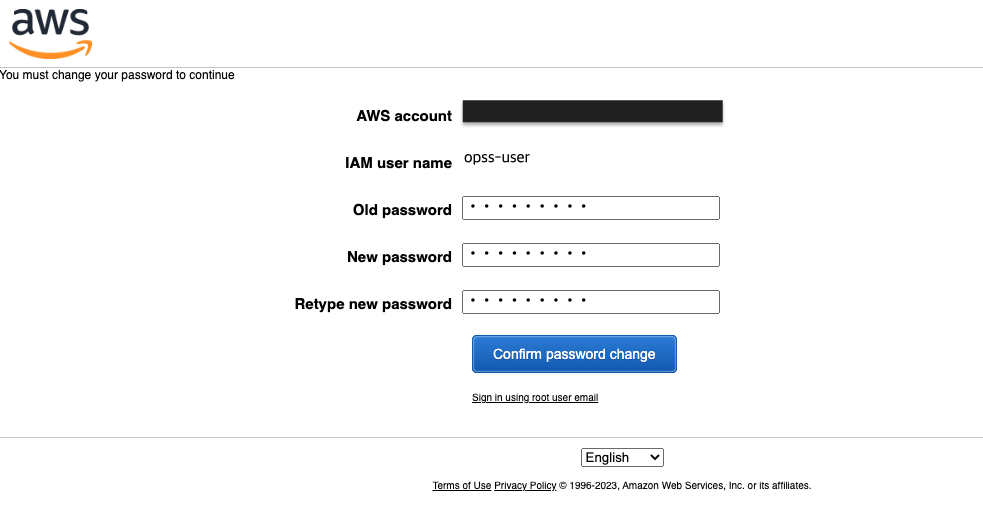

# Amazon OpenSearch Serverless CDK Python project for Vector Search usecase!


This is an Amazon OpenSearch Serverless project for CDK development with Python.

The `cdk.json` file tells the CDK Toolkit how to execute your app.

This project is set up like a standard Python project.  The initialization
process also creates a virtualenv within this project, stored under the `.venv`
directory.  To create the virtualenv it assumes that there is a `python3`
(or `python` for Windows) executable in your path with access to the `venv`
package. If for any reason the automatic creation of the virtualenv fails,
you can create the virtualenv manually.

To manually create a virtualenv on MacOS and Linux:

```
$ python3 -m venv .venv
```

After the init process completes and the virtualenv is created, you can use the following
step to activate your virtualenv.

```
$ source .venv/bin/activate
```

If you are a Windows platform, you would activate the virtualenv like this:

```
% .venv\Scripts\activate.bat
```

Once the virtualenv is activated, you can install the required dependencies.

```
(.venv) $ pip install -r requirements.txt
```

Before synthesizing the CloudFormation, you should set approperly the cdk context configuration file, `cdk.context.json`.

For example:

```
{
  "opensearch_iam_user": {
    "user_name": "opss-user",
    "initial_password": "PassW0rd!"
  },
  "collection_name": "vs-demo"
}
```

At this point you can now synthesize the CloudFormation template for this code.

<pre>
(.venv) $ export CDK_DEFAULT_ACCOUNT=$(aws sts get-caller-identity --query Account --output text)
(.venv) $ export CDK_DEFAULT_REGION=$(curl -s 169.254.169.254/latest/dynamic/instance-identity/document | jq -r .region)
(.venv) $ cdk synth --all
</pre>

Use `cdk deploy` command to create the stack shown above.

<pre>
(.venv) $ cdk deploy --all
</pre>

To add additional dependencies, for example other CDK libraries, just add
them to your `setup.py` file and rerun the `pip install -r requirements.txt`
command.

## Clean Up

Delete the CloudFormation stack by running the below command.

<pre>
(.venv) $ cdk destroy --force --all
</pre>

## Useful commands

 * `cdk ls`          list all stacks in the app
 * `cdk synth`       emits the synthesized CloudFormation template
 * `cdk deploy`      deploy this stack to your default AWS account/region
 * `cdk diff`        compare deployed stack with current state
 * `cdk docs`        open CDK documentation

Enjoy!

## Run Test

### Step 1: Login to AWS Web console with the OpenSearch IAM User

To access Amazon OpenSearch Serverless data-plane APIs and OpenSearch Dashboards from the browser, you need to login to AWS Web console with the IAM User that is created.

You can find the IAM User name and initial password in the `cdk.context.json` file.

1. Sign into the Amazon Web console at [https://console.aws.amazon.com/](https://console.aws.amazon.com/console/home)
   
2. Change the password.
   
3. Check if successfuly logined.<br/>
   For example: `opss-user` login into the `N. Virgina (us-east-1)` region.
   

### Step 2: Upload and search data

If you would like to upload and search data, check out **Module 3 - Vector Search usecase** in [Getting started with Amazon OpenSearch Serverless](https://catalog.us-east-1.prod.workshops.aws/workshops/f8d2c175-634d-4c5d-94cb-d83bbc656c6a/en-US)

The followings are examples using **Dev Tools** with the OpenSearch Dashboards console.

* Create a single index called `housing-index`
  <pre>
  PUT housing-index
  {
    "settings": {
        "index.knn": true
    },
    "mappings": {
        "properties": {
          "housing-vector": {
              "type": "knn_vector",
              "dimension": 3
          },
          "title": {
              "type": "text"
          },
          "price": {
              "type": "long"
          },
          "location": {
              "type": "geo_point"
          }
        }
    }
  }
  </pre>

* To index a single document into `housing-index``, send the following request:
  <pre>
  POST housing-index/_doc
  {
    "housing-vector": [
      10,
      20,
      30
    ],
    "title": "2 bedroom in downtown Seattle",
    "price": "2800",
    "location": "47.71, 122.00"
  }
  </pre>

* To search for properties that are similar to the ones in your index, send the following query:
  <pre>
  GET housing-index/_search
  {
      "size": 5,
      "query": {
          "knn": {
              "housing-vector": {
                  "vector": [
                      10,
                      20,
                      30
                  ],
                  "k": 5
              }
          }
      }
  }
  </pre>

* Look up the indices available in the collection.
  <pre>
  GET _cat/indices?v
  </pre>

* List all the documents in the index
  <pre>
  GET housing-index/_search
  </pre>

* **Filtered search** - you can use filters to refine your semantic search results.<br/>
  For more information, see [here](https://docs.aws.amazon.com/opensearch-service/latest/developerguide/serverless-vector-search.html#serverless-vector-filter)


## References

 * [(Hands-on) Getting started with Amazon OpenSearch Serverless](https://catalog.us-east-1.prod.workshops.aws/workshops/f8d2c175-634d-4c5d-94cb-d83bbc656c6a/en-US)
 * [Amazon OpenSearch Serverless](https://docs.aws.amazon.com/opensearch-service/latest/developerguide/serverless.html)
   * [Working with vector search collections](https://docs.aws.amazon.com/opensearch-service/latest/developerguide/serverless-vector-search.html)
   * [Filtered search](https://docs.aws.amazon.com/opensearch-service/latest/developerguide/serverless-vector-search.html#serverless-vector-filter)
 * [OpenSearch: k-NN search with filters](https://opensearch.org/docs/latest/search-plugins/knn/filter-search-knn/)
 * [Supported OpenSearch API operations and permissions in Amazon OpenSearch Serverless](https://docs.aws.amazon.com/opensearch-service/latest/developerguide/serverless-genref.html#serverless-operations)
 * [Supported plugins in Amazon OpenSearch Serverless](https://docs.aws.amazon.com/opensearch-service/latest/developerguide/serverless-genref.html#serverless-plugins)
   * check out ***Korean (Nori) Analysis***
 * [Identity and Access Management for Amazon OpenSearch Serverless](https://docs.aws.amazon.com/opensearch-service/latest/developerguide/security-iam-serverless.html)
 * [Configure SAML federation for Amazon OpenSearch Serverless with AWS IAM Identity Center (2023-04-18)](https://aws.amazon.com/blogs/big-data/configure-saml-federation-for-amazon-opensearch-serverless-with-aws-iam-identity-center/)
 * [OpenSearch Popular APIs](https://opensearch.org/docs/latest/opensearch/popular-api/)

## Troubleshooting
 * [Getting a 401 when trying to access OpenSearch serverless dashboard](https://repost.aws/questions/QUrOZGnwlHRMSLQoSePGuShg/getting-a-401-when-trying-to-access-opensearch-serverless-dashboard)
   <pre>
   If you are on public access, and your IAM has the right permission but you still cannot access dashboard, check if you have enabled "Access to Opensearch Dashboards", which is disabled by default. Here is how:

    1. Go to <b>OpenSearch</b> -> <b>Collections</b>, click into your serverless collection.
    2. Scroll down to Network part, click <b>Manage network access</b> -> click into network policy name, choose edit, scroll to the very bottom and click <b>"Enable access to OpenSearch Dashboards"</b>, put your filters in.
   </pre>