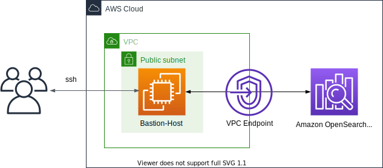

# Creating Amazon OpenSearch Serverless in VPC!



This CDK project launches an Amazon OpenSearch Serverless in VPC.

The `cdk.json` file tells the CDK Toolkit how to execute your app.

This project is set up like a standard Python project.  The initialization
process also creates a virtualenv within this project, stored under the `.venv`
directory.  To create the virtualenv it assumes that there is a `python3`
(or `python` for Windows) executable in your path with access to the `venv`
package. If for any reason the automatic creation of the virtualenv fails,
you can create the virtualenv manually.

To manually create a virtualenv on MacOS and Linux:

```
$ python3 -m venv .venv
```

After the init process completes and the virtualenv is created, you can use the following
step to activate your virtualenv.

```
$ source .venv/bin/activate
```

If you are a Windows platform, you would activate the virtualenv like this:

```
% .venv\Scripts\activate.bat
```

Once the virtualenv is activated, you can install the required dependencies.

```
(.venv) $ pip install -r requirements.txt
```

At this point you can now synthesize the CloudFormation template for this code.

<pre>
(.venv) $ export CDK_DEFAULT_ACCOUNT=$(aws sts get-caller-identity --query Account --output text)
(.venv) $ export CDK_DEFAULT_REGION=$(curl -s 169.254.169.254/latest/dynamic/instance-identity/document | jq -r .region)
(.venv) $ cdk synth --all \
              -c vpc_name='<i>your-existing-vpc-name</i>' \
              -c collection_name='<i>collection-name</i>' \
              -c ec2_key_pair_name="<i>your-ec2-key-pair-name(exclude .pem extension)</i>"
</pre>

Use `cdk deploy` command to create the stack shown above.

<pre>
(.venv) $ cdk deploy --all \
             -c vpc_name='<i>your-existing-vpc-name</i>' \
              -c collection_name='<i>collection-name</i>' \
              -c ec2_key_pair_name="<i>your-ec2-key-pair-name(exclude .pem extension)</i>"
</pre>

To add additional dependencies, for example other CDK libraries, just add
them to your `setup.py` file and rerun the `pip install -r requirements.txt`
command.

## Clean Up

Delete the CloudFormation stack by running the below command.

<pre>
(.venv) $ cdk destroy --force --all \
             -c vpc_name='<i>your-existing-vpc-name</i>' \
              -c collection_name='<i>collection-name</i>' \
              -c ec2_key_pair_name="<i>your-ec2-key-pair-name(exclude .pem extension)</i>"
</pre>

## Useful commands

 * `cdk ls`          list all stacks in the app
 * `cdk synth`       emits the synthesized CloudFormation template
 * `cdk deploy`      deploy this stack to your default AWS account/region
 * `cdk diff`        compare deployed stack with current state
 * `cdk docs`        open CDK documentation

Enjoy!

## Run Test

#### Prerequisites

* In order to upload and search data, log into the opensearch client machine by `ssh`.
  <pre>
  $ ssh -i ~/.ssh/<i>your-ssh-key.pem</i> ec2-user@<i>ec2-instance-public-ip</i>
  </pre>

* Configure aws credentials for the Opensearch IAM User.
  <pre>
  [ec2-user@ip-172-31-0-19 ~]$ aws configure --profile opensearch
  AWS Access Key ID [None]: ****************46FI
  AWS Secret Access Key [None]: ****************FdsE
  Default region name [None]: us-east-1
  Default output format [None]:
  </pre>

* At this point, you can run queries to the opensearch endpoint.<br/>
  The followings are examples using `run_opensearch_query.py` in the opensearch client machine.
  <pre>
  [ec2-user@ip-172-31-0-19 ~]$ aws configure --profile opensearch
  get-pip.py
  run_opensearch_query.py
  </pre>

#### Upload and search data

* Create a single index called `movies-index`
  <pre>
  python3 run_opensearch_query.py \
    --host <i>1csodkhc1h7yj93iekof</i>.us-east-1.aoss.amazonaws.com \
    --region us-east-1 \
    --profile opensearch \
    --create-index \
    --index-name movies-index
  </pre>

* Adding a document to an index
  <pre>
  python3 run_opensearch_query.py \
    --host <i>1csodkhc1h7yj93iekof</i>.us-east-1.aoss.amazonaws.com \
    --region us-east-1 \
    --profile opensearch \
    --index-name movies-index \
    --put-doc
  </pre>

* Upload Data using Bulk API
  <pre>
  python3 run_opensearch_query.py \
    --host <i>1csodkhc1h7yj93iekof</i>.us-east-1.aoss.amazonaws.com \
    --region us-east-1 \
    --profile opensearch \
    --index-name movies-index \
    --bulk-load
  </pre>

* List all the documents in the index
  <pre>
  python3 run_opensearch_query.py \
    --host <i>1csodkhc1h7yj93iekof</i>.us-east-1.aoss.amazonaws.com \
    --region us-east-1 \
    --profile opensearch \
    --index-name movies-index \
    --search-all
  </pre>

* Searching for a document
  <pre>
  python3 run_opensearch_query.py \
    --host <i>1csodkhc1h7yj93iekof</i>.us-east-1.aoss.amazonaws.com \
    --region us-east-1 \
    --profile opensearch \
    --index-name movies-index \
    --search \
    --keyword miller
  </pre>

## References

 * [Getting started with Amazon OpenSearch Serverless](https://catalog.us-east-1.prod.workshops.aws/workshops/f8d2c175-634d-4c5d-94cb-d83bbc656c6a/en-US)
 * [Amazon OpenSearch Serverless](https://docs.aws.amazon.com/opensearch-service/latest/developerguide/serverless.html)
 * [OpenSearch Python Client Documentation](https://opensearch-project.github.io/opensearch-py/index.html)
 * [Supported OpenSearch API operations and permissions in Amazon OpenSearch Serverless](https://docs.aws.amazon.com/opensearch-service/latest/developerguide/serverless-genref.html#serverless-operations)
 * [Supported plugins in Amazon OpenSearch Serverless](https://docs.aws.amazon.com/opensearch-service/latest/developerguide/serverless-genref.html#serverless-plugins)
   * check out ***Korean (Nori) Analysis***

