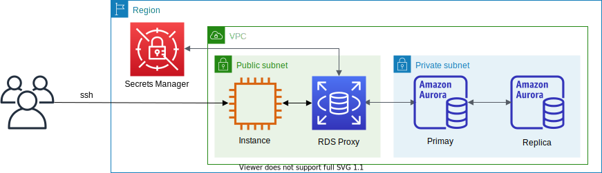

# Aurora MySQL



This is a sample project for Python development with CDK.

The `cdk.json` file tells the CDK Toolkit how to execute your app.

This project is set up like a standard Python project.  The initialization
process also creates a virtualenv within this project, stored under the .env
directory.  To create the virtualenv it assumes that there is a `python3`
(or `python` for Windows) executable in your path with access to the `venv`
package. If for any reason the automatic creation of the virtualenv fails,
you can create the virtualenv manually.

To manually create a virtualenv on MacOS and Linux:

```
$ python3 -m venv .venv
```

After the init process completes and the virtualenv is created, you can use the following
step to activate your virtualenv.

```
$ source .env/bin/activate
```

If you are a Windows platform, you would activate the virtualenv like this:

```
% .venv\Scripts\activate.bat
```

Once the virtualenv is activated, you can install the required dependencies.

```
(.venv) $ pip install -r requirements.txt
```

At this point you can now synthesize the CloudFormation template for this code.

<pre>
(.venv) $ export CDK_DEFAULT_ACCOUNT=$(aws sts get-caller-identity --query Account --output text)
(.venv) $ export CDK_DEFAULT_REGION=$(curl -s 169.254.169.254/latest/dynamic/instance-identity/document | jq -r .region)
(.venv) $ cdk synth --all \
              -c vpc_name='<i>your-existing-vpc-name</i>' \
              -c db_cluster_name='<i>db-cluster-name</i>'
</pre>

Use `cdk deploy` command to create the stack shown above.

<pre>
(.venv) $ cdk deploy --all \
              -c vpc_name='<i>your-existing-vpc-name</i>' \
              -c db_cluster_name='<i>db-cluster-name</i>'
</pre>

## Clean Up

Delete the CloudFormation stack by running the below command.

<pre>
(.venv) $ cdk destroy --force --all
</pre>

## Useful commands

 * `cdk ls`          list all stacks in the app
 * `cdk synth`       emits the synthesized CloudFormation template
 * `cdk deploy`      deploy this stack to your default AWS account/region
 * `cdk diff`        compare deployed stack with current state
 * `cdk docs`        open CDK documentation

Enjoy!

# Example
### Connect to Aurora MySQL
1. Connecting to Aurora MySQL

    :information_source: The Aurora MySQL `username` and `password` are stored in the [AWS Secrets Manager](https://console.aws.amazon.com/secretsmanager/listsecrets) as a name such as `DatabaseSecret-xxxxxxxxxxxx`.

    <pre>
    $ mysql -h <i>db-cluster-name</i>.cluster-<i>xxxxxxxxxxxx</i>.<i>region-name</i>.rds.amazonaws.com -uadmin -p
    Welcome to the MySQL monitor.  Commands end with ; or \g.
    Your MySQL connection id is 947748268
    Server version: 5.7.12-log MySQL Community Server (GPL)

    Copyright (c) 2000, 2020, Oracle and/or its affiliates. All rights reserved.

    Oracle is a registered trademark of Oracle Corporation and/or its
    affiliates. Other names may be trademarks of their respective
    owners.

    Type 'help;' or '\h' for help. Type '\c' to clear the current input statement.

    mysql>
    </pre>

2. Creating MySQL User

    ```
    mysql> SHOW DATABASES;
    +--------------------+
    | Database           |
    +--------------------+
    | information_schema |
    | mysql              |
    | performance_schema |
    | sys                |
    +--------------------+
    4 rows in set (0.00 sec)

    mysql> SELECT user FROM mysql.user;
    +---------------+
    | user          |
    +---------------+
    | admin         |
    | rdsproxyadmin |
    | mysql.sys     |
    | rdsadmin      |
    +---------------+
    3 rows in set (0.00 sec)

    mysql> CREATE USER 'guest'@'%' IDENTIFIED BY 'password';
    mysql> GRANT SELECT, PROCESS, SHOW DATABASES, CREATE VIEW, SHOW VIEW, SELECT INTO S3 ON *.* TO 'guest'@'%';
    mysql> FLUSH PRIVILEGES;
    mysql> SHOW GRANTS FOR 'guest'@'%';
    +-----------------------------------------------------------------------------------------------------+
    | Grants for guest@%                                                                                  |
    +-----------------------------------------------------------------------------------------------------+
    | GRANT SELECT, PROCESS, SHOW DATABASES, CREATE VIEW, SHOW VIEW, SELECT INTO S3 ON *.* TO 'guest'@'%' |
    +-----------------------------------------------------------------------------------------------------+
    1 row in set (0.00 sec)
    mysql> SELECT user FROM mysql.user;
    +---------------+
    | user          |
    +---------------+
    | admin         |
    | guest         |
    | rdsproxyadmin |
    | mysql.sys     |
    | rdsadmin      |
    +---------------+
    4 rows in set (0.00 sec)

    mysql>
    ```

3. Connecting to the database as a new MySQL user

    <pre>
    $ mysql -h <i>db-cluster-name</i>.cluster-<i>xxxxxxxxxxxx</i>.<i>region-name</i>.rds.amazonaws.com -uguest -p
    Welcome to the MySQL monitor.  Commands end with ; or \g.
    Your MySQL connection id is 2444658406
    Server version: 5.7.12-log MySQL Community Server (GPL)

    Copyright (c) 2000, 2020, Oracle and/or its affiliates. All rights reserved.

    Oracle is a registered trademark of Oracle Corporation and/or its
    affiliates. Other names may be trademarks of their respective
    owners.

    Type 'help;' or '\h' for help. Type '\c' to clear the current input statement.

    mysql> SHOW DATABASES;
    +--------------------+
    | Database           |
    +--------------------+
    | information_schema |
    | mysql              |
    | performance_schema |
    | sys                |
    +--------------------+
    4 rows in set (0.00 sec)

    mysql>
    </pre>

4. Connecting to Aurora MySQL Readonly endpoint

    <pre>
    $ mysql -h <i>db-cluster-name</i>.cluster-ro-<i>xxxxxxxxxxxx</i>.<i>region-name</i>.rds.amazonaws.com -uadmin -p
    Welcome to the MySQL monitor.  Commands end with ; or \g.
    Your MySQL connection id is 1286796224
    Server version: 5.7.12-log MySQL Community Server (GPL)

    Copyright (c) 2000, 2018, Oracle and/or its affiliates. All rights reserved.

    Oracle is a registered trademark of Oracle Corporation and/or its
    affiliates. Other names may be trademarks of their respective
    owners.

    Type 'help;' or '\h' for help. Type '\c' to clear the current input statement.

    mysql> SHOW DATABASES;
    +--------------------+
    | Database           |
    +--------------------+
    | information_schema |
    | mysql              |
    | performance_schema |
    | sys                |
    +--------------------+
    4 rows in set (0.01 sec)

    mysql> CREATE DATABASE test;
    ERROR 1290 (HY000): The MySQL server is running with the --read-only option so it cannot execute this statement
    mysql>
    </pre>

### How to turn on Aurora MySQL binlog
1. Add `'binlog_format': 'ROW'` into db cluster parameter group, and deploy cdk stack.
   <pre>
    ...
    rds_cluster_param_group = aws_rds.ParameterGroup(self, 'AuroraMySQLClusterParamGroup',
      engine=rds_engine,
      description='Custom cluster parameter group for aurora-mysql8.x',
      parameters={
        ...
        'binlog_format': 'ROW' #XXX: Turn on binlog
      }
    )
    ...
   </pre>
2. After CDK stack creation is completed, connect to the Aurora cluster writer node.
   <pre>
    $ mysql -h<i>db-cluster-name</i>.cluster-<i>xxxxxxxxxxxx</i>.<i>region-name</i>.rds.amazonaws.com -uadmin -p
    Enter password:
    Welcome to the MariaDB monitor.  Commands end with ; or \g.
    Your MySQL connection id is 20
    Server version: 8.0.23 Source distribution

    Copyright (c) 2000, 2018, Oracle, MariaDB Corporation Ab and others.

    Type 'help;' or '\h' for help. Type '\c' to clear the current input statement.

    MySQL [(none)]> SHOW GLOBAL VARIABLES LIKE "log_bin";
   </pre>

3. At SQL prompt run the below command to confirm that binary logging is enabled:
   <pre>
    MySQL [(none)]> SHOW GLOBAL VARIABLES LIKE "log_bin";
    +---------------+-------+
    | Variable_name | Value |
    +---------------+-------+
    | log_bin       | ON    |
    +---------------+-------+
    1 row in set (0.00 sec)
   </pre>

4. Also run this to AWS DMS has bin log access that is required for replication
   <pre>
    MySQL [(none)]> CALL mysql.rds_set_configuration('binlog retention hours', 24);
    Query OK, 0 rows affected (0.01 sec)
   </pre>

# References

 * [Build Data Analytics using AWS Amazon Data Migration Service(DMS)](https://github.com/aws-samples/aws-dms-cdc-data-pipeline)
