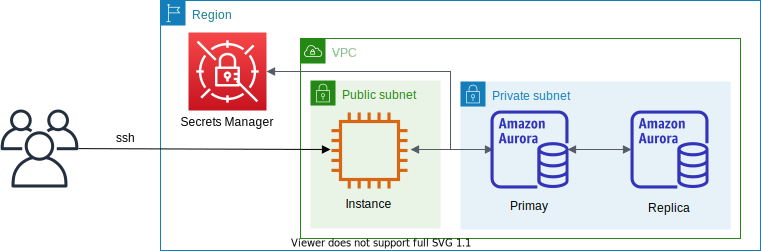

# Aurora PostgreSQL



This is a sample project for Python development with CDK.

The `cdk.json` file tells the CDK Toolkit how to execute your app.

This project is set up like a standard Python project.  The initialization
process also creates a virtualenv within this project, stored under the .env
directory.  To create the virtualenv it assumes that there is a `python3`
(or `python` for Windows) executable in your path with access to the `venv`
package. If for any reason the automatic creation of the virtualenv fails,
you can create the virtualenv manually.

To manually create a virtualenv on MacOS and Linux:

```
$ python3 -m venv .venv
```

After the init process completes and the virtualenv is created, you can use the following
step to activate your virtualenv.

```
$ source .env/bin/activate
```

If you are a Windows platform, you would activate the virtualenv like this:

```
% .venv\Scripts\activate.bat
```

Once the virtualenv is activated, you can install the required dependencies.

```
(.venv) $ pip install -r requirements.txt
```

At this point you can now synthesize the CloudFormation template for this code.

<pre>
(.venv) $ export CDK_DEFAULT_ACCOUNT=$(aws sts get-caller-identity --query Account --output text)
(.venv) $ export CDK_DEFAULT_REGION=$(curl -s 169.254.169.254/latest/dynamic/instance-identity/document | jq -r .region)
(.venv) $ cdk synth --all \
              -c vpc_name='<i>your-existing-vpc-name</i>' \
              -c db_cluster_name='<i>db-cluster-name</i>'
</pre>

Use `cdk deploy` command to create the stack shown above.

<pre>
(.venv) $ cdk deploy --all \
              -c vpc_name='<i>your-existing-vpc-name</i>' \
              -c db_cluster_name='<i>db-cluster-name</i>'
</pre>

## Clean Up

Delete the CloudFormation stack by running the below command.

<pre>
(.venv) $ cdk destroy --force --all
</pre>

## Useful commands

 * `cdk ls`          list all stacks in the app
 * `cdk synth`       emits the synthesized CloudFormation template
 * `cdk deploy`      deploy this stack to your default AWS account/region
 * `cdk diff`        compare deployed stack with current state
 * `cdk docs`        open CDK documentation

Enjoy!

# Example

1. Install PostgreSQL 13 on Amazon Linux 2

   <pre>
   $ sudo amazon-linux-extras install epel
   $ sudo amazon-linux-extras | grep postgres
   $ sudo amazon-linux-extras enable postgresql13
   $ sudo yum clean metadata
   $ sudo yum install -y postgresql
   </pre>

2. Connect to Aurora PostgreSQL

    :information_source: The Aurora PostgreSQL `username` and `password` are stored in the [AWS Secrets Manager](https://console.aws.amazon.com/secretsmanager/listsecrets) as a name such as `DatabaseSecret-xxxxxxxxxxxx`.

    <pre>
    $ psql -h <i>db-cluster-name</i>.cluster-<i>xxxxxxxxxxxx</i>.<i>region-name</i>.rds.amazonaws.com -Upostgres -W
    psql (13.3, server 13.4)
    SSL connection (protocol: TLSv1.2, cipher: ECDHE-RSA-AES256-GCM-SHA384, bits: 256, compression: off)
    Type "help" for help.

    postgres=>
    postgres=> \l
                                  List of databases
    Name    |  Owner   | Encoding |   Collate   |    Ctype    |   Access privileges
    -----------+----------+----------+-------------+-------------+-----------------------
    postgres  | postgres | UTF8     | en_US.UTF-8 | en_US.UTF-8 |
    rdsadmin  | rdsadmin | UTF8     | en_US.UTF-8 | en_US.UTF-8 | rdsadmin=CTc/rdsadmin
    template0 | rdsadmin | UTF8     | en_US.UTF-8 | en_US.UTF-8 | =c/rdsadmin          +
              |          |          |             |             | rdsadmin=CTc/rdsadmin
    template1 | postgres | UTF8     | en_US.UTF-8 | en_US.UTF-8 | =c/postgres          +
              |          |          |             |             | postgres=CTc/postgres
    (4 rows)

    postgres=> SELECT version();
                                                version
    -------------------------------------------------------------------------------------------------
    PostgreSQL 13.4 on x86_64-pc-linux-gnu, compiled by x86_64-pc-linux-gnu-gcc (GCC) 7.4.0, 64-bit
    (1 row)

    postgres=>
    </pre>

# PostgreSQL cheat sheet for MySQL users

### General hints on PostgreSQL
- `\?` opens the command overview
- `\d` lists things: `\du` lists users, `\dt` lists tables etc

### Command comparison

| MySQL command | PostgreSQL equivalent |
|---------------|-----------------------|
| mysql -u $USERNAME -p | psql -u postgres |
| SHOW DATABASES | \l[ist1] |
| USE some_database | \c some_database |
| SHOW TABLES | \dt |
| DESCRIBE some_table | \d+ some_table |
| SHOW INDEX FROM some_table | \di |
| CREATE USER username IDENTIFIED BY 'password' | CREATE ROLE username WITH createdb LOGIN [PASSWORD 'password']; |
| GRANT ALL PRIVILEGES ON database.\* TO username@localhost | GRANT ALL PRIVILEGES ON DATABASE database TO username; |
| SELECT * FROM table LIMIT 10\G; | \x on |

# References

 * [PostgreSQL Cheat Sheet](https://postgrescheatsheet.com/#/connections)
 * [Postgresql Manuals](https://www.postgresql.org/docs/)
 * [PostgreSQL Tutorial](https://www.postgresqltutorial.com/)
 * [Best practices with Amazon Aurora PostgreSQL](https://docs.aws.amazon.com/AmazonRDS/latest/AuroraUserGuide/AuroraPostgreSQL.BestPractices.html)
 * [Managing PostgreSQL users and roles (2019-03-04)](https://aws.amazon.com/ko/blogs/database/managing-postgresql-users-and-roles/)
