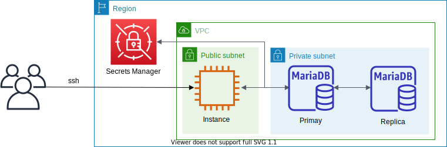

# MariaDB



This is a sample project for CDK development with Python.

The `cdk.json` file tells the CDK Toolkit how to execute your app.

This project is set up like a standard Python project.  The initialization
process also creates a virtualenv within this project, stored under the `.venv`
directory.  To create the virtualenv it assumes that there is a `python3`
(or `python` for Windows) executable in your path with access to the `venv`
package. If for any reason the automatic creation of the virtualenv fails,
you can create the virtualenv manually.

To manually create a virtualenv on MacOS and Linux:

```
$ python3 -m venv .venv
```

After the init process completes and the virtualenv is created, you can use the following
step to activate your virtualenv.

```
$ source .venv/bin/activate
```

If you are a Windows platform, you would activate the virtualenv like this:

```
% .venv\Scripts\activate.bat
```

Once the virtualenv is activated, you can install the required dependencies.

```
(.venv) $ pip install -r requirements.txt
```

At this point you can now synthesize the CloudFormation template for this code.

<pre>
(.venv) $ export CDK_DEFAULT_ACCOUNT=$(aws sts get-caller-identity --query Account --output text)
(.venv) $ export CDK_DEFAULT_REGION=$(aws configure get region)
(.venv) $ cdk synth --all
</pre>

Use `cdk deploy` command to create the stack shown above.

<pre>
(.venv) $ cdk deploy --all
</pre>

To add additional dependencies, for example other CDK libraries, just add
them to your `setup.py` file and rerun the `pip install -r requirements.txt`
command.

## Clean Up

Delete the CloudFormation stack by running the below command.

<pre>
(.venv) $ cdk destroy --force --all
</pre>

## Useful commands

 * `cdk ls`          list all stacks in the app
 * `cdk synth`       emits the synthesized CloudFormation template
 * `cdk deploy`      deploy this stack to your default AWS account/region
 * `cdk diff`        compare deployed stack with current state
 * `cdk docs`        open CDK documentation

Enjoy!

# Example
### Connect to MariaDB
1. Connecting to MariaDB

    :information_source: The MariaDB `username` and `password` are stored in the [AWS Secrets Manager](https://console.aws.amazon.com/secretsmanager/listsecrets) as a name such as `DatabaseSecret-xxxxxxxxxxxx`.

    <pre>
    $ mysql -h <i>db-instance-name</i>-<i>xxxxxxxxxxxx</i>.<i>region-name</i>.rds.amazonaws.com -uadmin -p
    Welcome to the MariaDB monitor.  Commands end with ; or \g.
    Your MariaDB connection id is 611
    Server version: 10.6.8-MariaDB-log managed by https://aws.amazon.com/rds/

    Copyright (c) 2000, 2018, Oracle, MariaDB Corporation Ab and others.

    Type 'help;' or '\h' for help. Type '\c' to clear the current input statement.

    MariaDB [(none)]>
    </pre>

2. Creating MariaDB User

    ```
    MariaDB [(none)]> show databases;
    +--------------------+
    | Database           |
    +--------------------+
    | information_schema |
    | innodb             |
    | mysql              |
    | performance_schema |
    | sys                |
    +--------------------+
    5 rows in set (0.00 sec)

    MariaDB [(none)]> select user from mysql.user;
    +--------------+
    | User         |
    +--------------+
    | admin        |
    | rdsrepladmin |
    | mariadb.sys  |
    | rdsadmin     |
    +--------------+
    4 rows in set (0.00 sec)

    MariaDB [(none)]> CREATE USER 'guest'@'%' IDENTIFIED BY 'password';
    Query OK, 0 rows affected (0.00 sec)

    MariaDB [(none)]> GRANT SELECT, PROCESS, SHOW DATABASES, CREATE VIEW, SHOW VIEW ON *.* TO 'guest'@'%';
    Query OK, 0 rows affected (0.00 sec)

    MariaDB [(none)]> FLUSH PRIVILEGES;
    Query OK, 0 rows affected (0.00 sec)

    MariaDB [(none)]> SHOW GRANTS FOR 'guest'@'%';
    +--------------------------------------------------------------------------------------------------------------------------------------------------------+
    | Grants for guest@%                                                                                                                                     |
    +--------------------------------------------------------------------------------------------------------------------------------------------------------+
    | GRANT SELECT, PROCESS, SHOW DATABASES, CREATE VIEW, SHOW VIEW ON *.* TO `guest`@`%` IDENTIFIED BY PASSWORD '*2470C0C06DEE42FD1618BB99005ADCA2EC9D1E19' |
    +--------------------------------------------------------------------------------------------------------------------------------------------------------+
    1 row in set (0.00 sec)

    MariaDB [(none)]> SELECT user FROM mysql.user;
    +--------------+
    | User         |
    +--------------+
    | admin        |
    | guest        |
    | rdsrepladmin |
    | mariadb.sys  |
    | rdsadmin     |
    +--------------+
    5 rows in set (0.00 sec)

    MariaDB [(none)]>
    ```

3. Connecting to the database as a new MariaDB user

    <pre>
    $ mysql -h <i>db-instance-name</i>-<i>xxxxxxxxxxxx</i>.<i>region-name</i>.rds.amazonaws.com -uguest -p
    Welcome to the MariaDB monitor.  Commands end with ; or \g.
    Your MariaDB connection id is 611
    Server version: 10.6.8-MariaDB-log managed by https://aws.amazon.com/rds/

    Copyright (c) 2000, 2018, Oracle, MariaDB Corporation Ab and others.

    Type 'help;' or '\h' for help. Type '\c' to clear the current input statement.

    MariaDB [(none)]> SHOW DATABASES;
    +--------------------+
    | Database           |
    +--------------------+
    | information_schema |
    | innodb             |
    | mysql              |
    | performance_schema |
    | sys                |
    +--------------------+
    5 rows in set (0.00 sec)

    MariaDB [(none)]>
    </pre>

4. Connecting to MariaDB Readonly endpoint

    <pre>
    $ mysql -h <i>db-instance-name</i>-<i>xxxxxxxxxxxx</i>.<i>region-name</i>.rds.amazonaws.com -uadmin -p
    Welcome to the MariaDB monitor.  Commands end with ; or \g.
    Your MariaDB connection id is 598
    Server version: 10.6.8-MariaDB-log managed by https://aws.amazon.com/rds/

    Copyright (c) 2000, 2018, Oracle, MariaDB Corporation Ab and others.

    Type 'help;' or '\h' for help. Type '\c' to clear the current input statement.

    MariaDB [(none)]> SHOW DATABASES;
    +--------------------+
    | Database           |
    +--------------------+
    | information_schema |
    | innodb             |
    | mysql              |
    | performance_schema |
    | sys                |
    +--------------------+
    5 rows in set (0.00 sec)

    MariaDB [(none)]> CREATE DATABASE test;
    ERROR 1290 (HY000): The MariaDB server is running with the --read-only option so it cannot execute this statement
    MariaDB [(none)]>
    </pre>

# References

 * [A 10-minute MariaDB primer](https://mariadb.com/kb/en/a-mariadb-primer/)
 * [Useful MariaDB queries](https://mariadb.com/kb/en/useful-mariadb-queries/)
 * [Build Data Analytics using AWS Amazon Data Migration Service(DMS)](https://github.com/aws-samples/aws-dms-cdc-data-pipeline)
