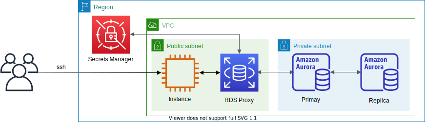

# RDS Proxy + Aurora MySQL



This is a sample project for Python development with CDK.

The `cdk.json` file tells the CDK Toolkit how to execute your app.

This project is set up like a standard Python project.  The initialization
process also creates a virtualenv within this project, stored under the .env
directory.  To create the virtualenv it assumes that there is a `python3`
(or `python` for Windows) executable in your path with access to the `venv`
package. If for any reason the automatic creation of the virtualenv fails,
you can create the virtualenv manually.

To manually create a virtualenv on MacOS and Linux:

```
$ python3 -m venv .env
```

After the init process completes and the virtualenv is created, you can use the following
step to activate your virtualenv.

```
$ source .env/bin/activate
```

If you are a Windows platform, you would activate the virtualenv like this:

```
% .env\Scripts\activate.bat
```

Once the virtualenv is activated, you can install the required dependencies.

```
$ pip install -r requirements.txt
```

At this point you can now synthesize the CloudFormation template for this code.

<pre>
$ export CDK_DEFAULT_ACCOUNT=$(aws sts get-caller-identity --query Account --output text)
$ export CDK_DEFAULT_REGION=$(curl -s 169.254.169.254/latest/dynamic/instance-identity/document | jq -r .region)
$ cdk -c vpc_name='<i>your-existing-vpc-name</i>' \
  -c db_cluster_name='<i>db-cluster-name</i>>'
  synth --all
</pre>

Use `cdk deploy` command to create the stack shown above.

<pre>
$ cdk -c vpc_name='<i>your-existing-vpc-name</i>' \
      -c db_cluster_name='<i>db-cluster-name</i>'
      deploy --all
</pre>

## Clean Up

Delete the CloudFormation stack by running the below command.

<pre>
(.venv) $ cdk destroy --force --all
</pre>

## Useful commands

 * `cdk ls`          list all stacks in the app
 * `cdk synth`       emits the synthesized CloudFormation template
 * `cdk deploy`      deploy this stack to your default AWS account/region
 * `cdk diff`        compare deployed stack with current state
 * `cdk docs`        open CDK documentation

Enjoy!

# Example

1. Connecting to Aurora MySQL using RDS Proxy

    :information_source: The Aurora MySQL `username` and `password` are stored in the [AWS Secrets Manager](https://console.aws.amazon.com/secretsmanager/listsecrets) as a name such as `DatabaseSecret-xxxxxxxxxxxx`.

    <pre>
    $ mysql -h <i>rds-proxy-name</i>.proxy-<i>xxxxxxxxxxxx</i>.<i>region-name</i>.rds.amazonaws.com -uadmin -p
    Welcome to the MySQL monitor.  Commands end with ; or \g.
    Your MySQL connection id is 947748268
    Server version: 5.7.12-log MySQL Community Server (GPL)

    Copyright (c) 2000, 2020, Oracle and/or its affiliates. All rights reserved.

    Oracle is a registered trademark of Oracle Corporation and/or its
    affiliates. Other names may be trademarks of their respective
    owners.

    Type 'help;' or '\h' for help. Type '\c' to clear the current input statement.

    mysql>
    </pre>

2. Creating MySQL User

    ```
    mysql> SHOW DATABASES;
    +--------------------+
    | Database           |
    +--------------------+
    | information_schema |
    | mysql              |
    | performance_schema |
    | sys                |
    +--------------------+
    4 rows in set (0.00 sec)

    mysql> SELECT user FROM mysql.user;
    +---------------+
    | user          |
    +---------------+
    | admin         |
    | rdsproxyadmin |
    | mysql.sys     |
    | rdsadmin      |
    +---------------+
    3 rows in set (0.00 sec)

    mysql> CREATE USER 'guest'@'%' IDENTIFIED BY 'password';
    mysql> GRANT SELECT, PROCESS, SHOW DATABASES, CREATE VIEW, SHOW VIEW, SELECT INTO S3 ON *.* TO 'guest'@'%';
    mysql> FLUSH PRIVILEGES;
    mysql> SHOW GRANTS FOR 'guest'@'%';
    +-----------------------------------------------------------------------------------------------------+
    | Grants for guest@%                                                                                  |
    +-----------------------------------------------------------------------------------------------------+
    | GRANT SELECT, PROCESS, SHOW DATABASES, CREATE VIEW, SHOW VIEW, SELECT INTO S3 ON *.* TO 'guest'@'%' |
    +-----------------------------------------------------------------------------------------------------+
    1 row in set (0.00 sec)
    mysql> SELECT user FROM mysql.user;
    +---------------+
    | user          |
    +---------------+
    | admin         |
    | guest         |
    | rdsproxyadmin |
    | mysql.sys     |
    | rdsadmin      |
    +---------------+
    4 rows in set (0.00 sec)

    mysql>
    ```

3. Creating AWS Secret for a new MySQL User

    <pre>
    aws secretsmanager create-secret \
        --name "<i>guest_secret_name</i>" \
        --description "application user" \
        --secret-string '{"username": "<i>guest</i>", "password": "<i>choose_your_own_password</i>"}'
    </pre>

4. Modifying IAM Role so that RDS Proxy can access the secret of new MySQL User

    <pre>
    {
        "Version": "2012-10-17",
        "Statement": [
            {
                "Action": [
                    "secretsmanager:GetSecretValue",
                    "secretsmanager:DescribeSecret"
                ],
                "Resource": [
                    "arn:aws:secretsmanager:<i>region_name</i>:<i>account_id:secret</i>:<i>secret_name_1-??????</i>",
                    "arn:aws:secretsmanager:<i>region_name</i>:<i>account_id:secret</i>:<i>secret_name_2-??????</i>",
                ],
                "Effect": "Allow"
            }
        ]
    }
    </pre>

5. Connecting to the database as a new MySQL user

    <pre>
    $ mysql -h <i>rds-proxy-name</i>.proxy-<i>xxxxxxxxxxxx</i>.<i>region-name</i>.rds.amazonaws.com -uguest -p
    Welcome to the MySQL monitor.  Commands end with ; or \g.
    Your MySQL connection id is 2444658406
    Server version: 5.7.12-log MySQL Community Server (GPL)

    Copyright (c) 2000, 2020, Oracle and/or its affiliates. All rights reserved.

    Oracle is a registered trademark of Oracle Corporation and/or its
    affiliates. Other names may be trademarks of their respective
    owners.

    Type 'help;' or '\h' for help. Type '\c' to clear the current input statement.

    mysql> SHOW DATABASES;
    +--------------------+
    | Database           |
    +--------------------+
    | information_schema |
    | mysql              |
    | performance_schema |
    | sys                |
    +--------------------+
    4 rows in set (0.00 sec)

    mysql>
    </pre>

6. Connecting to Aurora MySQL using an RDS Proxy read-only endpoint

    <pre>
    $ mysql -h <i>readonly-rds-proxy-name</i>.proxy-<i>xxxxxxxxxxxx</i>.<i>region-name</i>.rds.amazonaws.com -uadmin -p
    Welcome to the MySQL monitor.  Commands end with ; or \g.
    Your MySQL connection id is 1286796224
    Server version: 5.7.12-log MySQL Community Server (GPL)

    Copyright (c) 2000, 2018, Oracle and/or its affiliates. All rights reserved.

    Oracle is a registered trademark of Oracle Corporation and/or its
    affiliates. Other names may be trademarks of their respective
    owners.

    Type 'help;' or '\h' for help. Type '\c' to clear the current input statement.

    mysql> SHOW DATABASES;
    +--------------------+
    | Database           |
    +--------------------+
    | information_schema |
    | mysql              |
    | performance_schema |
    | sys                |
    +--------------------+
    4 rows in set (0.01 sec)

    mysql> CREATE DATABASE test;
    ERROR 1290 (HY000): The MySQL server is running with the --read-only option so it cannot execute this statement
    mysql>
    </pre>

## References

- [Amazon Aurora MySQL reference](https://docs.aws.amazon.com/AmazonRDS/latest/AuroraUserGuide/AuroraMySQL.Reference.html)
- [Managing connections with Amazon RDS Proxy](https://docs.aws.amazon.com/AmazonRDS/latest/UserGuide/rds-proxy-managing.html)
  - [Configuring connection settings](https://docs.aws.amazon.com/AmazonRDS/latest/UserGuide/rds-proxy-managing.html#rds-proxy-connection-pooling-tuning)
    - [IdleClientTimeout](https://docs.aws.amazon.com/AmazonRDS/latest/UserGuide/rds-proxy-managing.html#rds-proxy-connection-pooling-tuning.idleclienttimeout)
    - [MaxConnectionsPercent](https://docs.aws.amazon.com/AmazonRDS/latest/UserGuide/rds-proxy-managing.html#rds-proxy-connection-pooling-tuning.maxconnectionspercent)
    - [MaxIdleConnectionsPercent](https://docs.aws.amazon.com/AmazonRDS/latest/UserGuide/rds-proxy-managing.html#rds-proxy-connection-pooling-tuning.maxidleconnectionspercent)
    - [ConnectionBorrowTimeout](https://docs.aws.amazon.com/AmazonRDS/latest/UserGuide/rds-proxy-managing.html#rds-proxy-connection-pooling-tuning.connectionborrowtimeout)
- [Monitoring Amazon RDS Proxy metrics with Amazon CloudWatch](https://docs.aws.amazon.com/AmazonRDS/latest/UserGuide/rds-proxy.monitoring.html)
- [Troubleshooting for RDS Proxy](https://docs.aws.amazon.com/AmazonRDS/latest/UserGuide/rds-proxy.troubleshooting.html)
  - ```ERROR 3159 (HY000): This RDS Proxy requires TLS connections.```
- [Use Amazon RDS Proxy with read-only endpoints (by Peter Celentano, on 04 JAN 2022)](https://aws.amazon.com/ko/blogs/database/use-amazon-rds-proxy-with-read-only-endpoints/)
- [aws rds create-db-proxy-endpoint](https://docs.aws.amazon.com/cli/latest/reference/rds/create-db-proxy-endpoint.html) - command to create a `DBProxyEndpoint`
- [(AWS re:Invent 2020) Deep dive into Amazon RDS Proxy for scaling applications](https://d1.awsstatic.com/events/reinvent/2020/Deep_dive_into_Amazon_RDS_Proxy_for_scaling_applications_DAT318.pdf)
- [(AWS Prescriptive Guidance) Increasing application scalability, performance, and availability by using Amazon RDS Proxy](https://docs.aws.amazon.com/prescriptive-guidance/latest/amazon-rds-proxy/introduction.html)
