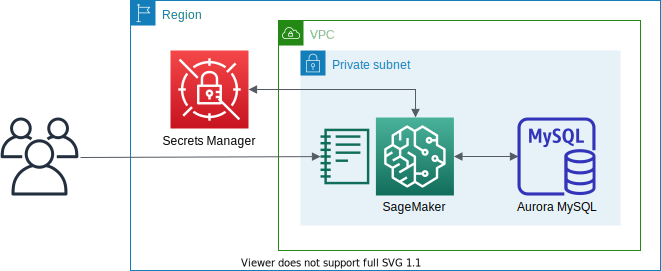

# Aurora MySQL Access via SageMaker Notebook Instance (Jupyter)



This is a sample project for Python development with CDK.

The `cdk.json` file tells the CDK Toolkit how to execute your app.

This project is set up like a standard Python project.  The initialization
process also creates a virtualenv within this project, stored under the .env
directory.  To create the virtualenv it assumes that there is a `python3`
(or `python` for Windows) executable in your path with access to the `venv`
package. If for any reason the automatic creation of the virtualenv fails,
you can create the virtualenv manually.

To manually create a virtualenv on MacOS and Linux:

```
$ python3 -m venv .env
```

After the init process completes and the virtualenv is created, you can use the following
step to activate your virtualenv.

```
$ source .env/bin/activate
```

If you are a Windows platform, you would activate the virtualenv like this:

```
% .env\Scripts\activate.bat
```

Once the virtualenv is activated, you can install the required dependencies.

```
$ pip install -r requirements.txt
```

At this point you can now synthesize the CloudFormation template for this code.

```
$ export CDK_DEFAULT_ACCOUNT=$(aws sts get-caller-identity --query Account --output text)
$ export CDK_DEFAULT_REGION=$(aws configure get region)
$ cdk -c vpc_name='<your-existing-vpc-name>' -c db_cluster_name='<db-cluster-name>' synth --all
```

Use `cdk deploy` command to create the stack shown above,

```
$ cdk -c vpc_name='<your-existing-vpc-name>' -c db_cluster_name='<db-cluster-name>' deploy --all
```

 then load and run the [Jupyter notebook](https://github.com/ksmin23/my-aws-cdk-examples/blob/main/rds/sagemaker-aurora_mysql/ipython-sql.ipynb) in your Sagemaker instance.


## Clean Up

Delete the CloudFormation stack by running the below command.

<pre>
(.venv) $ cdk destroy --force --all
</pre>

## Useful commands

 * `cdk ls`          list all stacks in the app
 * `cdk synth`       emits the synthesized CloudFormation template
 * `cdk deploy`      deploy this stack to your default AWS account/region
 * `cdk diff`        compare deployed stack with current state
 * `cdk docs`        open CDK documentation

Enjoy!

## References
 - [ipython-sql](https://pypi.org/project/ipython-sql/) - RDBMS access via IPython
 - [Analyzing data stored in Amazon DocumentDB (with MongoDB compatibility) using Amazon Sagemaker](https://aws.amazon.com/blogs/machine-learning/analyzing-data-stored-in-amazon-documentdb-with-mongodb-compatibility-using-amazon-sagemaker/)
 - [github.com/aws-samples/documentdb-sagemaker-example](https://github.com/aws-samples/documentdb-sagemaker-example)
