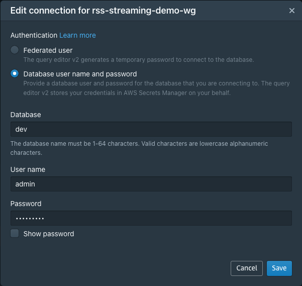

# Amazon Redshift Streaming Ingestion from Amazon MSK Serverless CDK Python project!


This is an Amazon Redshift Streaming Ingestion from MSK Serverless project for CDK development with Python.

The `cdk.json` file tells the CDK Toolkit how to execute your app.

This project is set up like a standard Python project.  The initialization
process also creates a virtualenv within this project, stored under the `.venv`
directory.  To create the virtualenv it assumes that there is a `python3`
(or `python` for Windows) executable in your path with access to the `venv`
package. If for any reason the automatic creation of the virtualenv fails,
you can create the virtualenv manually.

To manually create a virtualenv on MacOS and Linux:

```
$ python3 -m venv .venv
```

After the init process completes and the virtualenv is created, you can use the following
step to activate your virtualenv.

```
$ source .venv/bin/activate
```

If you are a Windows platform, you would activate the virtualenv like this:

```
% .venv\Scripts\activate.bat
```

Once the virtualenv is activated, you can install the required dependencies.

```
$ pip install -r requirements.txt
```

At this point you can now synthesize the CloudFormation template for this code.

<pre>
(.venv) $ export CDK_DEFAULT_ACCOUNT=$(aws sts get-caller-identity --query Account --output text)
(.venv) $ export CDK_DEFAULT_REGION=$(aws configure get region)
(.venv) $ cdk synth --all \
              -c vpc_name='<i>your-existing-vpc-name</i>' \
              -c aws_secret_name='<i>your_redshift_secret_name</i>'
</pre>

:information_source: Before you deploy this project, you should create an AWS Secret for your Redshift Serverless Admin user. You can create an AWS Secret like this:

<pre>
$ aws secretsmanager create-secret \
    --name "<i>your_redshift_secret_name</i>" \
    --description "<i>(Optional) description of the secret</i>" \
    --secret-string '{"admin_username": "admin", "admin_user_password": "<i>password_of_at_least_8_characters</i>"}'
</pre>

Use `cdk deploy` command to create the stack shown above.

<pre>
(.venv) $ cdk deploy --all \
              -c vpc_name='<i>your-existing-vpc-name</i>' \
              -c aws_secret_name='<i>your_redshift_secret_name</i>'
</pre>

To add additional dependencies, for example other CDK libraries, just add
them to your `setup.py` file and rerun the `pip install -r requirements.txt`
command.

## Clean Up

Delete the CloudFormation stack by running the below command.

<pre>
(.venv) $ cdk destroy --force --all \
              -c vpc_name='<i>your-existing-vpc-name</i>' \
              -c aws_secret_name='<i>your_redshift_secret_name</i>'
</pre>

## Run Test

#### Amazon MSK Serverless setup

After MSK Serverless is succesfully created, you can now create topic, and produce on the topic in MSK as the following example.

1. Get cluster information
   <pre>
   $ export MSK_SERVERLESS_CLUSTER_ARN=$(aws kafka list-clusters-v2 | jq -r '.ClusterInfoList[] | select(.ClusterName == "<i>your-msk-cluster-name</i>") | .ClusterArn')
   $ aws kafka describe-cluster-v2 --cluster-arn $MSK_SERVERLESS_CLUSTER_ARN
   {
     "ClusterInfo": {
       "ClusterType": "SERVERLESS",
       "ClusterArn": "arn:aws:kafka:us-east-1:123456789012:cluster/<i>your-msk-cluster-name</i>/813876e5-2023-4882-88c4-58ad8599da5a-s2",
       "ClusterName": "<i>your-msk-cluster-name</i>",
       "CreationTime": "2022-12-16T02:26:31.369000+00:00",
       "CurrentVersion": "K2EUQ1WTGCTBG2",
       "State": "ACTIVE",
       "Tags": {},
       "Serverless": {
         "VpcConfigs": [
           {
             "SubnetIds": [
               "subnet-0113628395a293b98",
               "subnet-090240f6a94a4b5aa",
               "subnet-036e818e577297ddc"
             ],
             "SecurityGroupIds": [
               "sg-0bd8f5ce976b51769",
               "sg-0869c9987c033aaf1"
             ]
           }
         ],
         "ClientAuthentication": {
           "Sasl": {
             "Iam": {
               "Enabled": true
             }
           }
         }
       }
     }
   }
   </pre>

2. Get booststrap brokers

   <pre>
   $ aws kafka get-bootstrap-brokers --cluster-arn $MSK_SERVERLESS_CLUSTER_ARN
   {
     "BootstrapBrokerStringSaslIam": "boot-deligu0c.c1.kafka-serverless.<i>{region}</i>.amazonaws.com:9098"
   }
   </pre>

3. Connect the MSK client EC2 Host.

   You can connect to an EC2 instance using the EC2 Instance Connect CLI.<br/>
   Install `ec2instanceconnectcli` python package and Use the **mssh** command with the instance ID as follows.
   <pre>
   $ sudo pip install ec2instanceconnectcli
   $ mssh ec2-user@<i>i-001234a4bf70dec41EXAMPLE</i>
   </pre>

4. Create an Apache Kafka topic
   After connect your EC2 Host, you use the client machine to create a topic on the cluster.
   Run the following command to create a topic called `ev_stream_data`.
   <pre>
   [ec2-user@ip-172-31-0-180 ~]$ export PATH=$HOME/opt/kafka/bin:$PATH
   [ec2-user@ip-172-31-0-180 ~]$ export BS=<i>{BootstrapBrokerString}</i>
   [ec2-user@ip-172-31-0-180 ~]$ kafka-topics.sh --bootstrap-server $BS --command-config client.properties --create --topic <i>ev_stream_data</i> --partitions 3 --replication-factor 2
   </pre>

   `client.properties` is a property file containing configs to be passed to Admin Client. This is used only with `--bootstrap-server` option for describing and altering broker configs.<br/>
   For more information, see [Getting started using MSK Serverless clusters - Step 3: Create a client machine](https://docs.aws.amazon.com/msk/latest/developerguide/create-serverless-cluster-client.html)
   <pre>
   [ec2-user@ip-172-31-0-180 ~]$ cat client.properties
   security.protocol=SASL_SSL
   sasl.mechanism=AWS_MSK_IAM
   sasl.jaas.config=software.amazon.msk.auth.iam.IAMLoginModule required;
   sasl.client.callback.handler.class=software.amazon.msk.auth.iam.IAMClientCallbackHandler
   </pre>

5. Produce and consume data

   **(1) To produce messages**

   Run the following command to generate messages into the topic on the cluster.

   <pre>
   [ec2-user@ip-172-31-0-180 ~]$ python3 gen_fake_data.py | kafka-console-producer.sh --bootstrap-server $BS --producer.config client.properties --topic <i>ev_stream_data</i>
   </pre>

   **(2) To consume messages**

   Keep the connection to the client machine open, and then open a second, separate connection to that machine in a new window.

   <pre>
   [ec2-user@ip-172-31-0-180 ~]$ kafka-console-consumer.sh --bootstrap-server $BS --consumer.config client.properties --topic <i>ev_stream_data</i> --from-beginning
   </pre>

   You start seeing the messages you entered earlier when you used the console producer command.
   Enter more messages in the producer window, and watch them appear in the consumer window.

#### Amazon Redshift setup

These steps show you how to configure the materialized view to ingest data.

1. Connect to the Redshift query editor v2

   

2. Create an external schema to map the data from MSK to a Redshift object.
   <pre>
   CREATE EXTERNAL SCHEMA <i>evdata</i>
   FROM MSK
   IAM_ROLE 'arn:aws:iam::<i>{AWS-ACCOUNT-ID}</i>:role/RedshiftStreamingRole'
   AUTHENTICATION iam
   CLUSTER_ARN 'arn:aws:kafka:<i>{region}</i>:<i>{AWS-ACCOUNT-ID}</i>:cluster/<i>{cluser-name}</i>/b5555d61-dbd3-4dab-b9d4-67921490c072-3';
   </pre>
   For information about how to configure the IAM role, see [Getting started with streaming ingestion from Amazon Managed Streaming for Apache Kafka](https://docs.aws.amazon.com/redshift/latest/dg/materialized-view-streaming-ingestion-getting-started-MSK.html).

3. Create a materialized view to consume the stream data.

   Note that MSK cluster names are case-sensitive and can contain both uppercase and lowercase letters. To use case-sensitive identifiers, you can set the configuration setting `enable_case_sensitive_identifier` to true at either the session or cluster level.
   <pre>
   -- To create and use case sensitive identifiers
   SET enable_case_sensitive_identifier TO true;

   -- To check if enable_case_sensitive_identifier is turned on
   SHOW enable_case_sensitive_identifier;
   </pre>

   The following example defines a materialized view with JSON source data.<br/>
   Create the materialized view so it’s distributed on the UUID value from the stream and is sorted by the `refresh_time` value. The `refresh_time` is the start time of the materialized view refresh that loaded the record. The materialized view is set to auto refresh and will be refreshed as data keeps arriving in the stream.
   <pre>
   CREATE MATERIALIZED VIEW <i>ev_station_data_extract</i> DISTKEY(6) sortkey(1) AUTO REFRESH YES AS
     SELECT refresh_time,
       kafka_timestamp_type,
       kafka_timestamp,
       kafka_key,
       kafka_partition,
       kafka_offset,
       kafka_headers,
       json_extract_path_text(from_varbyte(kafka_value,'utf-8'),'_id',true)::character(36) as ID,
       json_extract_path_text(from_varbyte(kafka_value,'utf-8'),'clusterID',true)::varchar(30) as clusterID,
       json_extract_path_text(from_varbyte(kafka_value,'utf-8'),'connectionTime',true)::varchar(20) as connectionTime,
       json_extract_path_text(from_varbyte(kafka_value,'utf-8'),'kWhDelivered',true)::DECIMAL(10,2) as kWhDelivered,
       json_extract_path_text(from_varbyte(kafka_value,'utf-8'),'stationID',true)::INTEGER as stationID,
       json_extract_path_text(from_varbyte(kafka_value,'utf-8'),'spaceID',true)::varchar(100) as spaceID,
       json_extract_path_text(from_varbyte(kafka_value,'utf-8'),'timezone',true)::varchar(30)as timezone,
       json_extract_path_text(from_varbyte(kafka_value,'utf-8'),'userID',true)::varchar(30) as userID
     FROM <i>evdata.ev_stream_data</i>
     WHERE LENGTH(kafka_value) < 65355 AND CAN_JSON_PARSE(kafka_value);
   </pre>
   The code above filters records larger than **65355** bytes. This is because `json_extract_path_text` is limited to varchar data type. The Materialized view should be defined so that there aren’t any type conversion errors.

4. Refreshing materialized views for streaming ingestion

   The materialized view is auto-refreshed as long as there is new data on the MSK stream. You can also disable auto-refresh and run a manual refresh or schedule a manual refresh using the Redshift Console UI.<br/>
   To update the data in a materialized view, you can use the `REFRESH MATERIALIZED VIEW` statement at any time.
   <pre>
   REFRESH MATERIALIZED VIEW <i>ev_station_data_extract</i>;
   </pre>

#### Query the stream

1. Query data in the materialized view.
   <pre>
   SELECT *
   FROM <i>ev_station_data_extract</i>;
   </pre>
2. Query the refreshed materialized view to get usage statistics.
   <pre>
   SELECT to_timestamp(connectionTime, 'YYYY-MM-DD HH24:MI:SS') as connectiontime
      ,SUM(kWhDelivered) AS Energy_Consumed
      ,count(distinct userID) AS #Users
   FROM <i>ev_station_data_extract</i>
   GROUP BY to_timestamp(connectionTime, 'YYYY-MM-DD HH24:MI:SS')
   ORDER BY 1 DESC;
   </pre>

## Useful commands

 * `cdk ls`          list all stacks in the app
 * `cdk synth`       emits the synthesized CloudFormation template
 * `cdk deploy`      deploy this stack to your default AWS account/region
 * `cdk diff`        compare deployed stack with current state
 * `cdk docs`        open CDK documentation

Enjoy!

## References

 * [Getting started using MSK Serverless clusters](https://docs.aws.amazon.com/msk/latest/developerguide/serverless-getting-started.html)
 * [Configuration for MSK Serverless clusters](https://docs.aws.amazon.com/msk/latest/developerguide/serverless-config.html)
 * [Actions, resources, and condition keys for Apache Kafka APIs for Amazon MSK clusters](https://docs.aws.amazon.com/service-authorization/latest/reference/list_apachekafkaapisforamazonmskclusters.html)
 * [Amazon Redshift - Getting started with streaming ingestion from Amazon Managed Streaming for Apache Kafka](https://docs.aws.amazon.com/redshift/latest/dg/materialized-view-streaming-ingestion-getting-started-MSK.html)
 * [Amazon Redshift - Electric vehicle station-data streaming ingestion tutorial, using Kinesis](https://docs.aws.amazon.com/redshift/latest/dg/materialized-view-streaming-ingestion-example-station-data.html)
 * [Amazon Redshift Configuration Reference - enable_case_sensitive_identifier](https://docs.aws.amazon.com/redshift/latest/dg/r_enable_case_sensitive_identifier.html)
 * [Real-time analytics with Amazon Redshift streaming ingestion (2022-04-27)](https://aws.amazon.com/ko/blogs/big-data/real-time-analytics-with-amazon-redshift-streaming-ingestion/)
  
 * [Connect using the EC2 Instance Connect CLI](https://docs.aws.amazon.com/AWSEC2/latest/UserGuide/ec2-instance-connect-methods.html#ec2-instance-connect-connecting-ec2-cli)
   <pre>
   $ sudo pip install ec2instanceconnectcli
   $ mssh <i>ec2-user</i>@<i>i-001234a4bf70dec41EXAMPLE</i> # ec2-instance-id
   </pre>
 * [ec2instanceconnectcli](https://pypi.org/project/ec2instanceconnectcli/): This Python CLI package handles publishing keys through EC2 Instance Connectand using them to connect to EC2 instances.
 * [Mimesis: Fake Data Generator](https://mimesis.name/en/latest/index.html) - Mimesis is a high-performance fake data generator for Python, which provides data for a variety of purposes in a variety of languages

