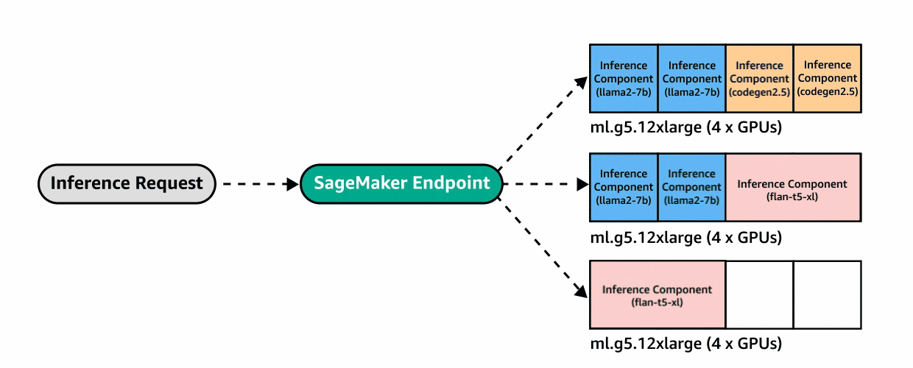

# Amazon SageMaker Inference Component CDK Python Project!

This is a CDK Python project to deploy multiple FMs to the same instance.

In this demo, we will now create inference component-based endpoints and
deploy a copy of the [Dolly v2 7B model](https://huggingface.co/databricks/dolly-v2-7b)
and a copy of the [FLAN-T5 XXL model](https://huggingface.co/google/flan-t5-xxl)
from the [Hugging Face model hub](https://huggingface.co/models) on a SageMaker real-time endpoint.

An inference component (IC) abstracts your ML model and enables you to assign CPUs, GPU, or AWS Neuron accelerators, and scaling policies per model. Inference components offer the following benefits:

  - SageMaker will optimally place and pack models onto ML instances to maximize utilization, leading to cost savings.
  - SageMaker will scale each model up and down based on your configuration to meet your ML application requirements.
  - SageMaker will scale to add and remove instances dynamically to ensure capacity is available while keeping idle compute to a minimum.
  - You can scale down to zero copies of a model to free up resources for other models. You can also specify to keep important models always loaded and ready to serve traffic.


<p align="center">(Image Source: <a href="https://aws.amazon.com/blogs/machine-learning/reduce-model-deployment-costs-by-50-on-average-using-sagemakers-latest-features/">AWS Blog</a>)</p>


The `cdk.json` file tells the CDK Toolkit how to execute your app.

This project is set up like a standard Python project.  The initialization
process also creates a virtualenv within this project, stored under the `.venv`
directory.  To create the virtualenv it assumes that there is a `python3`
(or `python` for Windows) executable in your path with access to the `venv`
package. If for any reason the automatic creation of the virtualenv fails,
you can create the virtualenv manually.

To manually create a virtualenv on MacOS and Linux:

```
$ python3 -m venv .venv
```

After the init process completes and the virtualenv is created, you can use the following
step to activate your virtualenv.

```
$ source .venv/bin/activate
```

If you are a Windows platform, you would activate the virtualenv like this:

```
% .venv\Scripts\activate.bat
```

Once the virtualenv is activated, you can install the required dependencies.

```
(.venv) $ pip install -r requirements.txt
```
To add additional dependencies, for example other CDK libraries, just add
them to your `setup.py` file and rerun the `pip install -r requirements.txt`
command.

## Set up `cdk.context.json`

Then, you should set approperly the cdk context configuration file, `cdk.context.json`.

For example,
<pre>
{
  "sagemaker_endpoint_name": "ic-endpoint",
  "sagemaker_endpoint_config": {
    "instance_type": "ml.g5.12xlarge",
    "managed_instance_scaling": {
      "min_instance_count": 1,
      "max_instance_count": 2,
      "status": "ENABLED"
    },
    "routing_config": {
      "routing_strategy": "LEAST_OUTSTANDING_REQUESTS"
    }
  },
  "deep_learning_container_image_uri": {
    "repository_name": "huggingface-pytorch-tgi-inference",
    "tag": "2.0.1-tgi0.9.3-gpu-py39-cu118-ubuntu20.04"
  },
  "models": {
    "dolly-v2-7b": {
      "HF_MODEL_ID": "databricks/dolly-v2-7b",
      "HF_TASK": "text-generation"
    },
    "flan-t5-xxl": {
      "HF_MODEL_ID": "google/flan-t5-xxl",
      "HF_TASK": "text-generation"
    }
  },
  "inference_components": {
    "ic-dolly-v2-7b": {
      "model_name": "dolly-v2-7b",
      "compute_resource_requirements": {
        "number_of_accelerator_devices_required": 2,
        "number_of_cpu_cores_required": 2,
        "min_memory_required_in_mb": 1024
      },
      "runtime_config": {
        "copy_count": 1
      }
    },
    "ic-flan-t5-xxl": {
      "model_name": "flan-t5-xxl",
      "compute_resource_requirements": {
        "number_of_accelerator_devices_required": 2,
        "number_of_cpu_cores_required": 2,
        "min_memory_required_in_mb": 1024
      },
      "runtime_config": {
        "copy_count": 1
      }
    }
  }
}
</pre>

:information_source: The avialable Deep Learning Container (DLC) images (`deep_learning_container_image_uri`) can be found in [here](https://github.com/aws/deep-learning-containers/blob/master/available_images.md).

## Deploy

At this point you can now synthesize the CloudFormation template for this code.

```
(.venv) $ export CDK_DEFAULT_ACCOUNT=$(aws sts get-caller-identity --query Account --output text)
(.venv) $ export CDK_DEFAULT_REGION=$(curl -s 169.254.169.254/latest/dynamic/instance-identity/document | jq -r .region)
(.venv) $ cdk synth --all
```

Use `cdk deploy` command to create the stack shown above.

```
(.venv) $ cdk deploy --require-approval never --all
```

## Test Run Inference

If you want to run inference, checkout this [example notebook](./src/notebook/inference_component.ipynb).

## Clean Up

Delete the CloudFormation stack by running the below command.

```
(.venv) $ cdk destroy --force --all
```

## Useful commands

 * `cdk ls`          list all stacks in the app
 * `cdk synth`       emits the synthesized CloudFormation template
 * `cdk deploy`      deploy this stack to your default AWS account/region
 * `cdk diff`        compare deployed stack with current state
 * `cdk docs`        open CDK documentation

Enjoy!

## References

 * [(AWS Blog) Amazon SageMaker adds new inference capabilities to help reduce foundation model deployment costs and latency (2023-11-29)](https://aws.amazon.com/blogs/aws/amazon-sagemaker-adds-new-inference-capabilities-to-help-reduce-foundation-model-deployment-costs-and-latency/)
 * [(AWS Blog) Reduce model deployment costs by 50% on average using the latest features of Amazon SageMaker (2023-11-30)](https://aws.amazon.com/blogs/machine-learning/reduce-model-deployment-costs-by-50-on-average-using-sagemakers-latest-features/)
 * [Amazon Sagemaker API Reference - CreateInferenceComponent](https://docs.aws.amazon.com/sagemaker/latest/APIReference/API_CreateInferenceComponent.html)
 * [Amazon SageMaker Deploy models for real-time inference](https://docs.aws.amazon.com/sagemaker/latest/dg/realtime-endpoints-deploy-models.html)
 * [Docker Registry Paths and Example Code for Pre-built SageMaker Docker images](https://docs.aws.amazon.com/sagemaker/latest/dg-ecr-paths/sagemaker-algo-docker-registry-paths.html)
 * [Available Amazon Deep Learning Containers Images page](https://github.com/aws/deep-learning-containers/blob/master/available_images.md)
