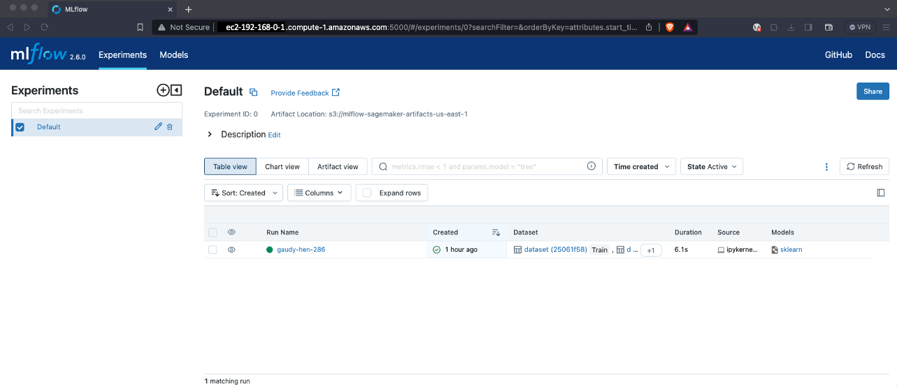

# MLflow on ECS Fargate with Amazon SageMaker


This is a MLflow project on Amazon EC2 instance for CDK development with Python.

### Prerequisites

We will use [the AWS CDK](https://cdkworkshop.com/) to deploy the MLflow server.

To go through this example, make sure you have the following:
* [Docker](https://www.docker.com) to build and push the MLflow container image to ECR
* This [Github repository](https://github.com/ksmin23/my-aws-cdk-examples.git) cloned into your environment to follow the steps

Execute the following commands to build and push the MLflow container image to ECR:

<pre>
git clone https://github.com/ksmin23/my-aws-cdk-examples.git
cd sagemaker/mlflow-ecs-sagemaker/container
docker build -t mlflow .
docker tag mlflow:latest {<i>account-id</i>}.dkr.ecr.{<i>region</i>}.amazonaws.com/mlflow:latest
aws ecr create-repository --repository-name mlflow
aws ecr get-login-password --region {<i>region</i>} | docker login --username AWS --password-stdin {<i>account-id</i>}.dkr.ecr.{<i>region</i>}.amazonaws.com
docker push {<i>account-id</i>}.dkr.ecr.{<i>region</i>}.amazonaws.com/mlflow:latest
</pre>

### Deploying the stack

The `cdk.json` file tells the CDK Toolkit how to execute your app.

This project is set up like a standard Python project.  The initialization
process also creates a virtualenv within this project, stored under the `.venv`
directory.  To create the virtualenv it assumes that there is a `python3`
(or `python` for Windows) executable in your path with access to the `venv`
package. If for any reason the automatic creation of the virtualenv fails,
you can create the virtualenv manually.

To manually create a virtualenv on MacOS and Linux:

```
$ python3 -m venv .venv
```

After the init process completes and the virtualenv is created, you can use the following
step to activate your virtualenv.

```
$ source .venv/bin/activate
```

If you are a Windows platform, you would activate the virtualenv like this:

```
% .venv\Scripts\activate.bat
```

Once the virtualenv is activated, you can install the required dependencies.

```
(.venv) $ pip install -r requirements.txt
```

Before synthesizing the CloudFormation, you should set approperly the cdk context configuration file, `cdk.context.json`.

For example:

```
{
  "ami_name": "ubuntu/images/hvm-ssd/ubuntu-focal-20.04-amd64-server-20230517",
  "vpc_name": "default"
}
```

At this point you can now synthesize the CloudFormation template for this code.

```
(.venv) $ export CDK_DEFAULT_ACCOUNT=$(aws sts get-caller-identity --query Account --output text)
(.venv) $ export CDK_DEFAULT_REGION=$(curl -s 169.254.169.254/latest/dynamic/instance-identity/document | jq -r .region)
(.venv) $ cdk synth --all
```

Use `cdk deploy` command to create the stack shown above,

```
(.venv) $ export CDK_DEFAULT_ACCOUNT=$(aws sts get-caller-identity --query Account --output text)
(.venv) $ export CDK_DEFAULT_REGION=$(curl -s 169.254.169.254/latest/dynamic/instance-identity/document | jq -r .region)
(.venv) $ cdk deploy --require-approval never --all
```

To add additional dependencies, for example other CDK libraries, just add
them to your `setup.py` file and rerun the `pip install -r requirements.txt`
command.


## Running Test

1. Open the jupyter notebook, `training_job_on_premise.ipynb` in `example/sklearn_diabetes_regression` directory on your jupyter lab.
2. Replace `MLFLOW_TRACKING_URI` with the mlflow server deployed on Amazon EC2 instance.
3. Run all cells in `training_job_on_premise.ipynb`.
4. Open the mlflow web in your browser and you can see the screen like this:
   
5. Launch Amazon SageMaker Studio
6. Upload `mflow_with_sagemaker.ipynb` file in `example/sklearn_diabetes_regression` directory to the SageMaker Studio.
7. Set `MLFLOW_TRACKING_URI`
8. Run all cells in `mflow_with_sagemaker.ipynb`.


## Clean Up

Delete the CloudFormation stack by running the below command.

```
(.venv) $ cdk destroy --force --all
```

## Useful commands

 * `cdk ls`          list all stacks in the app
 * `cdk synth`       emits the synthesized CloudFormation template
 * `cdk deploy`      deploy this stack to your default AWS account/region
 * `cdk diff`        compare deployed stack with current state
 * `cdk docs`        open CDK documentation

Enjoy!

## References

 * [(AWS Blog) Managing your machine learning lifecycle with MLflow and Amazon SageMaker (2021-01-28)](https://aws.amazon.com/blogs/machine-learning/managing-your-machine-learning-lifecycle-with-mlflow-and-amazon-sagemaker/)
   * [(GitHub Repo) amazon-sagemaker-mlflow-fargate](https://github.com/ksmin23/amazon-sagemaker-mlflow-fargate)
 * [MLflow Documentation](https://mlflow.org/docs/latest/index.html)
 * [Dockerfile reference](https://docs.docker.com/engine/reference/builder/)
 * [Use the Docker command line](https://docs.docker.com/engine/reference/commandline/cli/)
 * [Connect using the EC2 Instance Connect CLI](https://docs.aws.amazon.com/AWSEC2/latest/UserGuide/ec2-instance-connect-methods.html#ec2-instance-connect-connecting-ec2-cli)
   <pre>
   $ sudo pip install ec2instanceconnectcli
   $ mssh ubuntu@<i>i-001234a4bf70dec41EXAMPLE</i> # ec2-instance-id with <i>ubuntu</i> user
   </pre>